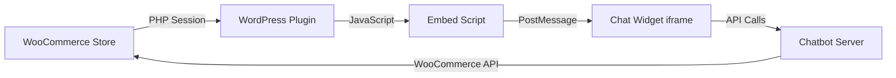

# WooCommerce Chatbot Embedding Guide

## Table of Contents
- [Overview](#overview)
- [Features](#features)
- [Installation Methods](#installation-methods)
- [User Detection & Context](#user-detection--context)
- [Implementation Details](#implementation-details)
- [Configuration Options](#configuration-options)
- [Security & Privacy](#security--privacy)
- [Troubleshooting](#troubleshooting)
- [API Reference](#api-reference)

## Overview

This guide explains how to embed your AI-powered customer service chatbot into any WooCommerce store with full user authentication and context awareness. The chatbot automatically detects logged-in users, accesses their order history, monitors their shopping cart, and provides personalized assistance.

### Key Benefits
- **Zero Authentication Friction**: Customers don't need to identify themselves
- **Real-Time Context**: Knows what product they're viewing, cart contents, order history
- **Personalized Experience**: Different greetings and support for VIP, regular, and new customers
- **Seamless Integration**: Works with any WooCommerce theme or setup

## Features

### 🔐 User Authentication Detection
The chatbot automatically detects and uses:
- Login status (logged in vs guest)
- User credentials (name, email, ID)
- Customer history (registration date, lifetime value)
- Customer segmentation (VIP, regular, new, guest)

### 🛒 Shopping Context Awareness
Real-time access to:
- Current cart contents with item details
- Applied coupons and discounts
- Cart abandonment detection
- Current page context (product, category, checkout)
- Order status when viewing orders

### 💬 Personalized Interactions
- Custom greetings based on customer tier
- Order history references in conversations
- Proactive abandoned cart recovery
- Context-aware help suggestions

## Installation Methods

### Method 1: WordPress Plugin (Recommended)

#### Step 1: Install the Plugin

1. Download the plugin file: `wordpress-plugin/customer-service-chat.php`
2. In WordPress Admin, go to **Plugins → Add New → Upload Plugin**
3. Upload the plugin file and click **Install Now**
4. Click **Activate**

#### Step 2: Configure Settings

1. Navigate to **WooCommerce → Chat Widget**
2. Enter your configuration:
   ```
   Chat Server URL: https://your-chatbot-server.com
   Position: Bottom Right
   ✅ Pass user information to chat
   ✅ Pass cart data to chat
   ✅ Enable order lookup in chat
   ```
3. Click **Save Settings**

#### Step 3: Test the Integration

1. Open your store in an incognito window (guest user)
2. Open in a regular window while logged in (authenticated user)
3. Verify different greetings and context awareness

### Method 2: Manual Theme Integration

Add to your theme's `functions.php`:

```php
// Add chat widget with WooCommerce user detection
add_action('wp_footer', function() {
    // Skip on admin pages
    if (is_admin()) return;
    
    // Get user data if logged in
    $user_data = array(
        'isLoggedIn' => false,
        'email' => '',
        'displayName' => '',
        'customerId' => '',
        'totalOrders' => 0,
        'customerGroup' => 'guest'
    );
    
    if (is_user_logged_in()) {
        $user = wp_get_current_user();
        $customer = new WC_Customer($user->ID);
        
        $user_data = array(
            'isLoggedIn' => true,
            'email' => $user->user_email,
            'displayName' => $user->display_name,
            'customerId' => $user->ID,
            'totalOrders' => $customer->get_order_count(),
            'totalSpent' => $customer->get_total_spent(),
            'customerGroup' => $customer->get_total_spent() > 1000 ? 'vip' : 
                             ($customer->get_order_count() > 5 ? 'regular' : 'new')
        );
    }
    
    // Get cart data
    $cart_data = array(
        'hasItems' => false,
        'itemCount' => 0,
        'cartTotal' => '0'
    );
    
    if (WC()->cart && !WC()->cart->is_empty()) {
        $cart_data = array(
            'hasItems' => true,
            'itemCount' => WC()->cart->get_cart_contents_count(),
            'cartTotal' => WC()->cart->get_total()
        );
    }
    ?>
    <script>
        window.ChatWidgetConfig = {
            serverUrl: 'https://your-chatbot-server.com',
            userData: <?php echo json_encode($user_data); ?>,
            cartData: <?php echo json_encode($cart_data); ?>
        };
    </script>
    <script src="https://your-chatbot-server.com/embed.js"></script>
    <?php
});
```

### Method 3: Page Builder Integration

For Elementor, Divi, or other page builders:

1. Add an **HTML Widget** to your footer
2. Insert this code:
```html
<script>
// This will be populated by WooCommerce
window.ChatWidgetConfig = {
    serverUrl: 'https://your-chatbot-server.com',
    appearance: {
        position: 'bottom-right'
    }
};
</script>
<script src="https://your-chatbot-server.com/embed.js"></script>
```

## User Detection & Context

### Data Flow Architecture



### Available User Context

The chatbot receives this user data structure:

```typescript
interface UserData {
  // Authentication
  isLoggedIn: boolean;
  userId: string;
  email: string;
  
  // Personal Information
  firstName: string;
  lastName: string;
  displayName: string;
  
  // Customer History
  customerSince: string;      // Registration date
  totalOrders: number;        // Lifetime order count
  totalSpent: string;         // Lifetime value
  lastOrderId: string;        // Most recent order
  lastOrderDate: string;      // Last purchase date
  
  // Segmentation
  customerGroup: 'guest' | 'new' | 'regular' | 'vip';
  preferredLanguage: string;  // From WordPress locale
}
```

### Cart Context Structure

```typescript
interface CartData {
  hasItems: boolean;
  itemCount: number;
  cartTotal: string;
  cartCurrency: string;
  abandonedCart: boolean;     // Detected after 5 min inactivity
  
  cartItems: Array<{
    id: string;
    name: string;
    quantity: number;
    price: string;
    sku?: string;
    variation?: string;
  }>;
  
  appliedCoupons: string[];   // Active coupon codes
}
```

### Page Context Information

```typescript
interface PageContext {
  pageType: 'home' | 'shop' | 'product' | 'category' | 
            'cart' | 'checkout' | 'account' | 'order-confirmation';
  pageUrl: string;
  pageTitle: string;
  
  // Product pages
  productId?: string;
  productName?: string;
  productPrice?: string;
  productSku?: string;
  
  // Category pages
  categoryId?: string;
  categoryName?: string;
  
  // Order pages
  orderId?: string;
  orderStatus?: string;
  trackingNumber?: string;
}
```

## Implementation Details

### Customer Segmentation Logic

The plugin automatically segments customers:

```php
// VIP Customer: Total spent > $1000
if ($customer->get_total_spent() > 1000) {
    $customer_group = 'vip';
}
// Regular Customer: More than 5 orders
elseif ($customer->get_order_count() > 5) {
    $customer_group = 'regular';
}
// New Customer: Has made at least 1 order
elseif ($customer->get_order_count() > 0) {
    $customer_group = 'new';
}
// Guest: Not logged in or no orders
else {
    $customer_group = 'guest';
}
```

### Personalized Greeting Examples

Based on customer context:

```javascript
// VIP Customer
"Welcome back, John! As a VIP customer, you have priority support. How can I assist you today?"

// Regular Customer with cart items
"Hi Sarah! I see you have 3 items in your cart. Need any help completing your purchase?"

// New Customer on product page
"Hello Mike! Questions about the Blue Widget? I'm here to help!"

// Guest with abandoned cart
"I noticed you have items in your cart. Need any help completing your purchase?"

// Customer viewing order
"I can see you're checking order #12345. It shipped yesterday and should arrive by Friday!"
```

### Dynamic Context Updates

The chatbot receives real-time updates when:
- Items are added/removed from cart
- User logs in or out
- User navigates to different pages
- Coupons are applied
- Checkout process begins

```javascript
// Listen for WooCommerce cart updates
jQuery(document).on('added_to_cart removed_from_cart updated_cart_totals', function() {
    window.updateChatContext();
});
```

## Configuration Options

### Plugin Settings

| Setting | Description | Default |
|---------|-------------|---------|
| `server_url` | Your chatbot server URL | `http://localhost:3000` |
| `position` | Widget position on screen | `bottom-right` |
| `auto_open_on_checkout` | Auto-open chat on checkout page | `false` |
| `show_on_product_pages` | Display on product pages | `true` |
| `pass_user_data` | Share user information with chat | `true` |
| `pass_cart_data` | Share cart contents with chat | `true` |
| `enable_order_lookup` | Allow order status queries | `true` |
| `custom_greeting` | Override automatic greetings | `""` |

### JavaScript Configuration

```javascript
window.ChatWidgetConfig = {
    // Server configuration
    serverUrl: 'https://your-server.com',
    
    // Appearance
    appearance: {
        position: 'bottom-right',  // or 'bottom-left', 'top-right', 'top-left'
        width: 400,
        height: 600
    },
    
    // Behavior
    behavior: {
        autoOpen: false,           // Auto-open on page load
        greeting: 'Custom greeting message'
    },
    
    // Privacy
    privacy: {
        requireConsent: true,      // GDPR consent required
        allowOptOut: true,         // Show opt-out option
        retentionDays: 30         // Data retention period
    },
    
    // User data (populated by WordPress)
    userData: { /* ... */ },
    
    // Cart data (populated by WooCommerce)
    cartData: { /* ... */ },
    
    // Page context
    pageContext: { /* ... */ }
};
```

## Security & Privacy

### Data Protection

1. **Secure Transmission**
   - All data passed via HTTPS
   - PostMessage API with origin verification
   - Nonce tokens for AJAX requests

2. **Privacy Compliance**
   - GDPR consent management built-in
   - User opt-out capability
   - Data retention controls
   - Export and deletion rights

3. **Authentication Security**
   ```php
   // Nonce verification for AJAX requests
   if (!wp_verify_nonce($_GET['nonce'], 'csc_chat_widget')) {
       wp_die('Security check failed');
   }
   ```

4. **Data Sanitization**
   ```php
   // All user inputs are sanitized
   $email = sanitize_email($user->user_email);
   $name = sanitize_text_field($user->display_name);
   $url = sanitize_url($_POST['server_url']);
   ```

### GDPR Compliance

The integration includes:
- Consent request before data collection
- Clear privacy notices
- Data export functionality
- Right to deletion
- Configurable retention periods

## Troubleshooting

### Common Issues and Solutions

#### Chat Widget Not Appearing

**Problem**: Widget doesn't show on the site
**Solutions**:
1. Check browser console for JavaScript errors
2. Verify server URL is correct and accessible
3. Ensure plugin is activated in WordPress
4. Check for theme/plugin conflicts
5. Verify embed.js is loading: 
   ```javascript
   // In browser console
   console.log(window.ChatWidget);
   ```

#### User Data Not Detected

**Problem**: Chat shows guest greeting for logged-in users
**Solutions**:
1. Verify WooCommerce is active
2. Check WordPress user session:
   ```php
   // Add to theme temporarily to debug
   var_dump(is_user_logged_in());
   var_dump(wp_get_current_user());
   ```
3. Clear WordPress cache
4. Check for caching plugins interfering

#### Cart Data Not Updating

**Problem**: Cart changes don't reflect in chat
**Solutions**:
1. Ensure jQuery is loaded (WooCommerce dependency)
2. Check for JavaScript errors
3. Verify AJAX endpoint is accessible
4. Test cart update events:
   ```javascript
   jQuery(document).on('updated_cart_totals', function() {
       console.log('Cart updated!');
   });
   ```

#### Cross-Origin Issues

**Problem**: "Blocked by CORS policy" errors
**Solutions**:
1. Add CORS headers to your chatbot server:
   ```javascript
   // Next.js API route
   res.setHeader('Access-Control-Allow-Origin', 'https://your-woocommerce-site.com');
   ```
2. Use HTTPS for both sites
3. Check firewall/security plugin settings

### Debug Mode

Enable debug mode to see context data:

```javascript
window.ChatWidgetConfig = {
    debug: true  // Shows console logs
};

// Or in WordPress plugin settings
define('CSC_DEBUG', true);
```

### Performance Optimization

1. **Lazy Loading**: Widget loads after page content
2. **Caching**: User context cached for 5 minutes
3. **Batch Updates**: Cart changes debounced
4. **Minimal Payload**: Only essential data transmitted

## API Reference

### JavaScript API

```javascript
// Open chat programmatically
window.ChatWidget.open();

// Close chat
window.ChatWidget.close();

// Send a message
window.ChatWidget.sendMessage('Hello, I need help with my order');

// Update user context
window.ChatWidget.updateContext({
    userData: { /* new user data */ },
    cartData: { /* new cart data */ }
});

// Privacy controls
window.ChatWidget.privacy.optOut();
window.ChatWidget.privacy.optIn();
window.ChatWidget.privacy.getStatus();
```

### WordPress Hooks

```php
// Modify user context before sending
add_filter('csc_user_context', function($context) {
    $context['customField'] = 'value';
    return $context;
});

// Add custom greeting logic
add_filter('csc_greeting_message', function($greeting, $user_data) {
    if ($user_data['totalSpent'] > 5000) {
        return 'Welcome, Platinum member!';
    }
    return $greeting;
}, 10, 2);

// Hook into chat initialization
add_action('csc_chat_init', function($user_id) {
    // Custom initialization logic
});
```

### AJAX Endpoints

```javascript
// Get fresh user context
fetch('/wp-admin/admin-ajax.php?action=csc_get_user_context&nonce=' + nonce)
    .then(response => response.json())
    .then(context => console.log(context));

// Update cart context
fetch('/wp-admin/admin-ajax.php?action=csc_update_cart&nonce=' + nonce)
    .then(response => response.json())
    .then(cart => console.log(cart));
```

## Testing Checklist

Before going live, test these scenarios:

- [ ] Guest user browsing products
- [ ] Guest user with items in cart
- [ ] New user registration and first purchase
- [ ] Returning customer login
- [ ] VIP customer experience
- [ ] Cart abandonment detection (wait 5 minutes)
- [ ] Product page context
- [ ] Checkout page assistance
- [ ] Order confirmation page
- [ ] Mobile responsive behavior
- [ ] Multiple browser testing
- [ ] Privacy opt-out/opt-in flow
- [ ] Data export request
- [ ] Cross-domain functionality

## Support & Resources

- **Plugin Location**: `/wordpress-plugin/customer-service-chat.php`
- **Enhanced Embed**: `/app/embed/enhanced-page.tsx`
- **Main Documentation**: [WOOCOMMERCE_INTEGRATION_GUIDE.md](./WOOCOMMERCE_INTEGRATION_GUIDE.md)
- **API Documentation**: [WOOCOMMERCE_FULL_API.md](./WOOCOMMERCE_FULL_API.md)
- **WooCommerce REST API**: [Official Docs](https://woocommerce.github.io/woocommerce-rest-api-docs/)

## Version History

| Version | Date | Changes |
|---------|------|---------|
| 1.0.0 | 2024 | Initial release with user detection |
| 1.1.0 | 2024 | Added cart tracking and abandonment detection |
| 1.2.0 | 2024 | Enhanced customer segmentation |
| 1.3.0 | 2024 | Real-time context updates |

---

*For additional help or feature requests, please open an issue in the project repository.*