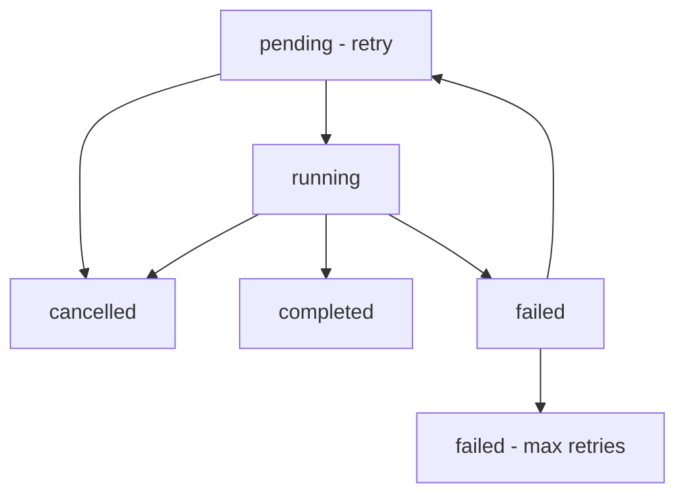

# Individual Scrape Job API

**Type:** Reference
**Status:** Active
**Last Updated:** 2025-11-18
**Verified For:** v0.1.0
**Dependencies:** [Scrape Jobs API](/home/user/Omniops/app/api/scrape-jobs/README.md), [Job Retry API](/home/user/Omniops/app/api/scrape-jobs/[id]/retry/README.md)
**Estimated Read Time:** 14 minutes

## Purpose

Complete API reference for managing specific scrape jobs by ID, including retrieving job details, updating job status, and cancelling jobs.

## Quick Links

- [Job Retry API](/home/user/Omniops/app/api/scrape-jobs/[id]/retry/README.md)
- [Job Queue API](/home/user/Omniops/app/api/scrape-jobs/next/README.md)
- [Job Statistics API](/home/user/Omniops/app/api/scrape-jobs/stats/README.md)

## Endpoints

### GET /api/scrape-jobs/[id]

Get detailed information about a specific scrape job.

#### Path Parameters

| Parameter | Type | Description |
|-----------|------|-------------|
| `id` | string | UUID of the scrape job |

#### Response

```json
{
  "success": true,
  "data": {
    "id": "123e4567-e89b-12d3-a456-426614174000",
    "domain_id": "456e7890-e89b-12d3-a456-426614174000",
    "customer_config_id": "789e0123-e89b-12d3-a456-426614174000",
    "domain": "example.com",
    "job_type": "domain_scrape",
    "status": "running",
    "priority": 7,
    "retry_count": 1,
    "max_retries": 3,
    "config": {
      "depth": 3,
      "maxPages": 150,
      "timeout": 30000,
      "respectRobots": true,
      "includeSubdomains": false,
      "userAgent": "CustomBot/1.0"
    },
    "metadata": {
      "source": "api",
      "tags": ["ecommerce", "high-priority"],
      "requestedBy": "user@example.com",
      "estimatedDuration": 300
    },
    "started_at": "2024-01-01T10:00:00.000Z",
    "completed_at": null,
    "error_message": null,
    "stats": {
      "pagesProcessed": 45,
      "totalPages": 150,
      "successfulRequests": 44,
      "failedRequests": 1,
      "avgResponseTime": 1200,
      "dataExtracted": {
        "products": 156,
        "images": 234,
        "links": 89
      }
    },
    "created_at": "2024-01-01T09:55:00.000Z",
    "updated_at": "2024-01-01T10:15:00.000Z"
  }
}
```

### PUT /api/scrape-jobs/[id]

Update a scrape job's status, metadata, or other properties.

#### Path Parameters

| Parameter | Type | Description |
|-----------|------|-------------|
| `id` | string | UUID of the scrape job |

#### Request Body

```json
{
  "status": "running",
  "metadata": {
    "updatedBy": "system",
    "notes": "Job restarted due to timeout"
  },
  "stats": {
    "pagesProcessed": 75,
    "successfulRequests": 70,
    "failedRequests": 5
  },
  "error_message": null,
  "started_at": "2024-01-01T11:00:00.000Z"
}
```

#### Updatable Fields

| Field | Type | Description |
|-------|------|-------------|
| `status` | string | Job status (`pending`, `running`, `completed`, `failed`, `cancelled`) |
| `error_message` | string | Error details (set to null to clear) |
| `stats` | object | Job performance and progress statistics |
| `retry_count` | number | Current retry attempt number |
| `started_at` | string | ISO timestamp when job started processing |
| `completed_at` | string | ISO timestamp when job finished |
| `metadata` | object | Additional metadata (merged with existing) |

#### Response

```json
{
  "success": true,
  "data": {
    "id": "123e4567-e89b-12d3-a456-426614174000",
    "status": "running",
    "updated_at": "2024-01-01T11:00:00.000Z",
    "stats": {
      "pagesProcessed": 75,
      "successfulRequests": 70,
      "failedRequests": 5
    }
  },
  "message": "Job updated successfully"
}
```

### DELETE /api/scrape-jobs/[id]

Cancel a scrape job and optionally provide a reason.

#### Path Parameters

| Parameter | Type | Description |
|-----------|------|-------------|
| `id` | string | UUID of the scrape job |

#### Query Parameters

| Parameter | Type | Description | Default |
|-----------|------|-------------|---------|
| `reason` | string | Reason for cancellation | "Cancelled via API" |

#### Response

```json
{
  "success": true,
  "data": {
    "id": "123e4567-e89b-12d3-a456-426614174000",
    "status": "cancelled",
    "error_message": "Cancelled via API: User requested cancellation",
    "completed_at": "2024-01-01T11:30:00.000Z"
  },
  "message": "Job cancelled successfully"
}
```

## Job Status Management

### Status Transitions



### Valid Status Updates

| Current Status | Valid Transitions |
|----------------|-------------------|
| `pending` | `running`, `cancelled` |
| `running` | `completed`, `failed`, `cancelled` |
| `completed` | None (final state) |
| `failed` | `pending` (retry), `cancelled` |
| `cancelled` | None (final state) |

## Job Statistics Structure

### Standard Statistics

```json
{
  "stats": {
    "pagesProcessed": 125,
    "totalPages": 200,
    "successfulRequests": 120,
    "failedRequests": 5,
    "avgResponseTime": 1500,
    "totalProcessingTime": 180000,
    "bytesDownloaded": 5242880,
    "dataExtracted": {
      "products": 45,
      "images": 234,
      "links": 89,
      "documents": 12
    },
    "errors": [
      {
        "url": "https://example.com/timeout-page",
        "error": "Request timeout",
        "timestamp": "2024-01-01T10:15:00.000Z"
      }
    ],
    "performance": {
      "memoryUsage": "150MB",
      "cpuUsage": 45.2,
      "networkLatency": 250
    }
  }
}
```

### E-commerce Specific Statistics

```json
{
  "stats": {
    "products": {
      "total": 156,
      "inStock": 134,
      "outOfStock": 22,
      "categories": ["Electronics", "Clothing", "Home & Garden"],
      "priceRange": {
        "min": 9.99,
        "max": 1299.99,
        "average": 89.50
      }
    },
    "inventory": {
      "tracked": 156,
      "updated": 145,
      "new": 11,
      "discontinued": 3
    }
  }
}
```

## Error Handling

### 404 Not Found

**Job Not Found:**
```json
{
  "success": false,
  "error": "Job not found"
}
```

### 400 Bad Request

**Invalid Status Update:**
```json
{
  "success": false,
  "error": "Cannot transition from 'completed' to 'running'"
}
```

**Invalid Data:**
```json
{
  "success": false,
  "error": "Invalid retry_count: must be a non-negative integer"
}
```

### 409 Conflict

**Job Cannot Be Cancelled:**
```json
{
  "success": false,
  "error": "Job not found or cannot be cancelled",
  "details": "Job is already completed"
}
```

### 500 Internal Server Error

**Database Error:**
```json
{
  "success": false,
  "error": "Failed to update scrape job",
  "details": "Database connection timeout"
}
```

## UpdateScrapeJobOptions Interface

```typescript
interface UpdateScrapeJobOptions {
  status?: 'pending' | 'running' | 'completed' | 'failed' | 'cancelled';
  error_message?: string;
  stats?: Record<string, any>;
  retry_count?: number;
  started_at?: string;
  completed_at?: string;
  metadata?: Record<string, any>;
}
```

## Usage Examples

### cURL Examples

**Get job details:**
```bash
curl "http://localhost:3000/api/scrape-jobs/123e4567-e89b-12d3-a456-426614174000"
```

**Update job status:**
```bash
curl -X PUT "http://localhost:3000/api/scrape-jobs/123e4567-e89b-12d3-a456-426614174000" \
  -H "Content-Type: application/json" \
  -d '{
    "status": "running",
    "started_at": "2024-01-01T12:00:00.000Z",
    "stats": {
      "pagesProcessed": 10,
      "totalPages": 100
    }
  }'
```

**Mark job as completed with results:**
```bash
curl -X PUT "http://localhost:3000/api/scrape-jobs/123e4567-e89b-12d3-a456-426614174000" \
  -H "Content-Type: application/json" \
  -d '{
    "status": "completed",
    "completed_at": "2024-01-01T12:30:00.000Z",
    "stats": {
      "pagesProcessed": 100,
      "successfulRequests": 95,
      "failedRequests": 5,
      "dataExtracted": {
        "products": 250,
        "images": 456
      }
    }
  }'
```

**Cancel job with reason:**
```bash
curl -X DELETE "http://localhost:3000/api/scrape-jobs/123e4567-e89b-12d3-a456-426614174000?reason=User%20requested%20cancellation"
```

### TypeScript Integration

```typescript
import { scrapeJobManager } from '@/lib/scrape-job-manager';

// Get job details
const job = await scrapeJobManager.getJob('123e4567-e89b-12d3-a456-426614174000');
if (job) {
  console.log(`Job ${job.id} status: ${job.status}`);
  console.log(`Progress: ${job.stats.pagesProcessed}/${job.stats.totalPages}`);
}

// Update job status
const updatedJob = await scrapeJobManager.updateJob(
  '123e4567-e89b-12d3-a456-426614174000',
  {
    status: 'running',
    started_at: new Date().toISOString(),
    stats: {
      pagesProcessed: 25,
      successfulRequests: 24,
      failedRequests: 1
    }
  }
);

// Mark job as completed
const completedJob = await scrapeJobManager.updateJob(
  '123e4567-e89b-12d3-a456-426614174000',
  {
    status: 'completed',
    completed_at: new Date().toISOString(),
    stats: {
      pagesProcessed: 100,
      totalProcessingTime: 180000,
      dataExtracted: {
        products: 156,
        images: 234
      }
    }
  }
);

// Cancel job
const cancelledJob = await scrapeJobManager.cancelJob(
  '123e4567-e89b-12d3-a456-426614174000',
  'Job taking too long, cancelling to free resources'
);
```

### React Job Monitor Component

```typescript
import React, { useState, useEffect } from 'react';

interface JobMonitorProps {
  jobId: string;
  onStatusChange?: (status: string) => void;
}

export function JobMonitor({ jobId, onStatusChange }: JobMonitorProps) {
  const [job, setJob] = useState(null);
  const [loading, setLoading] = useState(true);
  const [error, setError] = useState(null);

  const fetchJob = async () => {
    try {
      const response = await fetch(`/api/scrape-jobs/${jobId}`);
      const data = await response.json();
      
      if (data.success) {
        setJob(data.data);
        if (onStatusChange && data.data.status !== job?.status) {
          onStatusChange(data.data.status);
        }
      } else {
        setError(data.error);
      }
    } catch (err) {
      setError('Failed to fetch job details');
    } finally {
      setLoading(false);
    }
  };

  const cancelJob = async () => {
    try {
      const response = await fetch(`/api/scrape-jobs/${jobId}?reason=User%20cancelled`, {
        method: 'DELETE'
      });
      
      const data = await response.json();
      if (data.success) {
        setJob(data.data);
      }
    } catch (err) {
      console.error('Failed to cancel job:', err);
    }
  };

  useEffect(() => {
    fetchJob();
    
    // Poll for updates if job is active
    const interval = setInterval(() => {
      if (job?.status === 'pending' || job?.status === 'running') {
        fetchJob();
      }
    }, 5000);

    return () => clearInterval(interval);
  }, [jobId, job?.status]);

  if (loading) return <div>Loading job details...</div>;
  if (error) return <div>Error: {error}</div>;
  if (!job) return <div>Job not found</div>;

  const progress = job.stats.totalPages 
    ? (job.stats.pagesProcessed / job.stats.totalPages) * 100 
    : 0;

  return (
    <div className="job-monitor">
      <h2>Job: {job.domain}</h2>
      
      <div className={`status status-${job.status}`}>
        Status: {job.status}
      </div>
      
      {job.status === 'running' && (
        <div className="progress">
          <div className="progress-bar" style={{ width: `${progress}%` }}>
            {Math.round(progress)}%
          </div>
          <span>
            {job.stats.pagesProcessed} / {job.stats.totalPages} pages
          </span>
        </div>
      )}
      
      <div className="details">
        <p>Type: {job.job_type}</p>
        <p>Priority: {job.priority}</p>
        <p>Retry Count: {job.retry_count} / {job.max_retries}</p>
        <p>Created: {new Date(job.created_at).toLocaleString()}</p>
        {job.started_at && (
          <p>Started: {new Date(job.started_at).toLocaleString()}</p>
        )}
      </div>
      
      {job.stats.dataExtracted && (
        <div className="extracted-data">
          <h3>Extracted Data:</h3>
          {Object.entries(job.stats.dataExtracted).map(([key, value]) => (
            <p key={key}>{key}: {value}</p>
          ))}
        </div>
      )}
      
      {job.error_message && (
        <div className="error-message">
          Error: {job.error_message}
        </div>
      )}
      
      {(job.status === 'pending' || job.status === 'running') && (
        <button onClick={cancelJob} className="cancel-button">
          Cancel Job
        </button>
      )}
    </div>
  );
}
```

## Job Lifecycle Events

### Webhook Integration

Jobs can trigger webhooks on status changes:

```json
{
  "event": "job_status_changed",
  "job_id": "123e4567-e89b-12d3-a456-426614174000",
  "domain": "example.com",
  "old_status": "running",
  "new_status": "completed",
  "stats": {
    "pagesProcessed": 100,
    "dataExtracted": {
      "products": 156
    }
  },
  "timestamp": "2024-01-01T12:30:00.000Z"
}
```

### Performance Monitoring

Track job performance metrics:
- Processing speed (pages per minute)
- Success/failure rates
- Resource usage
- Error patterns
- Completion times by domain/job type

## Security Considerations

- Validate job IDs to prevent unauthorized access
- Sanitize error messages before storage
- Implement rate limiting for status updates
- Log all job modifications for auditing
- Consider job-level permissions for multi-tenant systems

## Related APIs

- [Scrape Jobs API](/app/api/scrape-jobs/README.md) - Job creation and listing
- [Job Retry API](/app/api/scrape-jobs/[id]/retry/README.md) - Retry failed jobs
- [Job Queue API](/app/api/scrape-jobs/next/README.md) - Worker job retrieval
- [Job Statistics API](/app/api/scrape-jobs/stats/README.md) - Analytics and reporting