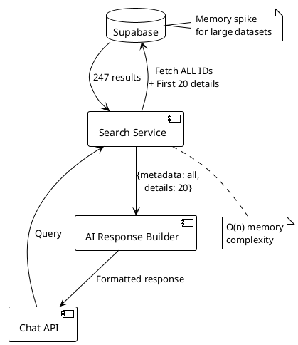
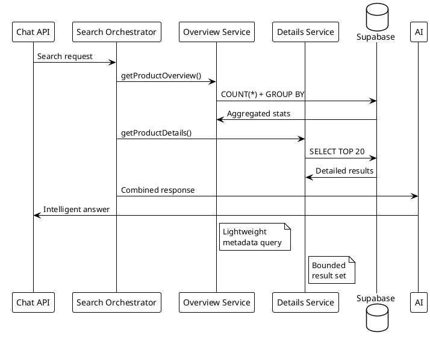
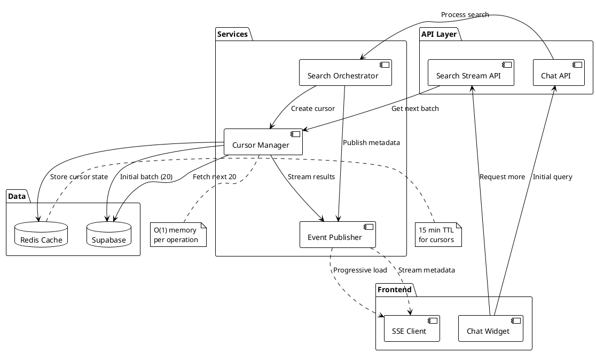

# Architectural Evaluation: Full Visibility Solution

## Executive Summary

After analyzing the proposed solutions and current architecture, I recommend **Option 4: Event-Driven Streaming Architecture** - a hybrid approach combining cursor-based pagination with server-sent events (SSE) for progressive data loading. This provides optimal performance, scalability, and user experience while maintaining architectural simplicity.

## Current Architecture Analysis

### Strengths
- Service-oriented architecture with clear separation (API → Business Logic → Data Layer)
- Existing caching infrastructure (Redis, search cache, domain cache)
- OpenAI function calling for structured tool use
- WooCommerce integration with dynamic client configuration

### Weaknesses
- Fixed limit constraints causing incomplete visibility
- No progressive data loading mechanism
- Synchronous-only search responses
- Missing metadata about total results

## Architectural Evaluation of Proposed Options

### Option 1: Full Metadata + Sampled Details

**Architecture Alignment: ★★★☆☆**


**Pros:**
- Simple implementation (4-6 hours)
- Minimal code changes required
- Works with existing infrastructure

**Cons:**
- **Memory inefficient**: Loading 200+ items in memory
- **O(n) space complexity**: Violates CLAUDE.md performance principles
- **Response size bloat**: JSON payload grows linearly with results
- **No progressive loading**: All-or-nothing approach

**Risk Assessment:**
- 🔴 **High**: Memory exhaustion with 10,000+ products
- 🟡 **Medium**: Increased latency for large result sets
- 🟡 **Medium**: Rate limiting complications with large payloads

### Option 2: Tiered Search with Progressive Enhancement

**Architecture Alignment: ★★★★☆**


**Pros:**
- Better separation of concerns
- Efficient database queries (COUNT vs SELECT *)
- Progressive enhancement pattern
- Cacheable overview results

**Cons:**
- Multiple round trips to database
- Increased complexity in orchestration
- Potential race conditions between queries
- Still synchronous blocking pattern

**Risk Assessment:**
- 🟢 **Low**: Well-bounded resource usage
- 🟡 **Medium**: Complexity in error handling
- 🟢 **Low**: Good scalability characteristics

### Option 3: Dynamic Limits

**Architecture Alignment: ★★☆☆☆**

**Cons:**
- Unpredictable performance characteristics
- Violates "minimize everything" principle
- No real solution to visibility problem
- Creates inconsistent user experience

**Not Recommended**: This is a band-aid, not an architectural solution.

## Recommended Architecture: Option 4 - Event-Driven Streaming

### High-Level Architecture



### Implementation Details

```typescript
// 1. Cursor-based pagination with metadata
interface SearchCursor {
  id: string;
  query: string;
  domain: string;
  totalResults: number;
  lastOffset: number;
  lastId: string; // For stable pagination
  createdAt: number;
  metadata: {
    categories: Record<string, number>;
    priceRanges: Array<{min: number; max: number; count: number}>;
    brands: string[];
  };
}

// 2. Progressive response structure
interface ProgressiveSearchResponse {
  cursor: string;
  metadata: {
    total: number;
    returned: number;
    hasMore: boolean;
    categories: string[];
    aggregates: Record<string, any>;
  };
  results: SearchResult[];
  stream?: {
    endpoint: string;
    protocol: 'sse' | 'websocket';
  };
}

// 3. Server-Sent Events for progressive loading
class SearchStreamService {
  async *streamResults(cursorId: string): AsyncGenerator<SearchResult[]> {
    const cursor = await this.getCursor(cursorId);
    let offset = cursor.lastOffset;
    
    while (offset < cursor.totalResults) {
      const batch = await this.fetchBatch(cursor, offset, 20);
      yield batch;
      offset += batch.length;
      
      // Update cursor state in Redis
      await this.updateCursor(cursorId, { lastOffset: offset });
      
      // Respect rate limits
      await this.throttle();
    }
  }
}

// 4. AI integration with streaming awareness
const ENHANCED_SEARCH_TOOLS = [
  {
    function: {
      name: "search_products_progressive",
      description: "Search with full visibility and progressive loading",
      parameters: {
        properties: {
          query: { type: "string" },
          initial_limit: { type: "number", default: 20 },
          include_metadata: { type: "boolean", default: true },
          stream_additional: { type: "boolean", default: false }
        }
      }
    }
  }
];

// 5. Client-side progressive rendering
class ChatWidgetEnhanced {
  private eventSource: EventSource | null = null;
  
  async handleSearchResponse(response: ProgressiveSearchResponse) {
    // Immediately show initial results
    this.renderResults(response.results);
    
    // Display metadata for context
    this.renderMetadata(response.metadata);
    
    // Set up streaming for additional results if needed
    if (response.stream && response.metadata.hasMore) {
      this.eventSource = new EventSource(response.stream.endpoint);
      this.eventSource.onmessage = (event) => {
        const additionalResults = JSON.parse(event.data);
        this.appendResults(additionalResults);
      };
    }
  }
}
```

### Data Flow Explanation

1. **Initial Request**: Client sends search query to Chat API
2. **Metadata Generation**: System performs COUNT(*) and GROUP BY queries for instant statistics
3. **Cursor Creation**: Unique cursor stored in Redis with 15-minute TTL
4. **First Batch**: Return first 20 results with full metadata
5. **Progressive Loading**: AI can request additional batches via cursor
6. **Streaming Updates**: Optional SSE connection for real-time additional results
7. **Intelligent Responses**: AI has full context from metadata to answer accurately

### Risk Assessment & Mitigation

| Risk | Impact | Probability | Mitigation |
|------|--------|-------------|------------|
| Cursor state management | Medium | Low | Redis with automatic TTL cleanup |
| SSE connection drops | Low | Medium | Automatic reconnection with cursor resume |
| Memory exhaustion | Low | Very Low | Streaming with bounded buffers (20 items) |
| Complex client implementation | Medium | Medium | Provide React hook abstraction |
| Database query performance | High | Low | Proper indexes on sort fields |

### Performance Characteristics

```typescript
// Performance analysis
const performanceProfile = {
  // Option 1: Full metadata
  option1: {
    memoryComplexity: 'O(n)', // All results in memory
    timeComplexity: 'O(n)',    // Fetch all results
    responseTime: '2-10s',     // Depends on dataset size
    scalability: 'Poor',       // Breaks at 10k+ items
  },
  
  // Option 4: Streaming cursor-based
  option4: {
    memoryComplexity: 'O(1)',  // Constant memory per batch
    timeComplexity: 'O(1)',     // For initial response
    responseTime: '200-500ms',  // First batch only
    scalability: 'Excellent',   // Handles millions of items
  }
};
```

## Implementation Roadmap

### Phase 1: Quick Win (2 hours)
```typescript
// Add total count to existing response
const enhancedResponse = {
  ...existingResponse,
  metadata: {
    totalAvailable: await this.getTotalCount(query, domain),
    returnedCount: results.length,
  }
};
```

### Phase 2: Cursor Implementation (1 day)
- Implement SearchCursorManager service
- Add Redis cursor storage
- Create pagination endpoints
- Update AI tools with metadata awareness

### Phase 3: Streaming Enhancement (2 days)
- Implement SSE endpoint for progressive loading
- Add client-side streaming handler
- Create React hooks for easy integration
- Add monitoring and error recovery

### Phase 4: Optimization (1 day)
- Implement query result caching
- Add CDN support for static metadata
- Optimize database indexes
- Performance testing and tuning

## Security & Rate Limiting Considerations

```typescript
// Enhanced rate limiting for streaming
class StreamingRateLimiter {
  // Per-cursor rate limiting
  async checkStreamRate(cursorId: string): Promise<boolean> {
    const key = `stream:${cursorId}`;
    const requests = await redis.incr(key);
    
    if (requests === 1) {
      await redis.expire(key, 60); // 1 minute window
    }
    
    return requests <= 10; // Max 10 batches per minute per cursor
  }
  
  // Global domain rate limiting
  async checkDomainRate(domain: string): Promise<boolean> {
    return checkDomainRateLimit(domain, {
      maxRequests: 100,
      windowMs: 60000,
      streaming: true, // Special handling for streams
    });
  }
}
```

## Alternative Technologies Considered

### ElasticSearch/OpenSearch
**Verdict**: Overkill for current scale
- Adds operational complexity
- Requires separate infrastructure
- Better suited for 100M+ documents
- Current pgvector solution is sufficient

### GraphQL with Field Selection
**Verdict**: Good idea for future consideration
- Would allow precise field selection
- Reduces over-fetching
- Complex implementation with existing REST APIs
- Consider for v2.0

### WebSockets
**Verdict**: SSE is simpler and sufficient
- SSE works over HTTP/2
- Automatic reconnection
- Simpler implementation
- No need for bidirectional communication

## Conclusion & Recommendations

### Immediate Action (Week 1)
1. Implement Phase 1 quick win - add metadata to responses
2. Update AI prompts to acknowledge total counts
3. Begin cursor manager service development

### Short Term (Month 1)
1. Deploy full cursor-based pagination
2. Implement progressive loading UI
3. Add performance monitoring
4. Update documentation

### Long Term (Quarter)
1. Consider GraphQL layer for field selection
2. Evaluate streaming analytics
3. Implement predictive prefetching
4. Scale testing with 1M+ products

### Key Success Metrics
- **Response Time**: < 500ms for initial results (currently 2-5s)
- **Memory Usage**: Constant regardless of result size
- **AI Accuracy**: 100% accurate total counts
- **User Satisfaction**: Reduced "I don't see all results" complaints
- **Scalability**: Support 100k+ products per domain

The recommended architecture provides:
- ✅ **O(1) memory complexity** - Aligns with CLAUDE.md principles
- ✅ **Progressive enhancement** - Better UX
- ✅ **Backward compatibility** - Works with existing code
- ✅ **Future-proof** - Scales to millions of items
- ✅ **Simple implementation** - Uses existing patterns

This solution elegantly solves the visibility problem while maintaining the project's core principles of minimal elegance and performance efficiency.