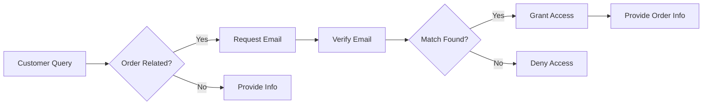

# WooCommerce Integration - Quick Reference

## 🚀 Quick Start

### Test if WooCommerce is Working
```bash
curl http://localhost:3001/api/test-woocommerce
```

### Test Chat with Order Query
```bash
curl -X POST http://localhost:3001/api/chat \
  -H "Content-Type: application/json" \
  -d '{
    "message": "Check order 119166",
    "session_id": "test-123",
    "domain": "thompsonseparts.co.uk"
  }'
```

### Check Stock Without Verification
```bash
curl -X POST http://localhost:3001/api/woocommerce/stock \
  -H "Content-Type: application/json" \
  -d '{
    "domain": "thompsonseparts.co.uk",
    "productName": "Palfinger"
  }'
```

## 📁 Key Files

| File | Purpose |
|------|---------|
| `lib/woocommerce-dynamic.ts` | WooCommerce API client |
| `lib/woocommerce-customer.ts` | Customer-specific operations |
| `lib/woocommerce-customer-actions.ts` | Post-verification actions |
| `lib/customer-verification-simple.ts` | Verification system |
| `lib/encryption.ts` | Credential encryption/decryption |
| `app/api/chat/route.ts` | Main chat endpoint |
| `app/api/woocommerce/stock/route.ts` | Stock checking API |
| `app/api/woocommerce/customer-action/route.ts` | Customer actions API |

## 🔐 Verification Flow



## 🛠️ Common Commands

### Run Tests
```bash
# Quick test
npm run dev
node scripts/simple-order-test.js

# Full customer journey
node scripts/test-customer-journey.js

# Test with real orders
node scripts/test-with-real-order.js
```

### Check Logs
```bash
# Watch for verification attempts
npm run dev | grep -i "verif"

# Watch for WooCommerce queries
npm run dev | grep -i "woocommerce"

# Check for errors
npm run dev | grep -i "error"
```

## 🔍 Debugging

### Check if Credentials are Encrypted
Look in Supabase `customer_configs` table:
- Encrypted: Long base64 string (100+ chars)
- Unencrypted: Starts with `ck_` or `cs_`

### Common Error Messages

| Error | Cause | Solution |
|-------|-------|----------|
| "Decryption error" | Wrong encryption key | Check ENCRYPTION_KEY env var |
| "Customer not found" | Email doesn't match | Use exact email from order |
| "WooCommerce not configured" | Missing credentials | Add to customer_configs |
| "Rate limit exceeded" | Too many requests | Wait or increase limits |

## 📊 Database Queries

### View Customer Configuration
```sql
SELECT 
  domain,
  woocommerce_url,
  LEFT(woocommerce_consumer_key, 10) as key_preview,
  created_at
FROM customer_configs
WHERE domain = 'thompsonseparts.co.uk';
```

### Check Verified Conversations
```sql
SELECT 
  id,
  verified,
  verified_email,
  created_at
FROM conversations
WHERE verified = true
ORDER BY created_at DESC
LIMIT 10;
```

### View Recent Messages
```sql
SELECT 
  m.role,
  LEFT(m.content, 100) as message_preview,
  c.verified,
  m.created_at
FROM messages m
JOIN conversations c ON m.conversation_id = c.id
WHERE c.domain = 'thompsonseparts.co.uk'
ORDER BY m.created_at DESC
LIMIT 20;
```

## 🎯 Quick Fixes

### Reset Verification for Testing
```sql
UPDATE conversations 
SET verified = false, verified_email = null 
WHERE id = 'conversation-uuid';
```

### Update Credentials (Unencrypted)
```sql
UPDATE customer_configs
SET 
  woocommerce_consumer_key = 'ck_your_key',
  woocommerce_consumer_secret = 'cs_your_secret'
WHERE domain = 'thompsonseparts.co.uk';
```

### Clear Rate Limits
```javascript
// In code - rate limits auto-clear after 1 minute
// Or restart the dev server
```

## 📈 Performance Tips

1. **Cache WooCommerce Data**
   - Products rarely change - cache for 1 hour
   - Orders change frequently - cache for 5 minutes

2. **Batch API Calls**
   - Use Promise.all() for multiple WooCommerce calls
   - Combine product queries when possible

3. **Optimize Queries**
   - Use specific product IDs/SKUs instead of search
   - Limit order history to last 10-20 orders

## 🚨 Security Checklist

- [ ] Never log customer emails
- [ ] Never log order details
- [ ] Always verify before showing private data
- [ ] Use encrypted credentials in production
- [ ] Implement rate limiting
- [ ] Validate all input parameters
- [ ] Use HTTPS for WooCommerce API
- [ ] Rotate API keys periodically

## 📝 Testing Checklist

- [ ] Order query triggers verification
- [ ] Product query works without verification
- [ ] Stock API returns real data
- [ ] Verification with valid email works
- [ ] Verification with invalid email fails
- [ ] Customer actions work post-verification
- [ ] Rate limiting prevents abuse
- [ ] Credentials decrypt properly

---

*Quick Reference v1.0 - January 2025*