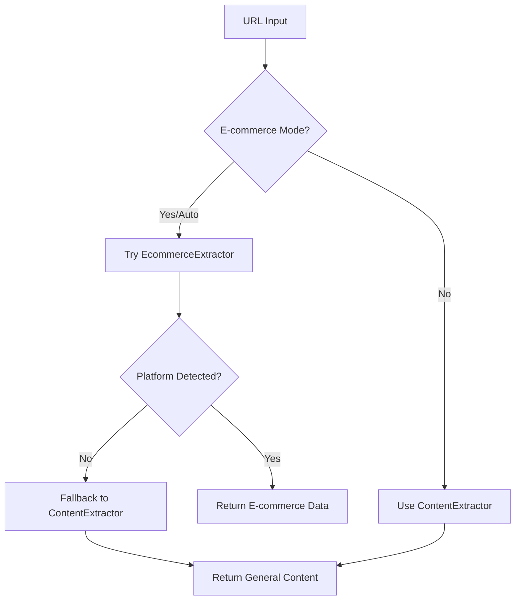

# Scraper Flow - Quick Reference

## 🎯 Entry Point
```
scrapePage() or crawlWebsite() in scraper-api.ts
```

## 🔄 Auto-Detection Flow



## 📦 Component Usage

| URL Type | Extractor Used | Features |
|----------|---------------|----------|
| Blog/Article | ContentExtractor | Clean text, images, metadata |
| Product Page | EcommerceExtractor | Price, variants, specs, platform detection |
| Category Page | EcommerceExtractor + PaginationCrawler | Full catalog, pagination following |
| Unknown | ContentExtractor (fallback) | Best-effort extraction |

## 🚀 Quick Start

```javascript
// Simple scraping - auto-detects type
import { scrapePage } from '@/lib/scraper-api';
const result = await scrapePage('https://any-website.com');

// Force e-commerce mode
const result = await scrapePage(url, { ecommerceMode: true });

// Full catalog crawl
import { PaginationCrawler } from '@/lib/pagination-crawler';
const crawler = new PaginationCrawler({ maxPages: 50 });
const catalog = await crawler.crawlCatalog(url, page);
```

## 🧩 Component Hierarchy

```
scraper-api.ts (orchestrator)
    ├── EcommerceExtractor (e-commerce sites)
    │   ├── extends ContentExtractor
    │   ├── uses ProductNormalizer
    │   └── uses PatternLearner
    └── ContentExtractor (general content)
        └── uses Mozilla Readability

PaginationCrawler (catalog crawling)
    └── uses EcommerceExtractor
```

## ⚡ Performance Tips

1. **Turbo Mode** (default on) - Blocks ads/trackers for 60% faster loads
2. **Pattern Learning** - Gets faster with each domain visit
3. **Use the right tool** - Don't use PaginationCrawler for single pages

## 📚 Full Documentation

See `/docs/SCRAPER-ARCHITECTURE.md` for complete details.