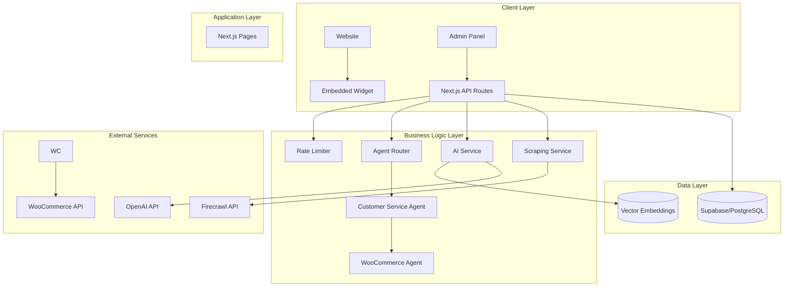

# Architecture Documentation

**Type:** Architecture
**Status:** Active
**Last Updated:** 2025-10-29
**Verified For:** v0.1.0
**Estimated Read Time:** 18 minutes

## Purpose
The Customer Service Agent is a multi-tenant SaaS application built with modern web technologies. It provides an embeddable AI-powered chat widget that can be integrated into any website.

## Quick Links
- [Overview](#overview)
- [System Architecture](#system-architecture)
- [Agent Architecture](#agent-architecture)
- [Component Architecture](#component-architecture)
- [Data Flow](#data-flow)

## Keywords
agent, architecture, component, considerations, data, database, decisions, deployment, development, flow

---


## Overview

The Customer Service Agent is a multi-tenant SaaS application built with modern web technologies. It provides an embeddable AI-powered chat widget that can be integrated into any website.

## System Architecture



## Agent Architecture

- Customer communicates with the generic Customer Service Agent (CSA).
- CSA builds the base system context for general support and products.
- When a message is an order/delivery/account query and a provider is enabled, CSA delegates to a provider-specific agent.
- Current provider agent: WooCommerce Agent. Future agents (e.g., Shopify) can be added without changing CSA.

Implementation details:
- Provider decision happens in `app/api/chat/route.ts:585`.
- CSA and provider agents expose the same interface (`lib/agents/ecommerce-agent.ts:1`).
- WooCommerce-specific instructions live in `lib/agents/woocommerce-agent.ts:1`.
- Generic instructions live in `lib/agents/customer-service-agent.ts:1`.
- A legacy shim keeps `lib/woocommerce-ai-instructions.ts:1` working for existing code/tests.

## Component Architecture

### Frontend Components

```
components/
├── ui/                    # Reusable UI components
│   ├── button.tsx        # Button component
│   ├── card.tsx          # Card component
│   ├── input.tsx         # Input component
│   └── ...               # Other UI components
├── chat/                  # Chat-specific components
│   ├── ChatInterface.tsx  # Main chat UI
│   ├── MessageList.tsx    # Message display
│   └── InputArea.tsx      # Message input
└── admin/                 # Admin components
    ├── ConfigForm.tsx     # Configuration form
    └── Analytics.tsx      # Usage analytics
```

### API Structure

```
app/api/
├── chat/                  # Chat endpoints
│   └── route.ts          # POST /api/chat
├── scrape/               # Scraping endpoints
│   └── route.ts          # POST /api/scrape
├── admin/                # Admin endpoints
│   ├── config/           # Configuration management
│   └── test-connection/  # Connection testing
├── woocommerce/          # E-commerce endpoints
│   ├── products/         # Product search
│   └── orders/           # Order lookup
└── gdpr/                 # GDPR compliance
    ├── export/           # Data export
    └── delete/           # Data deletion
```

## Data Flow

### Chat Message Flow

1. **User sends message** → Widget → API
2. **Rate limit check** → Allow/Deny
3. **Create/Get conversation** → Database
4. **Generate embedding** → OpenAI
5. **Search context** → Vector DB
6. **Query WooCommerce** → If enabled
7. **Generate response** → OpenAI
8. **Store message** → Database
9. **Return response** → Widget

### Website Scraping Flow

1. **Initiate scrape** → API
2. **Validate URL** → Firecrawl
3. **Crawl pages** → Async job
4. **Extract content** → Processing
5. **Generate embeddings** → OpenAI
6. **Store vectors** → Database
7. **Index complete** → Notification

## Database Schema

### Core Tables

```sql
-- Customer configuration
customer_configs
├── id (uuid, PK)
├── domain (text, unique)
├── config (jsonb)
├── encrypted_woocommerce_config (text)
└── timestamps

-- Scraped content
scraped_pages
├── id (uuid, PK)
├── customer_id (uuid, FK)
├── url (text)
├── title (text)
├── content (text)
└── timestamps

-- Vector embeddings
page_embeddings
├── id (uuid, PK)
├── page_id (uuid, FK)
├── chunk_text (text)
├── embedding (vector(1536))
└── metadata (jsonb)

-- Conversations
conversations
├── id (uuid, PK)
├── customer_id (uuid, FK)
├── session_id (text)
└── timestamps

-- Messages
messages
├── id (uuid, PK)
├── conversation_id (uuid, FK)
├── role (text)
├── content (text)
└── timestamps
```

## Security Architecture

### Multi-tenancy

- **Domain-based isolation**: Each customer identified by domain
- **Row Level Security (RLS)**: Database-level isolation
- **Encrypted credentials**: WooCommerce credentials encrypted at rest

### API Security

- **Rate limiting**: Per-domain request limits
- **Input validation**: Zod schemas for all inputs
- **CORS protection**: Restrict widget to allowed domains
- **Environment isolation**: Separate dev/staging/prod

### Data Protection

- **Encryption**: AES-256 for sensitive data
- **TLS**: All communications encrypted
- **PII handling**: GDPR-compliant data management
- **Audit logs**: Track all data access

## Performance Optimizations

### Caching Strategy

1. **Vector search results**: Cached for 15 minutes
2. **WooCommerce data**: Cached per session
3. **Static assets**: CDN caching
4. **API responses**: HTTP cache headers

### Scalability

- **Horizontal scaling**: Stateless API design
- **Database pooling**: Connection optimization
- **Async processing**: Background jobs for heavy tasks
- **Rate limiting**: Prevent abuse

### Monitoring

- **Application metrics**: Response times, error rates
- **Database metrics**: Query performance, connections
- **External API metrics**: OpenAI, Firecrawl usage
- **Business metrics**: Messages, conversations, customers

## Development Patterns

### Code Organization

```typescript
// Service pattern for business logic
class ChatService {
  async processMessage(message: string, context: Context) {
    // Rate limiting
    // Context retrieval
    // AI generation
    // Response formatting
  }
}

// Repository pattern for data access
class MessageRepository {
  async create(message: Message) {
    // Database operations
  }
}

// Factory pattern for dynamic clients
class WooCommerceFactory {
  static create(config: Config) {
    // Return configured client
  }
}
```

### Error Handling

```typescript
// Centralized error handling
class AppError extends Error {
  constructor(
    public statusCode: number,
    public message: string,
    public details?: any
  ) {
    super(message);
  }
}

// Usage
if (!allowed) {
  throw new AppError(429, 'Rate limit exceeded', { resetTime });
}
```

### Type Safety

```typescript
// Strict typing with Zod
const MessageSchema = z.object({
  message: z.string().min(1).max(1000),
  session_id: z.string(),
  conversation_id: z.string().uuid().optional(),
});

// Runtime validation
const validated = MessageSchema.parse(request.body);
```

## Deployment Architecture

### Production Environment

```
┌─────────────────┐     ┌─────────────────┐
│                 │     │                 │
│     Vercel      │────▶│    Supabase     │
│   (App Host)    │     │   (Database)    │
│                 │     │                 │
└─────────────────┘     └─────────────────┘
         │                       │
         ▼                       ▼
┌─────────────────┐     ┌─────────────────┐
│                 │     │                 │
│     OpenAI      │     │    Firecrawl    │
│      (AI)       │     │   (Scraping)    │
│                 │     │                 │
└─────────────────┘     └─────────────────┘
```

### CI/CD Pipeline

1. **Code Push** → GitHub
2. **Automated Tests** → GitHub Actions
3. **Build** → Vercel
4. **Deploy** → Production
5. **Monitor** → Logging/Analytics

## Future Architecture Considerations

### Planned Improvements

1. **Microservices**: Extract heavy services
2. **Message Queue**: Async job processing
3. **Redis Cache**: Performance optimization
4. **WebSockets**: Real-time chat updates
5. **Multi-region**: Global deployment

### Scaling Strategy

- **Phase 1**: Current monolith (0-1000 customers)
- **Phase 2**: Service extraction (1000-10000 customers)
- **Phase 3**: Full microservices (10000+ customers)

## Technology Decisions

### Why Next.js?

- Full-stack framework
- API routes + SSR
- Built-in optimizations
- Vercel deployment

### Why Supabase?

- PostgreSQL + pgvector
- Built-in auth (future)
- Real-time subscriptions
- Row Level Security

### Why OpenAI?

- Best-in-class LLM
- Embeddings API
- Function calling
- Continuous improvements

### Why TypeScript?

- Type safety
- Better DX
- Reduced bugs
- Self-documenting
