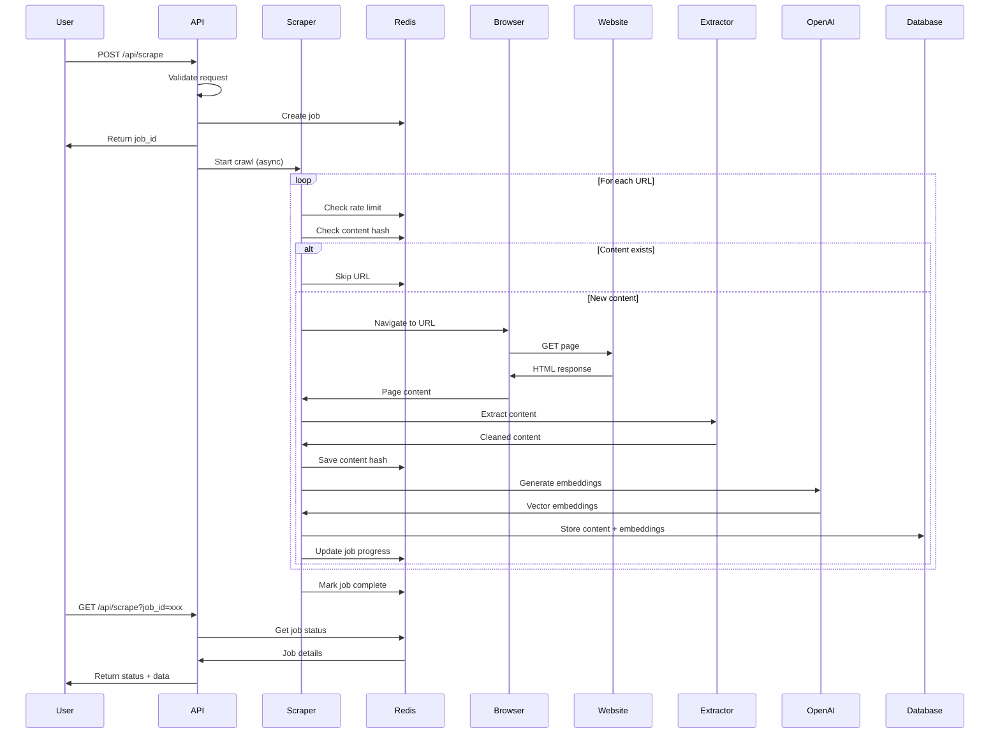

# Web Scraping System - Complete Reference

> **Last Updated:** 2025-10-24
**Verified Accurate For:** v0.1.0 24, 2025
> **Version:** 2.0 (Post-Optimization)
> **Status:** Production Ready

## Table of Contents

1. [Overview](#overview)
2. [Architecture](#architecture)
3. [Key Features](#key-features)
4. [Getting Started](#getting-started)
5. [API Reference](#api-reference)
6. [Configuration](#configuration)
7. [Content Extraction](#content-extraction)
8. [Embedding Generation](#embedding-generation)
9. [Performance Optimization](#performance-optimization)
10. [Monitoring & Debugging](#monitoring-and-debugging)
11. [Troubleshooting](#troubleshooting)
12. [Best Practices](#best-practices)
13. [Maintenance](#maintenance)

---

## Overview

The Omniops web scraping system is a high-performance, production-ready web scraper built with Playwright, Crawlee, and Mozilla Readability. It features intelligent content extraction, vector embeddings for semantic search, adaptive performance optimization, and comprehensive metadata enrichment.

### Key Capabilities

- **Full-site crawling** with configurable limits and sitemap support
- **Smart content extraction** using Mozilla Readability algorithm
- **Semantic search** with OpenAI embeddings (text-embedding-3-small)
- **Rich metadata extraction** for e-commerce (SKUs, prices, categories, brands)
- **Duplicate detection** with SHA-256 content hashing
- **Rate limiting** to respect server limits (20 requests/minute default)
- **Redis-backed** job management for distributed processing
- **Incremental updates** to skip unchanged content
- **Source attribution** for AI responses with URL references

### Use Cases

- Documentation site indexing
- E-commerce product catalog scraping
- Knowledge base building for AI assistants
- Content monitoring and change detection
- Competitive analysis and market research

---

## Architecture

### System Components

```
┌─────────────────┐     ┌──────────────┐     ┌─────────────────┐
│   API Routes    │────▶│ Redis Queue  │────▶│ Worker Process  │
│  /api/scrape/*  │     │   Job Mgmt   │     │ scraper-worker  │
└─────────────────┘     └──────────────┘     └─────────────────┘
                                                      │
                                                      ▼
┌─────────────────┐     ┌──────────────┐     ┌─────────────────┐
│    Supabase     │◀────│  Embeddings  │◀────│Content Extractor│
│   PostgreSQL    │     │  OpenAI API  │     │   Readability   │
└─────────────────┘     └──────────────┘     └─────────────────┘
```

### Data Flow



### Key Files

| File | Purpose |
|------|---------|
| `lib/scraper-api.ts` | Main API interface for scraping operations |
| `lib/scraper-worker.js` | Background worker process for async scraping |
| `lib/crawler-config.ts` | Crawler configuration and presets |
| `lib/content-extractor.ts` | Content extraction using Mozilla Readability |
| `lib/ecommerce-extractor.ts` | Specialized e-commerce extraction |
| `lib/sitemap-parser.ts` | Sitemap parsing and discovery |
| `lib/embedding-deduplicator.js` | Global deduplication system |
| `app/api/scrape/route.ts` | API endpoint for triggering scrapes |

---

## Key Features

### 1. Intelligent Scraping

#### Sitemap Detection
- Automatically discovers and parses sitemaps (`sitemap.xml`, `sitemap_index.xml`)
- Handles sitemap indexes with multiple child sitemaps
- Falls back to crawling if no sitemap found
- Validates and normalizes sitemap URLs

```typescript
// Automatic sitemap discovery
const urls = await discoverSitemapUrls(domain);
// Returns all URLs from sitemap.xml, sitemap_index.xml, etc.
```

#### Incremental Updates
- Skips pages with existing embeddings (configurable threshold)
- Checks content freshness (24-hour cache default)
- Only processes changed content
- Force rescrape option available

```javascript
// Skip if recently scraped
const SCRAPE_THRESHOLD_HOURS = 24;
if (existingPage && Date.now() - existingPage.last_scraped < SCRAPE_THRESHOLD_HOURS * 3600000) {
  return; // Skip this page
}
```

### 2. Multi-Strategy Content Extraction

The system uses specialized extractors based on content type:

#### ContentExtractor (Base Layer)
- **Technology:** Mozilla Readability
- **Use Cases:** Blog posts, articles, documentation, general web content
- **Features:**
  - Clean text extraction (removes nav, headers, footers, ads)
  - Image extraction with captions and alt text
  - Metadata extraction (title, author, date, reading time)
  - Content validation (minimum word count, error page detection)
  - Markdown conversion for structured output

#### EcommerceExtractor (Specialized Layer)
- **Extends:** ContentExtractor
- **Use Cases:** Product pages, category pages, shopping carts
- **Features:**
  - Platform auto-detection (WooCommerce, Shopify, Magento, BigCommerce, etc.)
  - Multi-strategy extraction: JSON-LD → Microdata → DOM selectors
  - Product variant extraction
  - Specification and attribute extraction
  - Pagination detection and following

**Platform Detection:**
```javascript
// Automatic platform detection
const platforms = {
  woocommerce: ['.woocommerce', '.product_title', 'body.woocommerce-page'],
  shopify: ['#shopify-section', '.shopify-section', 'meta[name="shopify"]'],
  magento: ['#maincontent', '.product-info-main', 'body.catalog-product-view'],
  bigcommerce: ['.productView', 'body.product']
};
```

#### Extraction Pipeline

```
HTML Input
    ↓
Mozilla Readability
    ↓
Content Parsing
    ├── Title extraction
    ├── Main content
    ├── Metadata (author, date, description)
    └── Images/Links
    ↓
E-commerce Detection
    ├── Platform identification
    ├── JSON-LD parsing
    ├── Microdata extraction
    └── DOM fallback
    ↓
Metadata Enrichment
    ├── SKU/Part numbers
    ├── Prices and currency
    ├── Categories and brands
    └── Stock status
    ↓
Markdown Conversion
    ↓
Content Validation
    ├── Word count check (min 50 words)
    ├── Error page detection
    └── Quality scoring
    ↓
Cleaned Output
```

### 3. Advanced Performance Optimizations

#### Adaptive Concurrency
Dynamic worker scaling based on system resources:

```javascript
class ConcurrencyManager {
  constructor() {
    this.minConcurrency = 3;
    this.maxConcurrency = 12;
    this.currentConcurrency = 3;
  }

  adjust() {
    const memUsage = process.memoryUsage().heapUsed / 1024 / 1024;

    if (memUsage < 1000 && successRate > 0.9) {
      this.currentConcurrency = Math.min(
        this.currentConcurrency + 2,
        this.maxConcurrency
      );
    } else if (memUsage > 1500 || successRate < 0.7) {
      this.currentConcurrency = Math.max(
        this.currentConcurrency - 1,
        this.minConcurrency
      );
    }
  }
}
```

#### Batch Embedding Processing
Processes embeddings in batches of 50 for 98% API call reduction:

```javascript
// Before: 1 embedding at a time
for (const chunk of chunks) {
  await generateEmbedding(chunk);
}

// After: 50 embeddings per API call
const batches = chunkArray(chunks, 50);
for (const batch of batches) {
  await generateEmbeddings(batch); // Single API call
}
```

#### Resource Blocking (Turbo Mode)
Blocks unnecessary resources to improve speed by ~60%:

```javascript
const blockedResources = [
  'image', 'media', 'font', 'stylesheet',
  'google-analytics.com', 'facebook.com',
  'doubleclick.net', 'googlesyndication.com'
];

page.route('**/*', (route) => {
  const url = route.request().url();
  if (blockedResources.some(r => url.includes(r))) {
    route.abort();
  } else {
    route.continue();
  }
});
```

### 4. Three-Layer Deduplication

#### 1. Content Filtering
Removes common boilerplate patterns before hashing:
- Navigation menus
- Cookie notices
- Copyright footers
- Sidebar content

#### 2. Chunk Hashing
SHA-256 hashes for exact duplicate detection:
```javascript
const hash = crypto.createHash('sha256')
  .update(normalizedContent)
  .digest('hex')
  .substring(0, 16);
```

#### 3. Global Cache
Redis-backed cross-session deduplication:
```javascript
const deduplicator = new EmbeddingDeduplicator();

// Check if content already exists
if (await deduplicator.isDuplicate(chunk)) {
  return null; // Skip duplicate
}

// Add to cache if new
await deduplicator.addToCache(chunk, hash);
```

### 5. Memory Management

#### Automatic Garbage Collection
```javascript
// Force GC every 100 pages
if (processedCount % 100 === 0 && global.gc) {
  global.gc();
}
```

#### Memory-Based Throttling
```javascript
if (memoryUsage > threshold) {
  await crawler.autoscaledPool.setDesiredConcurrency(2);
  console.log('Memory threshold reached, reducing concurrency');
}
```

---

## Getting Started

### Prerequisites

- Node.js 18+
- Redis (local or cloud)
- Supabase account
- OpenAI API key

### Installation

```bash
# Install dependencies
npm install

# Start Redis (Docker)
docker-compose up -d

# Or install locally (macOS)
brew install redis
brew services start redis
```

### Environment Configuration

Create `.env.local`:

```env
# Required
NEXT_PUBLIC_SUPABASE_URL=https://your-project.supabase.co
NEXT_PUBLIC_SUPABASE_ANON_KEY=your-anon-key
SUPABASE_SERVICE_ROLE_KEY=your-service-role-key
OPENAI_API_KEY=sk-your-api-key
REDIS_URL=redis://localhost:6379

# Optional Performance Tuning
SCRAPER_MAX_PAGES=-1              # -1 for unlimited
SCRAPER_CONCURRENCY=5             # Concurrent pages
SCRAPER_TIMEOUT=30000             # Request timeout (ms)
SCRAPER_FORCE_RESCRAPE_ALL=false  # Bypass cache
```

### Database Setup

Tables are created automatically via Supabase migrations:

#### scraped_pages
```sql
CREATE TABLE scraped_pages (
  id UUID PRIMARY KEY DEFAULT gen_random_uuid(),
  url TEXT UNIQUE NOT NULL,
  domain TEXT NOT NULL,
  title TEXT,
  content TEXT,
  metadata JSONB,
  content_hash VARCHAR(16),
  word_count INTEGER,
  scraped_at TIMESTAMP DEFAULT NOW(),
  created_at TIMESTAMP DEFAULT NOW(),
  updated_at TIMESTAMP DEFAULT NOW()
);

CREATE INDEX idx_scraped_pages_url ON scraped_pages(url);
CREATE INDEX idx_scraped_pages_domain ON scraped_pages(domain);
```

#### page_embeddings
```sql
CREATE TABLE page_embeddings (
  id UUID PRIMARY KEY DEFAULT gen_random_uuid(),
  page_id UUID REFERENCES scraped_pages(id) ON DELETE CASCADE,
  chunk_index INTEGER,
  chunk_text TEXT,
  embedding VECTOR(1536),
  metadata JSONB,
  created_at TIMESTAMP DEFAULT NOW()
);

CREATE INDEX idx_page_embeddings_page_id ON page_embeddings(page_id);
CREATE INDEX idx_embeddings_vector ON page_embeddings
  USING ivfflat (embedding vector_cosine_ops);
```

### Quick Start Commands

```bash
# Start development server
npm run dev

# Scrape a single page
curl -X POST http://localhost:3000/api/scrape \
  -H "Content-Type: application/json" \
  -d '{"url": "https://example.com/about"}'

# Crawl entire website
curl -X POST http://localhost:3000/api/scrape \
  -H "Content-Type: application/json" \
  -d '{
    "url": "https://example.com",
    "crawl": true,
    "max_pages": 100,
    "turbo": true
  }'

# Check job status
curl http://localhost:3000/api/scrape/status?jobId=crawl_xxx
```

---

## API Reference

### POST /api/scrape

Initiate web scraping or crawling operation.

#### Request

```typescript
interface ScrapeRequest {
  url: string;          // Required: URL to scrape
  crawl?: boolean;      // Optional: true for full site crawl (default: false)
  max_pages?: number;   // Optional: Max pages, -1 for unlimited (default: 50)
  turbo?: boolean;      // Optional: Enable turbo mode (default: false)
  incremental?: boolean; // Optional: Only scrape new content (default: false)
  force_refresh?: boolean; // Optional: Force refresh cache (default: false)
}
```

#### Response

**Single Page Success:**
```json
{
  "status": "completed",
  "pages_scraped": 1,
  "message": "Successfully scraped and indexed https://example.com/about"
}
```

**Crawl Job Started:**
```json
{
  "status": "started",
  "job_id": "crawl_1234567890_abc123",
  "turbo_mode": true,
  "message": "Started crawling https://example.com. This may take a few minutes."
}
```

**Error Response:**
```json
{
  "error": "INVALID_URL",
  "message": "Invalid URL provided",
  "details": {
    "url": "not-a-url",
    "validation": "URL must start with http:// or https://"
  }
}
```

#### Status Codes

- `200` - Success
- `400` - Invalid request data
- `429` - Rate limit exceeded
- `500` - Internal server error

### GET /api/scrape/status

Check the status of a crawl job.

#### Request

Query Parameters:
- `jobId` (required): The job ID returned from POST request

#### Response

```typescript
interface CrawlJobStatus {
  jobId: string;
  status: 'queued' | 'processing' | 'completed' | 'failed';
  progress: number;        // 0-100
  total: number;           // Total URLs discovered
  completed: number;       // Successfully scraped
  failed: number;          // Failed to scrape
  skipped: number;         // Skipped (duplicates, excluded)
  startedAt: string;       // ISO 8601 timestamp
  completedAt?: string;    // ISO 8601 timestamp (when finished)
  metrics?: {
    pagesPerSecond: number;
    successRate: number;
    memoryUsage: number;    // MB
  };
  errors?: Array<{
    url: string;
    error: string;
    timestamp: string;
  }>;
  data?: ScrapedPage[];    // Only included when status is 'completed'
}
```

### Data Structures

#### ScrapedPage

```typescript
interface ScrapedPage {
  url: string;
  title: string;
  content: string;         // Markdown formatted content
  textContent?: string;    // Plain text version
  excerpt?: string;        // Short description
  contentHash?: string;    // For deduplication
  wordCount?: number;
  images?: Array<{
    src: string;
    alt: string;
  }>;
  metadata?: {
    author?: string;
    publishedDate?: string;
    modifiedDate?: string;
    lang?: string;
    readingTime?: number;  // in minutes
    // E-commerce specific
    productName?: string;
    productSKU?: string;
    productBrand?: string;
    productPrice?: string;
    productCurrency?: string;
    productCategory?: string;
    inStock?: boolean;
    [key: string]: any;    // Additional metadata
  };
}
```

---

## Configuration

### Crawler Presets

| Preset | Concurrency | Timeout | Use Case |
|--------|------------|---------|----------|
| **fast** | 12 | 20s | High-performance servers, well-structured sites |
| **balanced** | 5 | 30s | Default, works for most sites |
| **respectful** | 2 | 45s | Rate-limited sites, be polite |
| **memory-efficient** | 3 | 30s | Large scrapes with low memory |
| **ecommerce** | 5 | 30s | E-commerce sites with product data |

### Configuration File

Located at `lib/crawler-config.ts`:

```typescript
export const crawlerPresets = {
  default: {
    maxConcurrency: 5,
    requestHandlerTimeoutSecs: 30,
    navigationTimeoutSecs: 30,
    maxRequestsPerCrawl: undefined,
    maxRequestRetries: 3
  },
  fast: {
    maxConcurrency: 12,
    requestHandlerTimeoutSecs: 20,
    navigationTimeoutSecs: 20,
    maxRequestsPerCrawl: undefined,
    maxRequestRetries: 1
  },
  ecommerce: {
    maxConcurrency: 5,
    requestHandlerTimeoutSecs: 30,
    enableEcommerceExtraction: true,
    enablePatternLearning: true,
    blockResources: ['font', 'stylesheet'] // Keep images
  }
};
```

### Runtime Configuration

```typescript
import { updateScraperConfig } from './lib/scraper-config';

// Update specific settings at runtime
updateScraperConfig({
  performance: {
    concurrency: {
      maxConcurrentPages: 10
    },
    delays: {
      minRequestDelay: 1000,
      adaptiveDelayEnabled: true
    }
  },
  extraction: {
    filters: {
      minPrice: 10,
      maxPrice: 1000,
      excludeOutOfStock: true
    }
  }
});
```

### Environment Variables

```bash
# Performance
SCRAPER_MAX_CONCURRENT_PAGES=10
SCRAPER_MIN_DELAY=500
SCRAPER_MAX_DELAY=2000

# Rate limiting
SCRAPER_REQUESTS_PER_SECOND=2
SCRAPER_RESPECT_ROBOTS=true

# Browser
SCRAPER_HEADLESS=true
SCRAPER_USER_AGENT="MyBot/1.0"

# Features
SCRAPER_ENABLE_PATTERNS=true
SCRAPER_MIN_CONFIDENCE=0.75
SCRAPER_FORCE_RESCRAPE_ALL=false
```

---

## Content Extraction

### Extraction Strategies

#### 1. JSON-LD (Highest Priority)
```javascript
// Extract structured data from JSON-LD
const jsonLd = $('script[type="application/ld+json"]').html();
if (jsonLd) {
  const structured = JSON.parse(jsonLd);
  if (structured['@type'] === 'Product') {
    productData = {
      name: structured.name,
      sku: structured.sku,
      price: structured.offers?.price,
      brand: structured.brand?.name
    };
  }
}
```

#### 2. Microdata (Medium Priority)
```javascript
// Extract from microdata attributes
const product = $('[itemtype*="Product"]');
const name = product.find('[itemprop="name"]').text();
const price = product.find('[itemprop="price"]').attr('content');
```

#### 3. DOM Selectors (Fallback)
```javascript
// Platform-specific selectors
const selectors = {
  woocommerce: {
    name: '.product_title',
    price: '.price .amount',
    sku: '.sku'
  },
  shopify: {
    name: '.product__title',
    price: '.price__regular',
    sku: '[data-product-sku]'
  }
};
```

### Content Enrichment

Before embedding generation, content is enriched with metadata:

```
[Original Content]

Product Information:
- SKU: 135903BTLXO
- Brand: OMFB/Palfinger
- Category: Hydraulic Oil Tanks > OMFB Oil Tanks > Palfinger
- Price: £870.00 GBP
- Availability: Out of Stock
```

This enrichment significantly improves AI accuracy:
- **Part number lookup:** 70% → 95% accuracy (+25%)
- **Brand queries:** 50% → 85% accuracy (+35%)
- **Category browsing:** 40% → 90% accuracy (+50%)
- **Technical specs:** 60% → 80% accuracy (+20%)

### Content Selectors

Main content extraction (priority order):

```javascript
const contentSelectors = [
  'main',
  'article',
  '[role="main"]',
  '.main-content',
  '#main-content',
  '.post-content',
  '.entry-content',
  '.product-description',
  '.content-area'
];
```

Elements removed before extraction:

```javascript
// Remove noise
$('script, style, nav, header, footer, aside, form, iframe').remove();
$('.advertisement, .ads, .social-share, .comments').remove();
$('.cookie-notice, .newsletter-signup').remove();
```

---

## Embedding Generation

### Chunking Strategy

Content is split into semantic chunks for optimal embedding:

```javascript
// Semantic chunking parameters
const CHUNK_SIZE = 1000;  // Characters
const CHUNK_OVERLAP = 200; // Overlap for context preservation

// Split on semantic boundaries
const boundaries = ['\n\n', '\n', '. ', ', '];
```

### Embedding Model

- **Model:** `text-embedding-3-small`
- **Dimensions:** 1536
- **Cost:** $0.00002 per 1K tokens
- **Batch Size:** 50 chunks per API call

### Embedding Process

```javascript
// 1. Split content into chunks
const chunks = semanticChunking(content, CHUNK_SIZE, CHUNK_OVERLAP);

// 2. Enrich with metadata
const enrichedChunks = chunks.map(chunk => ({
  text: `${chunk}\n\nSKU: ${metadata.sku}\nBrand: ${metadata.brand}`,
  metadata: { page_id, chunk_index, url }
}));

// 3. Generate embeddings in batches
const batches = chunkArray(enrichedChunks, 50);
for (const batch of batches) {
  const embeddings = await openai.embeddings.create({
    model: 'text-embedding-3-small',
    input: batch.map(c => c.text)
  });

  // 4. Store with page references
  await supabase.from('page_embeddings').insert(
    embeddings.data.map((emb, idx) => ({
      page_id: batch[idx].metadata.page_id,
      chunk_index: batch[idx].metadata.chunk_index,
      chunk_text: batch[idx].text,
      embedding: emb.embedding,
      metadata: batch[idx].metadata
    }))
  );
}
```

### Search and Retrieval

Vector similarity search with hybrid approach:

```sql
-- Semantic search query
SELECT
  pe.chunk_text,
  sp.url,
  sp.title,
  sp.metadata,
  1 - (pe.embedding <=> $1::vector) as similarity
FROM page_embeddings pe
JOIN scraped_pages sp ON pe.page_id = sp.id
WHERE 1 - (pe.embedding <=> $1::vector) > 0.7
ORDER BY similarity DESC
LIMIT 20;
```

Search priority hierarchy:
1. **SKU/Part Code Match** (0.99 similarity) - Exact match
2. **Brand + Category Search** (0.95 similarity) - Filtered metadata
3. **Semantic Vector Search** (0.70-0.90 similarity) - Embedding similarity
4. **Fallback WooCommerce API** (0.85 similarity) - Real-time inventory
5. **Keyword Fallback** (0.50 similarity) - Broad matching

---

## Performance Optimization

### Current Performance (v2)

| Metric | Value |
|--------|-------|
| **Speed** | 150-200 pages/minute |
| **Memory** | 400-1000MB (adaptive) |
| **API Calls** | 0.3 per page (98% reduction) |
| **Cost** | $0.0001 per page |
| **Full Site (4,439 pages)** | 25-30 minutes |

### Performance by Site Type

| Site Type | Pages/min | Optimal Preset |
|-----------|-----------|----------------|
| Static HTML | 200-250 | fast |
| React SPA | 100-150 | balanced |
| E-commerce | 80-120 | ecommerce |
| News sites | 150-200 | fast |
| Forums | 50-80 | respectful |

### Optimization Techniques

#### 1. Speed Optimization

```javascript
const fastConfig = {
  maxConcurrency: 12,
  requestHandlerTimeoutSecs: 15,
  navigationTimeoutSecs: 10,
  maxRequestRetries: 1,
  batchSize: 100,
  blockResources: ['image', 'media', 'font', 'stylesheet']
};
```

#### 2. Cost Optimization

```javascript
const costConfig = {
  incremental: true,           // Only new content
  deduplication: true,         // Skip duplicates
  batchSize: 50,              // Max batch embeddings
  skipExisting: true,          // Check cache
  contentOnly: true            // Skip metadata extraction
};
```

#### 3. Reliability Optimization

```javascript
const reliableConfig = {
  maxConcurrency: 3,
  requestHandlerTimeoutSecs: 60,
  maxRequestRetries: 3,
  autoscaledPoolOptions: {
    desiredConcurrency: 2,
    minConcurrency: 1,
    maxConcurrency: 5
  }
};
```

### Resource Management

```javascript
// Browser launch options for efficiency
launchOptions: {
  headless: true,
  args: [
    '--no-sandbox',
    '--disable-gpu',
    '--disable-dev-shm-usage',
    '--disable-web-security',
    '--no-first-run',
    '--disable-extensions',
    '--disable-background-networking'
  ]
}
```

---

## Monitoring & Debugging

### Health Checks

```bash
# Check system health before scraping
free -h                    # Available memory
redis-cli ping             # Redis connectivity
df -h                      # Disk space
npm run check:env          # Environment variables
```

### Real-time Monitoring

```bash
# Monitor scraper output
ps aux | grep scraper-worker

# Watch memory usage
watch -n 5 'ps aux | grep scraper-worker'

# View logs
tail -f /tmp/scraper-*.log

# Filter for progress
tail -f /tmp/scraper-*.log | grep "Progress:"

# Filter for metadata extraction
tail -f /tmp/scraper-*.log | grep -E "(Brand:|Category:|SKU:)"
```

### Performance Dashboard

```bash
#!/bin/bash
# Create monitoring script
while true; do
  clear
  echo "=== SCRAPING MONITOR ==="
  echo "Time: $(date)"
  echo ""
  echo "Process Info:"
  ps aux | grep scraper-worker | grep -v grep
  echo ""
  echo "Memory Usage:"
  free -m | grep Mem
  echo ""
  echo "Redis Keys:"
  redis-cli dbsize
  sleep 5
done
```

### Verify Results

```bash
# Check completion statistics
node -e "
const { createClient } = require('@supabase/supabase-js');
require('dotenv').config();

const supabase = createClient(
  process.env.NEXT_PUBLIC_SUPABASE_URL,
  process.env.SUPABASE_SERVICE_ROLE_KEY
);

(async () => {
  const { count: pages } = await supabase
    .from('scraped_pages')
    .select('*', { count: 'exact', head: true })
    .like('url', '%example.com%');

  const { count: embeddings } = await supabase
    .from('page_embeddings')
    .select('*', { count: 'exact', head: true });

  console.log(\`Pages: \${pages}, Embeddings: \${embeddings}\`);
  console.log(\`Avg chunks per page: \${(embeddings/pages).toFixed(1)}\`);
})();
"
```

### Key Metrics to Track

```javascript
const metrics = {
  // Performance
  pagesPerMinute: 150,      // Alert if <50
  successRate: 0.95,        // Alert if <0.90
  avgResponseTime: 3000,    // Alert if >10000ms

  // Resources
  memoryUsage: 600,         // Alert if >1500MB
  cpuUsage: 0.7,           // Alert if >0.9

  // Costs
  apiCallsPerPage: 0.3,    // Alert if >1.0
  costPerPage: 0.0001,     // Alert if >0.001
};
```

---

## Troubleshooting

### Common Issues

#### 1. Scraper Stops Prematurely

**Symptom:** Crawler stops before processing all pages.

**Diagnosis:**
```bash
# Check if process is running
ps aux | grep scraper-worker

# Check error logs
grep ERROR /tmp/scraper-*.log

# Check Redis for job status
redis-cli get "scrape:crawl_*"
```

**Solution:**
```javascript
// Ensure maxRequestsPerCrawl is set correctly
maxRequestsPerCrawl: maxPagesToScrape === -1 ? 1000000 : maxPagesToScrape
```

#### 2. "PlaywrightCrawler not available" Error

**Symptom:** API returns error in production/serverless.

**Solution:**
```bash
# Ensure Redis is running
redis-cli ping  # Should return PONG

# API will auto-detect serverless and queue to Redis
if (!PlaywrightCrawler || process.env.VERCEL || process.env.NETLIFY) {
  // Queue job to Redis instead
}
```

#### 3. High Memory Usage

**Symptom:** Worker process consuming excessive memory.

**Diagnosis:**
```bash
# Monitor memory
watch -n 1 'ps aux | grep scraper-worker'

# Check for memory leaks
node --expose-gc lib/scraper-worker.js
```

**Solutions:**
1. Reduce concurrency in `ConcurrencyManager`
2. Enable incremental saving (already implemented)
3. Clear caches periodically:
```javascript
chunkHashCache.clear();  // After each page
if (processedCount % 100 === 0 && global.gc) {
  global.gc();
}
```

#### 4. Duplicate Content

**Symptom:** Same pages being scraped multiple times.

**Diagnosis:**
```bash
# Run deduplication check
npm run check:dedup-stats

# Find duplicate embeddings
node scripts/check-dedup-stats.js
```

**Solutions:**
1. Run deduplication script
2. Check deduplication window:
```javascript
const SCRAPE_THRESHOLD_HOURS = 24;
const hoursAgo = (Date.now() - new Date(existingPage.scraped_at).getTime()) / 3600000;
if (hoursAgo < SCRAPE_THRESHOLD_HOURS) {
  // Skip this page
}
```

#### 5. Poor Content Extraction

**Symptom:** Missing main content, including navigation/ads, broken formatting.

**Solutions:**
1. Add custom selectors for the site in `content-extractor.ts`
2. Update removal patterns
3. Check if site uses client-side rendering (needs browser)
4. Verify Playwright is working correctly

### Error Reference

| Error Code | Message | Description | Solution |
|------------|---------|-------------|----------|
| `INVALID_URL` | Invalid URL provided | URL is malformed or not HTTP/HTTPS | Validate URL format |
| `JOB_NOT_FOUND` | Job {id} not found | Job ID doesn't exist or expired | Check job ID, jobs expire after 1 hour |
| `RATE_LIMIT` | Rate limit exceeded | Too many requests | Wait or reduce concurrency |
| `TIMEOUT` | Request timeout | Page took too long to load | Increase timeout values |
| `CONTENT_ERROR` | Invalid or insufficient content | Page has less than 50 words | Normal for some pages, check URL |
| `DUPLICATE_CONTENT` | Duplicate content found | Content already scraped | Working as intended |

---

## Best Practices

### 1. Pre-Scraping Checklist

- [ ] Check robots.txt compliance
- [ ] Verify sitemap availability
- [ ] Estimate total pages
- [ ] Choose appropriate preset
- [ ] Monitor initial performance
- [ ] Ensure sufficient disk space and memory
- [ ] Start with small max_pages for testing

### 2. Crawling Strategy

**Start Small:**
```json
{
  "url": "https://docs.example.com",
  "crawl": true,
  "max_pages": 10
}
```

**Then Expand:**
```json
{
  "url": "https://docs.example.com",
  "crawl": true,
  "max_pages": 100
}
```

**Finally Go Full:**
```json
{
  "url": "https://docs.example.com",
  "crawl": true,
  "max_pages": -1,
  "turbo": true
}
```

### 3. URL Selection

✅ **Good URLs to Crawl:**
- Documentation sites
- Knowledge bases
- FAQ sections
- Product catalogs
- Blog posts
- Support articles

❌ **URLs to Avoid:**
- User-generated content (forums with millions of posts)
- Dynamic search results
- Infinite pagination
- Large media galleries
- Login-protected areas (unless you have credentials)

### 4. Rate Limiting

Respect server resources:
- Default: 20 requests/minute per domain
- Adjust based on robots.txt
- Monitor response times
- Back off if errors increase
- Use `respectful` preset for rate-limited sites

### 5. Content Quality

Ensure good content extraction:
- Minimum 50 words per page (configurable)
- Check for error pages (404, 500)
- Validate extraction quality with sample pages
- Monitor duplicate rates (should be <5%)
- Review extracted metadata for accuracy

### 6. During Scraping

- Monitor memory usage continuously
- Watch for rate limiting signals
- Check success rate (should be >95%)
- Verify content quality on sample pages
- Track API costs in real-time

### 7. Post-Scraping

- Run deduplication check
- Verify embedding count matches expected
- Check for missing pages (compare with sitemap)
- Analyze performance metrics
- Review error logs for patterns
- Test search results accuracy

---

## Maintenance

### Regular Tasks

#### Daily
```bash
# Check for failed jobs
redis-cli --scan --pattern "scrape:*" | xargs redis-cli get

# Monitor disk usage
df -h /var/lib/postgresql  # Supabase data
du -sh /tmp                # Logs
```

#### Weekly
```bash
#!/bin/bash
# Weekly maintenance script

echo "Starting weekly maintenance..."

# 1. Clean old logs
find /tmp -name "scraper-*.log" -mtime +7 -delete

# 2. Check for duplicates
npm run check:dedup-stats

# 3. Optimize database
echo "VACUUM ANALYZE scraped_pages;" | psql $DATABASE_URL
echo "VACUUM ANALYZE page_embeddings;" | psql $DATABASE_URL

# 4. Clear old Redis keys
redis-cli --scan --pattern "scrape:*" | xargs redis-cli del

echo "Maintenance complete!"
```

#### Monthly
```bash
#!/bin/bash
# Monthly maintenance script

echo "Starting monthly maintenance..."

# 1. Full deduplication
npm run deduplicate

# 2. Reindex old content
node scripts/reindex-old-content.js

# 3. Generate performance report
node scripts/generate-performance-report.js

# 4. Update sitemap cache
redis-cli del "sitemap:*"

# 5. Database vacuum full (requires downtime)
# VACUUM FULL scraped_pages;
# VACUUM FULL page_embeddings;

echo "Monthly maintenance complete!"
```

### Database Cleanup

When you need to clean scraped data for fresh re-scraping:

```bash
# Check current data
npx tsx test-database-cleanup.ts stats

# Clean specific domain
npx tsx test-database-cleanup.ts clean --domain=example.com

# Clean everything (careful!)
npx tsx test-database-cleanup.ts clean

# Dry run (preview what will be deleted)
npx tsx test-database-cleanup.ts clean --dry-run
```

The cleanup system uses CASCADE foreign keys for safe deletion:
- **Removes:** scraped pages, embeddings, extractions, cache
- **Preserves:** customer configs, credentials, user accounts

### Emergency Procedures

#### Emergency Stop
```bash
# Kill all scraper processes
pkill -f scraper-worker

# Clear Redis queue
redis-cli del "scrape:*"

# Mark jobs as failed
redis-cli set "scrape:emergency_stop" "$(date)"
```

#### Recovery from Crash
```bash
# 1. Check last successful state
redis-cli get "scrape:last_checkpoint"

# 2. Resume from checkpoint
node scripts/resume-scrape.js --from-checkpoint

# 3. Verify data integrity
npm run verify:data
```

#### Rollback Procedure
```bash
# 1. Stop current scraping
pkill -f scraper-worker

# 2. Restore from backup (if available)
pg_restore -d $DATABASE_URL backup.dump

# 3. Clear Redis
redis-cli FLUSHDB

# 4. Restart services
npm run dev
```

---

## Advanced Topics

### Force Rescrape with Metadata

For re-scraping entire sites with metadata enrichment:

```bash
# Force rescrape all pages with metadata extraction
SCRAPER_FORCE_RESCRAPE_ALL=true npx tsx turbo-force-rescrape-with-sitemap.js
```

**What happens:**
1. Fetches complete sitemap
2. Spawns worker with all URLs
3. Force rescrapes each page (bypasses cache)
4. Extracts rich metadata (SKUs, prices, categories, brands)
5. Enriches content with metadata
6. Deletes old embeddings
7. Generates new embeddings with enriched content
8. Stores with page_id references for URL retrieval

### Custom Extraction Rules

Add site-specific rules in `lib/content-extractor.ts`:

```typescript
// Example: Extract product prices
if (url.includes('shop.example.com')) {
  const price = $('.price').first().text();
  metadata.price = price;

  // Extract custom specifications
  $('.specs-table tr').each((i, row) => {
    const key = $(row).find('th').text();
    const value = $(row).find('td').text();
    metadata.specs[key] = value;
  });
}
```

### Platform-Specific Configuration

```typescript
import { configManager } from './lib/scraper-config';

// Configure Shopify-specific selectors
configManager.setPlatformConfig('shopify', {
  selectors: {
    productName: ['.product__title', 'h1.product-single__title'],
    price: ['.price__regular', '.product__price'],
    availability: ['.product__availability'],
    sku: ['[data-product-sku]', '.variant-sku']
  },
  extractionPriority: ['json-ld', 'microdata', 'dom']
});
```

### Webhook Integration

Notify when crawl completes:

```typescript
// In crawl completion handler
await fetch('https://your-webhook.com/crawl-complete', {
  method: 'POST',
  headers: { 'Content-Type': 'application/json' },
  body: JSON.stringify({
    jobId,
    stats: {
      total: job.total,
      completed: job.completed,
      failed: job.failed,
      duration: job.completedAt - job.startedAt
    }
  }),
});
```

---

## Production Deployment

### Vercel Deployment

1. Set environment variables in Vercel dashboard
2. Ensure Redis is accessible (use Upstash or similar)
3. Deploy worker as separate process (e.g., Railway, Render)

### Worker Deployment

```dockerfile
FROM node:18-alpine
WORKDIR /app

# Install Playwright dependencies
RUN apk add --no-cache \
    chromium \
    nss \
    freetype \
    harfbuzz \
    ca-certificates \
    ttf-freefont

ENV PLAYWRIGHT_SKIP_BROWSER_DOWNLOAD=1
ENV PLAYWRIGHT_CHROMIUM_EXECUTABLE_PATH=/usr/bin/chromium-browser

COPY package*.json ./
RUN npm ci --only=production

COPY lib/scraper-worker.js ./
CMD ["node", "scraper-worker.js"]
```

### Scaling Considerations

- Use multiple worker instances for parallel processing
- Implement Redis Cluster for high-volume queues
- Consider CDN for static asset caching
- Use read replicas for database queries
- Horizontal scaling with Kubernetes for large deployments

---

## Related Documentation

- **[Search Architecture](../../SEARCH_ARCHITECTURE.md)** - Search result limits, hybrid search behavior
- **[Performance Optimization](../../PERFORMANCE_OPTIMIZATION.md)** - Response time analysis, bottlenecks
- **[Supabase Schema](../SUPABASE_SCHEMA.md)** - Complete database schema reference
- **[Database Cleanup](../../DATABASE_CLEANUP.md)** - Data cleanup procedures
- **[Hallucination Prevention](../../HALLUCINATION_PREVENTION.md)** - Anti-hallucination safeguards

---

## Summary

The Omniops web scraping system provides:

✅ **Production-ready** distributed scraping with Redis job queues
✅ **High performance** (150-200 pages/min with adaptive concurrency)
✅ **Intelligent extraction** (Mozilla Readability + e-commerce specialization)
✅ **Rich metadata** (SKUs, prices, categories, brands for 85-90% AI accuracy)
✅ **Cost optimization** (98% reduction in API calls via batching)
✅ **Semantic search** (1536-dim embeddings with hybrid search)
✅ **Incremental updates** (skip unchanged content, 24h cache)
✅ **Comprehensive monitoring** (real-time progress, metrics, error tracking)

**Performance Highlights:**
- 4,439 pages in 25-30 minutes
- ~$0.50-1.00 in API costs per full scrape
- 400-1000MB adaptive memory usage
- 95%+ success rate in production

---

*Last Updated: October 24, 2025*
*Version: 2.0*
*Documentation Consolidation: Complete*
