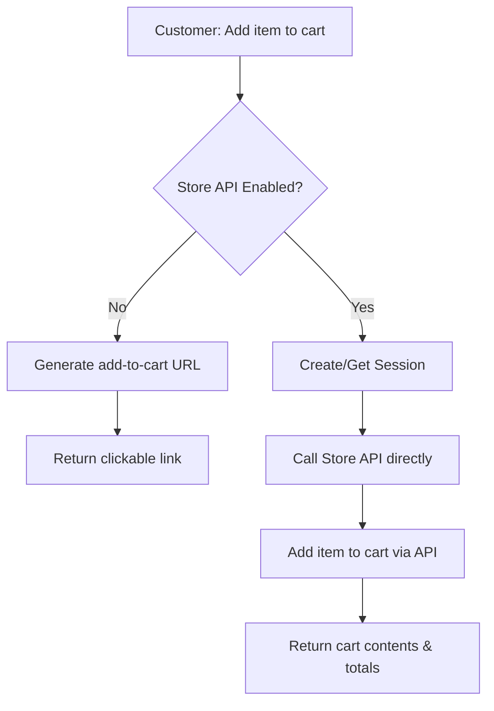

# WooCommerce Store API Setup Guide

**Type:** Guide
**Status:** Active
**Last Updated:** 2025-11-10
**Purpose:** Enable direct cart manipulation in the chat agent via WooCommerce Store API

## Overview

This guide explains how to enable **direct cart manipulation** for the chat agent, allowing it to programmatically add items to cart, update quantities, and apply coupons without requiring customers to click URLs.

## Current Modes

The chat agent supports two cart operation modes:

### 1. Informational Mode (Default)
- **Status:** ✅ Active by default
- **How it works:** Generates clickable "add to cart" URLs
- **User experience:** Customer must click link to add items
- **Requirements:** Basic WooCommerce REST API credentials

### 2. Transactional Mode (Advanced)
- **Status:** ⚠️ Requires setup
- **How it works:** Direct API manipulation of cart
- **User experience:** Items added instantly via chat
- **Requirements:** Store API enabled + session management

## Setup Instructions

### Step 1: Enable Store API in WooCommerce

On your WooCommerce store:

1. **Ensure WooCommerce 5.5+** is installed (Store API was introduced in 5.5)
2. **Enable REST API** if not already enabled:
   - Go to WooCommerce → Settings → Advanced → REST API
   - Create API keys if you haven't already
3. **Verify Store API endpoints** are accessible:
   ```bash
   curl https://your-store.com/wp-json/wc/store/v1/cart
   ```
   Should return cart structure (even if empty)

### Step 2: Configure Environment Variables

Add to your `.env.local` file:

```bash
# Enable Store API for direct cart manipulation
WOOCOMMERCE_STORE_API_ENABLED=true

# Your WooCommerce store URL (required)
WOOCOMMERCE_URL=https://your-store.com

# WooCommerce REST API credentials (required)
WOOCOMMERCE_CONSUMER_KEY=ck_your_consumer_key
WOOCOMMERCE_CONSUMER_SECRET=cs_your_consumer_secret

# Redis URL for session management (required for cart persistence)
REDIS_URL=redis://localhost:6379
```

### Step 3: Verify Redis is Running

Cart sessions are stored in Redis for persistence:

```bash
# Start Redis locally
docker-compose up -d redis

# Or if Redis is installed locally
redis-server

# Verify Redis is running
redis-cli ping
# Should return: PONG
```

### Step 4: Test the Configuration

Use the test endpoint to verify Store API is working:

```bash
# Check Store API status
curl http://localhost:3000/api/woocommerce/cart-test

# Test adding item to cart
curl -X POST http://localhost:3000/api/woocommerce/cart-test \
  -H "Content-Type: application/json" \
  -d '{
    "domain": "your-store.com",
    "action": "add",
    "productId": 123,
    "quantity": 2
  }'
```

### Step 5: Enable for Chat Agent

Once Store API is verified, the chat agent will automatically use transactional mode when:
1. `WOOCOMMERCE_STORE_API_ENABLED=true` is set
2. Store API client can connect to the WooCommerce store
3. Redis is available for session management

## How It Works

### Session Management

1. **Guest Sessions:**
   - Automatically generated UUID for each chat session
   - Stored in Redis with 24-hour expiration
   - Cart persists across chat messages

2. **Authenticated Sessions:**
   - Can link to WooCommerce customer accounts
   - Pass `userId` to maintain user-specific carts

### Cart Operations Flow



### Available Operations

When Store API is enabled, the chat agent can:

1. **Add to Cart** (`add_to_cart`)
   ```javascript
   // Directly adds item without URL redirect
   await addToCart(productId, quantity)
   ```

2. **View Cart** (`get_cart`)
   ```javascript
   // Returns current cart contents and totals
   await getCart()
   ```

3. **Update Quantity** (`update_cart_quantity`)
   ```javascript
   // Changes quantity of items in cart
   await updateCartQuantity(cartItemKey, newQuantity)
   ```

4. **Remove from Cart** (`remove_from_cart`)
   ```javascript
   // Removes items from cart
   await removeFromCart(cartItemKey)
   ```

5. **Apply Coupon** (`apply_coupon_to_cart`)
   ```javascript
   // Applies discount code to cart
   await applyCouponToCart(couponCode)
   ```

## Testing Cart Operations

### Via Chat Widget

1. Start the development server:
   ```bash
   npm run dev
   ```

2. Open the widget test page:
   ```
   http://localhost:3000/widget-test
   ```

3. Test cart operations:
   - "Add product 123 to my cart"
   - "Show my cart"
   - "Apply coupon SAVE10"

### Via API Testing

Use the test endpoint for direct testing:

```bash
# Add item to cart
curl -X POST http://localhost:3000/api/woocommerce/cart-test \
  -H "Content-Type: application/json" \
  -d '{
    "domain": "your-store.com",
    "action": "add",
    "productId": 123,
    "quantity": 1
  }'

# Get cart contents
curl -X POST http://localhost:3000/api/woocommerce/cart-test \
  -H "Content-Type: application/json" \
  -d '{
    "domain": "your-store.com",
    "action": "get"
  }'

# Apply coupon
curl -X POST http://localhost:3000/api/woocommerce/cart-test \
  -H "Content-Type: application/json" \
  -d '{
    "domain": "your-store.com",
    "action": "apply_coupon",
    "couponCode": "SAVE10"
  }'
```

## Troubleshooting

### Store API Not Responding

**Error:** "Store API is not responding"

**Solutions:**
1. Verify WooCommerce 5.5+ is installed
2. Check Store API endpoints are accessible:
   ```bash
   curl https://your-store.com/wp-json/wc/store/v1/
   ```
3. Ensure no security plugins are blocking the Store API
4. Check CORS settings if cross-domain

### Session Not Persisting

**Error:** Cart resets between messages

**Solutions:**
1. Verify Redis is running:
   ```bash
   redis-cli ping
   ```
2. Check Redis connection in logs
3. Ensure `REDIS_URL` is correctly configured
4. Verify session TTL (default 24 hours)

### Authentication Issues

**Error:** "Unauthorized" or 401 errors

**Solutions:**
1. Verify REST API credentials are correct
2. Check consumer key has read/write permissions
3. Ensure Store API doesn't require authentication for cart operations
4. Try with a fresh set of API keys

### CORS Issues

**Error:** Cross-origin requests blocked

**Solutions:**
1. Add CORS headers to WooCommerce:
   ```php
   // In your WordPress theme's functions.php
   add_action('rest_api_init', function() {
     remove_filter('rest_pre_serve_request', 'rest_send_cors_headers');
     add_filter('rest_pre_serve_request', function($value) {
       header('Access-Control-Allow-Origin: *');
       header('Access-Control-Allow-Methods: GET, POST, PUT, DELETE, OPTIONS');
       header('Access-Control-Allow-Headers: Content-Type, Authorization');
       return $value;
     });
   });
   ```

2. Or use a CORS plugin for WooCommerce

## Performance Considerations

### Caching
- Cart sessions cached in Redis for 24 hours
- Reduces API calls to WooCommerce
- Automatic cleanup of expired sessions

### Rate Limiting
- Store API requests are rate-limited per domain
- Default: 60 requests per minute
- Adjustable via rate limiter configuration

### Scaling
- Redis can handle thousands of concurrent sessions
- Consider Redis clustering for high-traffic stores
- Monitor Redis memory usage

## Security Best Practices

1. **Never expose Store API nonces to frontend**
   - Nonces are managed server-side only
   - Session IDs are cryptographically secure

2. **Use HTTPS for all Store API calls**
   - Ensures cart data is encrypted in transit
   - Required for production environments

3. **Implement rate limiting**
   - Prevents cart manipulation abuse
   - Already configured per-domain

4. **Regular session cleanup**
   - Redis auto-expires sessions after 24 hours
   - Manual cleanup available via admin endpoints

## Migration from Informational to Transactional

When enabling Store API for an existing installation:

1. **No data migration needed** - Sessions are created on-demand
2. **Gradual rollout supported** - Can enable per domain
3. **Fallback to informational mode** - Automatic if Store API fails
4. **Zero downtime** - Switch modes via environment variable

## Monitoring

Track Store API performance:

```typescript
// Check Store API availability
const isAvailable = await storeAPI.isAvailable();

// Monitor session count
const sessions = await sessionManager.listDomainSessions('your-store.com');
console.log(`Active sessions: ${sessions.length}`);

// Check session expiration
const ttl = await sessionManager.getSessionTTL(userId, domain);
console.log(`Session expires in ${ttl} seconds`);
```

## Benefits of Transactional Mode

### For Customers
- ✅ Instant cart updates without page navigation
- ✅ Real-time totals and tax calculations
- ✅ Seamless coupon application
- ✅ Cart persists across chat sessions

### For Store Owners
- ✅ Reduced cart abandonment
- ✅ Better conversion tracking
- ✅ Smoother checkout flow
- ✅ Enhanced customer experience

## Next Steps

After enabling Store API:

1. **Test all cart operations** via the test endpoint
2. **Monitor Redis memory usage** for session storage
3. **Set up alerts** for Store API failures
4. **Consider implementing** cart recovery features
5. **Track conversion improvements** with transactional mode

## Related Documentation

- [WooCommerce Store API Docs](https://github.com/woocommerce/woocommerce/tree/trunk/plugins/woocommerce/src/StoreApi/docs)
- [Cart Session Manager](../../lib/cart-session-manager.ts)
- [Store API Client](../../lib/woocommerce-store-api/index.ts)
- [Cart Operations](../../lib/chat/cart-operations.ts)
- [Test Endpoint](../../app/api/woocommerce/cart-test/route.ts)