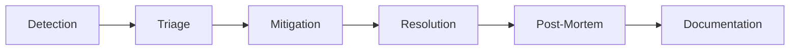

# Operations Documentation

**Type:** Documentation Index
**Status:** Active
**Last Updated:** 2025-11-18
**Purpose:** Central hub for all operational runbooks, guides, and procedures

## Directory Overview

This directory contains critical operational documentation for running, maintaining, and recovering the Omniops platform. All documents are designed to be actionable with specific commands and procedures.

## 📚 Document Index

### 🚨 Emergency Runbooks

| Document | Purpose | When to Use | Priority |
|----------|---------|-------------|----------|
| [RUNBOOK_ROLLBACK_PROCEDURES.md](./RUNBOOK_ROLLBACK_PROCEDURES.md) | Step-by-step rollback procedures | Service outages, failed deployments | **CRITICAL** |
| [RUNBOOK_DISASTER_RECOVERY.md](./RUNBOOK_DISASTER_RECOVERY.md) | Complete disaster recovery procedures | Major incidents, data loss | **CRITICAL** |
| [RUNBOOK_BACKUP_STRATEGY.md](./RUNBOOK_BACKUP_STRATEGY.md) | Backup procedures and verification | Regular backups, recovery testing | **HIGH** |

### 📈 Planning & Optimization

| Document | Purpose | Frequency | Owner |
|----------|---------|-----------|-------|
| [GUIDE_CAPACITY_PLANNING.md](./GUIDE_CAPACITY_PLANNING.md) | Capacity planning and scaling | Monthly review | DevOps |

## Quick Reference

### Emergency Contacts

| Role | Primary Contact | Backup Contact | Escalation |
|------|-----------------|----------------|------------|
| On-Call Engineer | PagerDuty | Rotation list | Automatic |
| Database Admin | DBA Team | Supabase Support | +15 min |
| Security | Security Team | CISO | Immediate |
| Infrastructure | DevOps Lead | CTO | +30 min |

### Critical Commands

```bash
# Emergency rollback (Docker)
./scripts/operations/emergency-rollback.sh

# Database backup (immediate)
./scripts/backup/backup-database.sh

# Health check all services
./scripts/monitoring/health-check-all.sh

# Disaster recovery initiation
./scripts/disaster-recovery/initiate-dr.sh
```

### System URLs

| Service | Production | Staging | Monitoring |
|---------|------------|---------|------------|
| **Application** | https://omniops.co.uk | https://staging.omniops.co.uk | [Status](https://status.omniops.co.uk) |
| **API** | https://api.omniops.co.uk | https://api-staging.omniops.co.uk | [Metrics](https://metrics.omniops.co.uk) |
| **Supabase** | [Dashboard](https://app.supabase.com/project/birugqyuqhiahxvxeyqg) | [Staging](https://app.supabase.com/project/staging-ref) | [Status](https://status.supabase.com) |
| **Vercel** | [Dashboard](https://vercel.com/team/omniops) | [Staging](https://vercel.com/team/omniops-staging) | [Status](https://www.vercel-status.com) |

## Operational Procedures

### Daily Operations

- [ ] Check system health dashboard
- [ ] Review overnight alerts
- [ ] Verify backup completion
- [ ] Check error rates
- [ ] Review resource utilization

### Weekly Operations

- [ ] Test backup restoration
- [ ] Review capacity metrics
- [ ] Update security patches
- [ ] Clean up old logs
- [ ] Review cost optimization

### Monthly Operations

- [ ] Full disaster recovery test
- [ ] Capacity planning review
- [ ] Security audit
- [ ] Performance benchmarking
- [ ] Documentation updates

## Runbook Standards

All runbooks in this directory follow these standards:

### Document Structure

```markdown
# Title

**Type:** Runbook
**Status:** Active
**Last Updated:** YYYY-MM-DD
**Criticality:** CRITICAL/HIGH/MEDIUM/LOW

## Purpose
[Brief description]

## When to Use
[Specific triggers]

## Procedure
[Step-by-step with exact commands]

## Verification
[How to verify success]

## Rollback
[If applicable]
```

### Required Elements

1. **Actionable Steps** - Exact commands to run
2. **Decision Points** - Clear if/then logic
3. **Verification** - How to confirm success
4. **Time Estimates** - Expected duration
5. **Escalation Path** - Who to contact if stuck

## Automation Scripts

Key automation scripts for operations:

```bash
# Backup automation
/scripts/backup/
├── backup-database.sh       # Database backup
├── backup-redis.sh          # Redis backup
├── backup-env.sh            # Environment backup
└── verify-backups.ts        # Backup verification

# Disaster recovery
/scripts/disaster-recovery/
├── auto-failover.ts         # Automatic failover
├── verify-restoration.sh    # Restoration verification
├── quarterly-dr-test.sh     # DR testing
└── recovery-data.ts         # Data recovery

# Monitoring
/scripts/monitoring/
├── capacity-dashboard.ts    # Capacity monitoring
├── backup-monitor.ts        # Backup health
├── health-check-all.sh      # System health
└── check-performance.ts     # Performance metrics
```

## Incident Response

### Incident Severity Levels

| Level | Response Time | Team Required | Examples |
|-------|--------------|---------------|----------|
| **SEV-1** | <5 min | All hands | Complete outage, data loss |
| **SEV-2** | <15 min | On-call + backup | Partial outage, degraded performance |
| **SEV-3** | <1 hour | On-call | Feature unavailable, slow response |
| **SEV-4** | <4 hours | Normal hours | Minor issues, cosmetic bugs |

### Incident Workflow



## Recovery Targets

### RTO (Recovery Time Objective)

| Scenario | Target | Actual | Method |
|----------|--------|--------|--------|
| Service restart | 5 min | 3 min | Docker |
| Rollback | 15 min | 10 min | Git + Docker |
| Database restore | 30 min | 25 min | Backup |
| Full DR | 2 hours | 1.5 hours | Complete recovery |

### RPO (Recovery Point Objective)

| Data Type | Target | Actual | Method |
|-----------|--------|--------|--------|
| Database | 1 hour | 1 hour | Hourly backup |
| User uploads | Real-time | Real-time | S3 replication |
| Logs | 1 hour | Real-time | Streaming |

## Maintenance Windows

### Scheduled Maintenance

| Type | Window | Frequency | Duration |
|------|--------|-----------|----------|
| **Database** | Sun 04:00-05:00 UTC | Weekly | 1 hour |
| **Application** | Tue/Thu 03:00 UTC | As needed | 30 min |
| **Infrastructure** | 1st Sun 02:00 UTC | Monthly | 2 hours |

### Maintenance Procedures

1. **Pre-Maintenance**
   - Send notification 48 hours prior
   - Prepare rollback plan
   - Test in staging

2. **During Maintenance**
   - Enable maintenance mode
   - Execute changes
   - Monitor closely

3. **Post-Maintenance**
   - Verify functionality
   - Remove maintenance mode
   - Send completion notice

## Cost Management

### Monthly Cost Breakdown

| Service | Budget | Alert @ | Action @ |
|---------|--------|---------|----------|
| Supabase | $600 | $500 | $550 |
| Vercel | $100 | $80 | $90 |
| Redis | $120 | $100 | $110 |
| OpenAI | $2000 | $1800 | $1900 |
| AWS | $200 | $150 | $175 |

### Cost Optimization Checklist

- [ ] Review unused resources
- [ ] Optimize database queries
- [ ] Enable caching where possible
- [ ] Use spot instances for non-critical
- [ ] Archive old data to cold storage
- [ ] Review rate limiting settings

## Documentation Maintenance

### Review Schedule

- **Weekly:** Update operational metrics
- **Monthly:** Review and update procedures
- **Quarterly:** Full documentation audit
- **Annually:** Complete rewrite/restructure

### Contributing

To add or update operational documentation:

1. Follow the runbook template
2. Include specific commands
3. Test all procedures
4. Get review from team lead
5. Update this README index

## Related Documentation

- [Docker Production Setup](../00-GETTING-STARTED/SETUP_DOCKER_PRODUCTION.md)
- [Staging Environment](../00-GETTING-STARTED/SETUP_STAGING_ENVIRONMENT.md)
- [Database Schema](../09-REFERENCE/REFERENCE_DATABASE_SCHEMA.md)
- [Performance Optimization](../09-REFERENCE/REFERENCE_PERFORMANCE_OPTIMIZATION.md)
- [Kubernetes Deployment](../../k8s/README.md)
- [Terraform Infrastructure](../../terraform/README.md)

## Tools & Resources

### Monitoring Dashboards
- [Grafana](https://grafana.omniops.co.uk)
- [CloudWatch](https://console.aws.amazon.com/cloudwatch)
- [Vercel Analytics](https://vercel.com/team/omniops/analytics)
- [Supabase Metrics](https://app.supabase.com/project/birugqyuqhiahxvxeyqg/reports)

### External Resources
- [Supabase Documentation](https://supabase.com/docs)
- [Vercel Documentation](https://vercel.com/docs)
- [Docker Documentation](https://docs.docker.com)
- [Kubernetes Documentation](https://kubernetes.io/docs)

## Emergency Procedures Card

**Keep this information readily accessible:**

```
🚨 EMERGENCY PROCEDURES 🚨

COMPLETE OUTAGE:
1. ./scripts/operations/emergency-rollback.sh
2. Check https://status.omniops.co.uk
3. Page on-call engineer

DATABASE CORRUPTION:
1. Stop all services: docker-compose down
2. ./scripts/disaster-recovery/data-recovery.sh
3. Escalate to DBA team

SECURITY BREACH:
1. Revoke all tokens: ./scripts/security/revoke-all.sh
2. Enable lockdown: ./scripts/security/lockdown.sh
3. Call security team immediately

HIGH LOAD/DDOS:
1. Enable Cloudflare Under Attack mode
2. Scale up: ./scripts/operations/emergency-scale.sh
3. Monitor: ./scripts/monitoring/watch-load.sh
```

---

**Remember:** In any incident, clear communication is as important as technical resolution. Keep stakeholders informed!