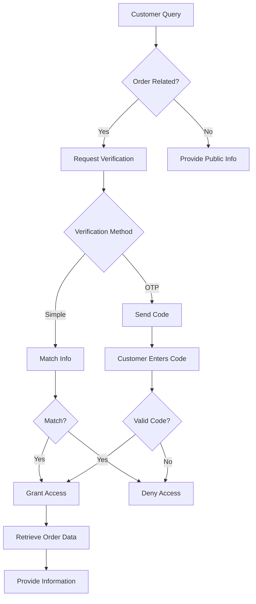

# WooCommerce Integration Guide

**Type:** Guide
**Status:** Active
**Last Updated:** 2025-11-18
**Verified For:** v0.1.0
**Dependencies:** [Commerce MCP Tools](/home/user/Omniops/servers/commerce/README.md), [Database Schema](/home/user/Omniops/docs/09-REFERENCE/REFERENCE_DATABASE_SCHEMA.md)
**Estimated Read Time:** 90 minutes

## Table of Contents

1. [Overview](#overview)
2. [Architecture](#architecture)
3. [Setup and Configuration](#setup-and-configuration)
4. [Integration Methods](#integration-methods)
5. [API Reference](#api-reference)
6. [Customer Verification](#customer-verification)
7. [Cart Tracking](#cart-tracking)
8. [Abandoned Carts](#abandoned-carts)
9. [Security and Privacy](#security-and-privacy)
10. [Testing](#testing)
11. [Troubleshooting](#troubleshooting)
12. [Performance Optimization](#performance-optimization)
13. [Code Examples](#code-examples)

---

## Purpose

Complete WooCommerce integration guide covering setup, API operations, customer verification, cart tracking, abandoned cart recovery, security, and privacy compliance.

## Quick Links
- [Commerce MCP Tools](/home/user/Omniops/servers/commerce/README.md)
- [WooCommerce API Client](/home/user/Omniops/lib/woocommerce-api.ts)
- [WooCommerce Provider](/home/user/Omniops/lib/agents/providers/woocommerce-provider.ts)
- [Customer Verification](/home/user/Omniops/lib/customer-verification-simple.ts)

**Keywords:** WooCommerce, e-commerce, orders, products, cart, customer verification, REST API, security, GDPR

---

## Overview

This comprehensive guide covers the WooCommerce integration for the AI-powered customer service chat widget. The integration provides secure access to customer order data, product information, real-time inventory, and personalized customer experiences through automated verification and context awareness.

### Key Features

- **Zero Authentication Friction**: Automatic detection of logged-in WooCommerce customers
- **Real-Time Context Awareness**: Access to cart contents, order history, and browsing context
- **Customer Verification System**: Secure email-based verification for sensitive data access
- **Full WooCommerce API Access**: Complete read/write capabilities for all WooCommerce resources
- **Multi-Tenant Support**: Per-domain credential isolation with encryption
- **Cart Tracking**: Real-time cart monitoring and abandoned cart recovery
- **Personalized Interactions**: Customer segmentation (VIP, regular, new, guest)

### System Capabilities

**Public Data (No Verification Required):**
- Product information and descriptions
- Stock levels and availability
- Pricing and categories
- General store information
- Product search and recommendations

**Private Data (Verification Required):**
- Order status and tracking
- Customer information and history
- Delivery tracking details
- Address updates
- Order cancellations
- Return/refund processing

---

## Architecture

### Component Overview

```
┌─────────────────────────────────────────────────────────────┐
│                    WooCommerce Store                         │
│  ┌──────────────┐  ┌──────────────┐  ┌──────────────┐      │
│  │   Products   │  │    Orders    │  │  Customers   │      │
│  └──────────────┘  └──────────────┘  └──────────────┘      │
│         ▲                 ▲                 ▲                │
│         │                 │                 │                │
│         └─────────────────┴─────────────────┘                │
│                           │                                  │
│                    WooCommerce REST API                      │
└───────────────────────────┬─────────────────────────────────┘
                            │
                    ┌───────▼────────┐
                    │  API Clients   │
                    │  (Multi-tenant)│
                    └───────┬────────┘
                            │
        ┌───────────────────┼────────────────────┐
        ▼                   ▼                    ▼
┌───────────────┐  ┌──────────────┐   ┌─────────────────┐
│  Verification │  │ Cart Tracker │   │ Customer Actions│
│    System     │  │              │   │                 │
└───────┬───────┘  └──────┬───────┘   └────────┬────────┘
        │                 │                     │
        └─────────────────┴─────────────────────┘
                          │
                ┌─────────▼──────────┐
                │   Chat Widget      │
                │   (AI Assistant)   │
                └────────────────────┘
```

### File Structure

```
lib/
├── woocommerce-api.ts              # Main API client with all methods
├── woocommerce-full.ts             # Type definitions and Zod schemas
├── woocommerce-dynamic.ts          # Multi-tenant dynamic client
├── woocommerce-customer.ts         # Customer-specific operations
├── woocommerce-customer-actions.ts # Post-verification actions
├── woocommerce-cart-tracker.ts     # Cart monitoring and abandonment
├── customer-verification-simple.ts # Simple verification (no email)
├── customer-verification.ts        # Full OTP verification
├── encryption.ts                   # AES-256 credential encryption
└── woocommerce-cache.ts           # Caching layer

app/api/
├── chat/route.ts                   # Main chat endpoint
├── woocommerce/
│   ├── stock/route.ts             # Public stock checking
│   ├── customer-action/route.ts   # Verified customer actions
│   └── abandoned-carts/route.ts   # Cart recovery
└── admin/woocommerce/
    └── [...path]/route.ts         # Dynamic admin API proxy

wordpress-plugin/
└── customer-service-chat.php      # WordPress/WooCommerce plugin
```

### Data Separation Model

The system implements a **two-tier data access model**:

1. **Public Tier** - No verification required
   - Source: Scraped website data + WooCommerce API
   - Content: Products, stock, pricing, categories
   - Access: All visitors

2. **Private Tier** - Verification required
   - Source: WooCommerce API only
   - Content: Orders, customer data, tracking
   - Access: Verified customers only

---

## Setup and Configuration

### Prerequisites

1. **WooCommerce Store Requirements**
   - WooCommerce REST API enabled
   - SSL certificate (HTTPS required)
   - WordPress admin access

2. **Application Requirements**
   - Node.js 18+
   - Supabase account and database
   - Redis server (for cart tracking)
   - OpenAI API key

### Environment Configuration

Add to `.env.local`:

```env
# WooCommerce Credentials (Optional - for single-tenant testing)
WOOCOMMERCE_URL=https://your-store.com
WOOCOMMERCE_CONSUMER_KEY=ck_xxxxxxxxxxxxxxxxxxxxxxxxxxxxx
WOOCOMMERCE_CONSUMER_SECRET=cs_xxxxxxxxxxxxxxxxxxxxxxxxxxxxx

# Encryption Key (REQUIRED - must be exactly 32 characters)
ENCRYPTION_KEY=12345678901234567890123456789012

# Redis (for cart tracking)
REDIS_URL=redis://localhost:6379

# OpenAI
OPENAI_API_KEY=sk-xxxxxxxxxxxxxxxxxxxxxxxxxxxxx

# Supabase
NEXT_PUBLIC_SUPABASE_URL=https://your-project.supabase.co
NEXT_PUBLIC_SUPABASE_ANON_KEY=your-anon-key
SUPABASE_SERVICE_ROLE_KEY=your-service-role-key
```

### Generate WooCommerce API Keys

1. Log into WordPress Admin
2. Navigate to **WooCommerce → Settings → Advanced → REST API**
3. Click **Add Key**
4. Configure:
   - Description: "Customer Service Chat Widget"
   - User: Admin user
   - Permissions: **Read/Write**
5. Click **Generate API Key**
6. Copy the Consumer Key and Consumer Secret

### Database Setup

The `customer_configs` table stores WooCommerce credentials:

```sql
-- Check if WooCommerce is configured
SELECT
  domain,
  woocommerce_url,
  woocommerce_enabled,
  CASE
    WHEN woocommerce_credentials_encrypted IS NOT NULL THEN 'Encrypted'
    ELSE 'Not Set'
  END as credentials_status,
  updated_at
FROM customer_configs
WHERE woocommerce_enabled = true;
```

### Adding WooCommerce Credentials

#### Method 1: Admin Panel (Recommended)

1. Navigate to `http://localhost:3000/admin`
2. Select or add your domain
3. Enable WooCommerce integration
4. Enter:
   - WooCommerce Store URL (e.g., `https://store.example.com`)
   - Consumer Key (from WooCommerce)
   - Consumer Secret
5. Click **Save** - credentials are automatically encrypted

#### Method 2: API

```bash
curl -X POST http://localhost:3000/api/admin/config \
  -H "Content-Type: application/json" \
  -d '{
    "domain": "example.com",
    "woocommerce_url": "https://store.example.com",
    "woocommerce_consumer_key": "ck_your_key",
    "woocommerce_consumer_secret": "cs_your_secret",
    "woocommerce_enabled": true
  }'
```

#### Method 3: Direct SQL (Development Only)

```sql
-- Insert encrypted credentials
INSERT INTO customer_configs (
  domain,
  woocommerce_url,
  woocommerce_enabled,
  woocommerce_credentials_encrypted
) VALUES (
  'example.com',
  'https://store.example.com',
  true,
  'encrypted_credentials_here'  -- Use encryption.ts to encrypt
);
```

---

## Integration Methods

### Method 1: WordPress Plugin (Recommended)

The WordPress plugin provides the easiest installation with automatic user detection and context awareness.

#### Installation Steps

1. **Upload Plugin**
   - Download `wordpress-plugin/customer-service-chat.php`
   - In WordPress Admin: **Plugins → Add New → Upload Plugin**
   - Upload and activate

2. **Configure Settings**
   - Navigate to **WooCommerce → Chat Widget**
   - Enter configuration:
     ```
     Chat Server URL: https://your-chatbot-server.com
     Position: Bottom Right
     ✅ Pass user information to chat
     ✅ Pass cart data to chat
     ✅ Enable order lookup in chat
     ```

3. **Test Integration**
   - Open store as guest (incognito window)
   - Open store as logged-in user
   - Verify different greetings based on context

#### Plugin Features

- Automatic user detection (logged in vs guest)
- Real-time cart tracking
- Page context awareness (product, cart, checkout)
- Customer segmentation (VIP, regular, new, guest)
- AJAX cart updates
- GDPR compliance built-in

### Method 2: Manual Theme Integration

Add to your theme's `functions.php`:

```php
<?php
// Add chat widget with WooCommerce user detection
add_action('wp_footer', function() {
    if (is_admin()) return; // Skip admin pages

    // Get user data if logged in
    $user_data = array(
        'isLoggedIn' => false,
        'email' => '',
        'displayName' => '',
        'customerId' => '',
        'totalOrders' => 0,
        'customerGroup' => 'guest'
    );

    if (is_user_logged_in()) {
        $user = wp_get_current_user();
        $customer = new WC_Customer($user->ID);

        $user_data = array(
            'isLoggedIn' => true,
            'email' => $user->user_email,
            'displayName' => $user->display_name,
            'customerId' => $user->ID,
            'totalOrders' => $customer->get_order_count(),
            'totalSpent' => $customer->get_total_spent(),
            'customerGroup' => $customer->get_total_spent() > 1000 ? 'vip' :
                             ($customer->get_order_count() > 5 ? 'regular' : 'new')
        );
    }

    // Get cart data
    $cart_data = array(
        'hasItems' => false,
        'itemCount' => 0,
        'cartTotal' => '0'
    );

    if (WC()->cart && !WC()->cart->is_empty()) {
        $cart_data = array(
            'hasItems' => true,
            'itemCount' => WC()->cart->get_cart_contents_count(),
            'cartTotal' => WC()->cart->get_total()
        );
    }
    ?>
    <script>
        window.ChatWidgetConfig = {
            serverUrl: 'https://your-chatbot-server.com',
            userData: <?php echo json_encode($user_data); ?>,
            cartData: <?php echo json_encode($cart_data); ?>
        };
    </script>
    <script src="https://your-chatbot-server.com/embed.js"></script>
    <?php
});

// Update cart context on AJAX events
add_action('wp_footer', function() {
    if (is_admin()) return;
    ?>
    <script>
    jQuery(document).on('added_to_cart removed_from_cart updated_cart_totals', function() {
        if (window.ChatWidget && window.ChatWidget.updateContext) {
            window.ChatWidget.updateContext();
        }
    });
    </script>
    <?php
});
```

### Method 3: Page Builder Integration

For Elementor, Divi, or other page builders:

1. Add an **HTML Widget** to your footer
2. Insert this code:

```html
<script>
window.ChatWidgetConfig = {
    serverUrl: 'https://your-chatbot-server.com',
    appearance: {
        position: 'bottom-right',
        width: 400,
        height: 600
    },
    behavior: {
        autoOpen: false
    }
};
</script>
<script src="https://your-chatbot-server.com/embed.js"></script>
```

---

## API Reference

### Quick Reference: Import Statements

```typescript
// Main API client
import { WooCommerceAPI } from '@/lib/woocommerce-api';

// Types
import type {
  Product, ProductVariation, ProductAttribute,
  Order, OrderNote, Refund,
  Customer, Coupon, TaxRate, ShippingZone,
  PaymentGateway, Webhook
} from '@/lib/woocommerce-full';

// Dynamic client for multi-tenant
import { getDynamicWooCommerceClient } from '@/lib/woocommerce-dynamic';
```

### Initialize Client

```typescript
// Using environment variables (single-tenant)
const wc = new WooCommerceAPI();

// Using custom config
const wc = new WooCommerceAPI({
  url: 'https://store.com',
  consumerKey: 'ck_xxx',
  consumerSecret: 'cs_xxx'
});

// Multi-tenant (automatically loads encrypted credentials)
const wc = await getDynamicWooCommerceClient('domain.com');
```

### Products

```typescript
// List products
await wc.getProducts({
  page?: number,
  per_page?: number,
  search?: string,
  status?: 'any' | 'draft' | 'pending' | 'private' | 'publish',
  type?: 'simple' | 'grouped' | 'external' | 'variable',
  sku?: string,
  featured?: boolean,
  category?: string,
  tag?: string,
  on_sale?: boolean,
  min_price?: string,
  max_price?: string,
  stock_status?: 'instock' | 'outofstock' | 'onbackorder',
  orderby?: 'date' | 'id' | 'title' | 'price' | 'popularity' | 'rating',
  order?: 'asc' | 'desc'
});

// Single product
await wc.getProduct(id: number);

// Create product
await wc.createProduct({
  name: string,
  type: 'simple' | 'grouped' | 'external' | 'variable',
  status?: 'draft' | 'pending' | 'private' | 'publish',
  regular_price?: string,
  sale_price?: string,
  description?: string,
  short_description?: string,
  sku?: string,
  manage_stock?: boolean,
  stock_quantity?: number,
  categories?: Array<{id: number}>,
  images?: Array<{src: string, alt?: string}>
});

// Update product
await wc.updateProduct(id: number, data: Partial<Product>);

// Delete product
await wc.deleteProduct(id: number, force?: boolean);

// Batch operations
await wc.batchProducts({
  create?: Partial<Product>[],
  update?: Array<{id: number} & Partial<Product>>,
  delete?: number[]
});
```

### Orders

```typescript
// List orders
await wc.getOrders({
  page?: number,
  per_page?: number,
  status?: string[], // ['pending', 'processing', 'completed', etc.]
  customer?: number,
  product?: number,
  after?: string,  // ISO8601 date
  before?: string, // ISO8601 date
  orderby?: 'date' | 'id' | 'include' | 'title' | 'slug',
  order?: 'asc' | 'desc'
});

// Single order
await wc.getOrder(id: number);

// Create order
await wc.createOrder({
  payment_method: string,
  payment_method_title: string,
  set_paid?: boolean,
  status?: string,
  currency?: string,
  customer_id?: number,
  billing: {
    first_name: string,
    last_name: string,
    address_1: string,
    city: string,
    state: string,
    postcode: string,
    country: string,
    email: string,
    phone: string
  },
  shipping: { /* same as billing */ },
  line_items: Array<{
    product_id?: number,
    variation_id?: number,
    quantity: number,
    subtotal?: string,
    total?: string
  }>,
  shipping_lines?: Array<{
    method_id: string,
    method_title: string,
    total: string
  }>
});

// Update order
await wc.updateOrder(id: number, {
  status?: string,
  currency?: string,
  // ... other fields
});

// Delete order
await wc.deleteOrder(id: number, force?: boolean);
```

### Order Notes

```typescript
// List order notes
await wc.getOrderNotes(orderId: number, {
  type?: 'any' | 'customer' | 'internal'
});

// Create note
await wc.createOrderNote(orderId: number, {
  note: string,
  customer_note?: boolean // true = visible to customer
});

// Delete note
await wc.deleteOrderNote(orderId: number, noteId: number);
```

### Refunds

```typescript
// List refunds for order
await wc.getOrderRefunds(orderId: number);

// Create refund
await wc.createOrderRefund(orderId: number, {
  amount: string,
  reason?: string,
  refunded_by?: number,
  api_refund?: boolean, // Process through payment gateway
  line_items?: Array<{
    id: number,
    quantity?: number,
    refund_total?: number
  }>
});

// Get all refunds (WooCommerce 9.0+)
await wc.getRefunds();
await wc.getRefund(id: number);
```

### Customers

```typescript
// List customers
await wc.getCustomers({
  page?: number,
  per_page?: number,
  search?: string,
  email?: string,
  role?: string,
  orderby?: 'id' | 'include' | 'name' | 'registered_date',
  order?: 'asc' | 'desc'
});

// Get by email
await wc.getCustomerByEmail(email: string);

// Create customer
await wc.createCustomer({
  email: string,
  first_name?: string,
  last_name?: string,
  username?: string,
  password?: string,
  billing?: { /* address fields */ },
  shipping?: { /* address fields */ }
});

// Update customer
await wc.updateCustomer(id: number, data: Partial<Customer>);

// Get customer downloads
await wc.getCustomerDownloads(customerId: number);
```

### Coupons

```typescript
// List coupons
await wc.getCoupons({
  page?: number,
  per_page?: number,
  search?: string,
  code?: string
});

// Get by code
await wc.getCouponByCode(code: string);

// Create coupon
await wc.createCoupon({
  code: string,
  discount_type: 'percent' | 'fixed_cart' | 'fixed_product',
  amount: string,
  individual_use?: boolean,
  exclude_sale_items?: boolean,
  minimum_amount?: string,
  maximum_amount?: string,
  usage_limit?: number,
  usage_limit_per_user?: number,
  date_expires?: string, // ISO8601
  free_shipping?: boolean,
  product_ids?: number[],
  excluded_product_ids?: number[],
  product_categories?: number[],
  email_restrictions?: string[]
});
```

### Reports

```typescript
// Sales report
await wc.getSalesReport({
  period?: 'week' | 'month' | 'last_month' | 'year',
  date_min?: string, // YYYY-MM-DD
  date_max?: string  // YYYY-MM-DD
});
// Returns: total_sales, net_sales, total_orders, total_items,
//          total_tax, total_shipping, total_refunds, total_discount

// Top sellers
await wc.getTopSellersReport(params);
// Returns: Array<{title, product_id, quantity}>

// Other reports
await wc.getCouponsReport(params);
await wc.getCustomersReport(params);
await wc.getOrdersReport(params);
await wc.getProductsReport(params);
await wc.getReviewsReport(params);
```

### System & Settings

```typescript
// System status
await wc.getSystemStatus();
// Returns: environment, database, active_plugins, theme, settings

// Settings groups
await wc.getSettingsGroups();
// Returns: ['general', 'products', 'tax', 'shipping', 'checkout', ...]

// Settings in group
await wc.getSettingsOptions(groupId: string);
await wc.getSettingOption(groupId: string, optionId: string);
await wc.updateSettingOption(groupId: string, optionId: string, value: any);
```

### REST API Endpoints

#### Chat Endpoint

**`POST /api/chat`**

Main conversational endpoint handling both public and private queries.

```typescript
// Request
{
  "message": string,           // User's message
  "session_id": string,        // Unique session ID
  "domain": string,            // Customer domain
  "conversation_id"?: string   // Optional: continuing conversation
}

// Response
{
  "message": string,                // Assistant's response
  "conversation_id": string,        // Conversation UUID
  "sources"?: Array<{               // Optional source references
    "url": string,
    "title": string,
    "relevance": number
  }>,
  "requiresVerification"?: boolean, // True if verification needed
  "verified"?: boolean,            // True if customer is verified
  "error"?: string
}
```

Example:
```bash
curl -X POST http://localhost:3000/api/chat \
  -H "Content-Type: application/json" \
  -d '{
    "message": "What is the status of order 12345?",
    "session_id": "session-123",
    "domain": "example.com"
  }'
```

#### Stock Check

**`POST /api/woocommerce/stock`**

Check product stock levels without verification.

```typescript
// Request
{
  "domain": string,
  "productName"?: string,  // Search by name
  "sku"?: string,         // Search by SKU
  "productId"?: number    // Search by ID
}

// Response
{
  "success": boolean,
  "message"?: string,
  "products"?: Array<{
    "id": number,
    "name": string,
    "sku": string,
    "price": string,
    "stock_status": "instock" | "outofstock" | "onbackorder",
    "stock_quantity": number | null
  }>,
  "error"?: string
}
```

Example:
```bash
curl -X POST http://localhost:3000/api/woocommerce/stock \
  -H "Content-Type: application/json" \
  -d '{
    "domain": "example.com",
    "productName": "Widget"
  }'
```

#### Customer Actions

**`POST /api/woocommerce/customer-action`**

Perform customer-specific actions after verification.

Available actions:
- `get-info` - Get customer information
- `get-order-status` - Get specific order status
- `get-recent-orders` - Get customer's recent orders
- `get-tracking` - Get order tracking
- `update-address` - Update shipping address
- `cancel-order` - Cancel pending order

```typescript
// Request
{
  "action": string,
  "domain": string,
  "conversationId": string,  // Must be verified
  "data": object
}

// Example: Get order status
{
  "action": "get-order-status",
  "domain": "example.com",
  "conversationId": "uuid",
  "data": {
    "orderNumber": "12345"
  }
}
```

#### Test WooCommerce

**`GET /api/test-woocommerce`**

Test WooCommerce connectivity and configuration.

```bash
curl http://localhost:3000/api/test-woocommerce
```

---

## Customer Verification

### Overview

The customer verification system ensures secure access to private order data through two verification methods:

1. **Simple Verification** - No email required (information matching)
2. **Full Verification** - Email OTP (one-time password)

### Simple Verification

Verifies customer identity by matching provided information against WooCommerce data.

```typescript
import { SimpleCustomerVerification } from '@/lib/customer-verification-simple';

// Verify customer
const verificationLevel = await SimpleCustomerVerification.verifyCustomer({
  conversationId: string,
  email?: string,
  orderNumber?: string,
  name?: string
}, domain: string);

// Returns: 'none' | 'partial' | 'full'
```

**Verification Levels:**
- `none` - No match found
- `partial` - Some information matched
- `full` - Complete verification successful

**Usage in Chat:**
```typescript
// Customer asks about order
const message = "What's the status of order 12345?";

// System detects order query
if (isOrderQuery(message)) {
  // Request verification
  return "To access your order information, please provide your email address.";
}

// Customer provides email
const customerEmail = extractEmail(message);

// Verify
const level = await SimpleCustomerVerification.verifyCustomer({
  conversationId,
  email: customerEmail,
  orderNumber: "12345"
}, domain);

if (level === 'full') {
  // Grant access to order data
  const order = await wc.getOrder(12345);
  // ...provide order information
}
```

### Full Verification (Email OTP)

Sends a verification code to the customer's email for higher security.

```typescript
import { CustomerVerification } from '@/lib/customer-verification';

// Step 1: Send verification code
await CustomerVerification.sendVerificationCode(
  customerEmail: string,
  conversationId: string,
  domain: string
);

// Step 2: Customer provides code
const isValid = await CustomerVerification.verifyCode(
  customerEmail: string,
  code: string,
  conversationId: string
);

if (isValid) {
  // Mark conversation as verified
  await markConversationVerified(conversationId, customerEmail);
}
```

**Code Properties:**
- 6-digit numeric code
- Expires after 5 minutes
- One-time use
- Stored securely in Redis

### Verification Flow in Chat



### Query Detection

The system automatically detects queries requiring verification:

```typescript
// Order/delivery queries
const isOrderQuery = /order|tracking|delivery|shipping|return|refund|invoice|receipt|my purchase|where is|when will|status|order #|dispatch/i.test(message);

// Customer-specific queries
const isCustomerQuery = /my|I|me|I'm|I am|I've|I have/i.test(message);

// Combine both
const requiresVerification = isOrderQuery && isCustomerQuery;
```

### Verification State Management

Verification state is stored in the `conversations` table:

```typescript
interface Conversation {
  id: string;
  verified: boolean;           // Verification status
  verified_email: string | null; // Verified customer email
  created_at: string;
  // ...other fields
}
```

**State persistence:**
- Verification lasts for the entire conversation
- Expires when conversation ends
- Not shared between different conversations
- Resets if customer changes

---

## Cart Tracking

### Overview

Real-time cart monitoring and abandoned cart recovery system.

### Cart Tracking Implementation

```typescript
import { WooCommerceCartTracker } from '@/lib/woocommerce-cart-tracker';

// Initialize tracker
const tracker = new WooCommerceCartTracker(domain: string);

// Track cart update
await tracker.trackCart({
  sessionId: string,
  userId?: string,
  email?: string,
  cartItems: Array<{
    productId: number,
    variationId?: number,
    quantity: number,
    price: string
  }>,
  cartTotal: string,
  cartCurrency: string
});

// Get cart by session
const cart = await tracker.getCart(sessionId: string);

// Update cart items
await tracker.updateCartItem(sessionId: string, item: CartItem);

// Remove from cart
await tracker.removeCartItem(sessionId: string, productId: number);

// Clear cart
await tracker.clearCart(sessionId: string);
```

### Cart Data Structure

```typescript
interface CartData {
  sessionId: string;
  userId?: string;
  email?: string;
  hasItems: boolean;
  itemCount: number;
  cartTotal: string;
  cartCurrency: string;
  lastUpdated: string;

  cartItems: Array<{
    id: string;
    productId: number;
    variationId?: number;
    name: string;
    quantity: number;
    price: string;
    sku?: string;
    variation?: string;
  }>;

  appliedCoupons: string[];
  abandoned: boolean;
  abandonedAt?: string;
}
```

### Real-Time Cart Updates

WordPress plugin automatically tracks cart changes:

```javascript
// In WordPress
jQuery(document).on('added_to_cart removed_from_cart updated_cart_totals', function() {
    // Get current cart data
    const cartData = {
        items: WC_Cart.get_cart_contents(),
        total: WC_Cart.get_total(),
        count: WC_Cart.get_cart_contents_count()
    };

    // Send to chat widget
    if (window.ChatWidget) {
        window.ChatWidget.updateContext({ cartData });
    }
});
```

### Cart Context in Chat

```typescript
// Chat receives cart context
interface ChatContext {
  // ... other context
  cartData: {
    hasItems: boolean;
    itemCount: number;
    cartTotal: string;
    items: CartItem[];
    appliedCoupons: string[];
  };
}

// AI can provide cart-aware responses
if (context.cartData.hasItems) {
  return "I see you have " + context.cartData.itemCount + " items in your cart. Would you like help completing your purchase?";
}
```

---

## Abandoned Carts

### Overview

Automatic detection and recovery of abandoned shopping carts.

### Abandoned Cart Detection

A cart is considered abandoned when:
- Has items in cart
- No activity for 5+ minutes
- Customer has email (logged in or provided)
- Order not completed

### Configuration

```typescript
// Abandoned cart settings
const ABANDONMENT_THRESHOLD = 5 * 60 * 1000; // 5 minutes in ms
const RECOVERY_EMAIL_DELAY = 60 * 60 * 1000; // 1 hour before first email
const MAX_RECOVERY_EMAILS = 3; // Maximum recovery attempts
```

### Get Abandoned Carts

```typescript
import { WooCommerceCartTracker } from '@/lib/woocommerce-cart-tracker';

// Get abandoned carts
const abandonedCarts = await WooCommerceCartTracker.getAbandonedCarts(
  domain: string,
  options?: {
    hours_abandoned?: number,      // Default: 1 hour
    include_guest_carts?: boolean, // Default: false
    min_cart_value?: number,       // Minimum cart value
    limit?: number                 // Default: 100
  }
);

// Returns array of abandoned carts
interface AbandonedCart {
  sessionId: string;
  email: string;
  userId?: string;
  cartItems: CartItem[];
  cartTotal: string;
  abandonedAt: string;
  recoveryEmailsSent: number;
  lastRecoveryEmail?: string;
}
```

### Recovery Email

```typescript
// Send recovery email
await WooCommerceCartTracker.sendRecoveryEmail(
  cartId: string,
  customerEmail: string,
  options?: {
    subject?: string,
    template?: string,
    includeDiscount?: boolean,
    discountCode?: string
  }
);

// Recovery email contains:
// - List of cart items
// - Cart total
// - Direct checkout link
// - Optional discount code
// - Personalized message
```

### Abandoned Cart API

**`GET /api/woocommerce/abandoned-carts`**

```typescript
// Request
GET /api/woocommerce/abandoned-carts?domain=example.com&hours=24

// Response
{
  "success": true,
  "carts": Array<AbandonedCart>,
  "totalCount": number,
  "totalValue": string
}
```

### Abandoned Cart Recovery Strategy

1. **Immediate Trigger** (5 minutes after abandonment)
   - Show chat prompt: "I noticed you have items in your cart. Need help?"

2. **First Email** (1 hour after abandonment)
   - Reminder email with cart contents
   - Direct checkout link

3. **Second Email** (24 hours after abandonment)
   - Urgency message
   - Small discount (5-10%)

4. **Final Email** (72 hours after abandonment)
   - Larger discount (15-20%)
   - Last chance message

### Chat Integration

```typescript
// Detect abandoned cart in chat
if (context.cartData.hasItems && isCartAbandoned(context)) {
  return `I noticed you have ${context.cartData.itemCount} items in your cart.
          Is there anything I can help you with to complete your purchase?
          I can also offer you a 10% discount code if you'd like!`;
}

// Function to check abandonment
function isCartAbandoned(context: ChatContext): boolean {
  const lastActivity = new Date(context.cartData.lastUpdated);
  const now = new Date();
  const minutesSinceActivity = (now - lastActivity) / 1000 / 60;

  return minutesSinceActivity >= 5;
}
```

---

## Security and Privacy

### Credential Encryption

All WooCommerce API credentials are encrypted using AES-256-GCM.

```typescript
import { encrypt, decrypt } from '@/lib/encryption';

// Encrypt credentials
const encrypted = encrypt({
  key: consumerKey,
  secret: consumerSecret
});
// Returns: { iv: string, data: string }

// Decrypt credentials
const credentials = decrypt(encrypted);
// Returns: { key: string, secret: string }
```

**Encryption Requirements:**
- Encryption key must be exactly 32 characters
- Set via `ENCRYPTION_KEY` environment variable
- Never store plaintext credentials
- Automatic detection of encrypted vs unencrypted

### Customer Data Protection

1. **Verification Required**
   - All sensitive data access requires verification
   - Session-based verification (expires with conversation)
   - Cannot be bypassed

2. **Data Minimization**
   - Only collect necessary information
   - PII not stored in conversation history
   - Customer email stored only during verification

3. **Access Control**
   - Per-domain credential isolation
   - Customers can only access their own data
   - No cross-customer data leakage

### GDPR Compliance

The integration includes:

1. **Consent Management**
   ```typescript
   // Request consent before data collection
   if (requiresConsent) {
     return "To access your order information, we need your consent to process your email address. Do you consent?";
   }
   ```

2. **Right to Access**
   ```typescript
   // Customer can request their data
   POST /api/privacy/export
   {
     "email": "customer@example.com",
     "domain": "example.com"
   }
   ```

3. **Right to Deletion**
   ```typescript
   // Customer can request deletion
   POST /api/privacy/delete
   {
     "email": "customer@example.com",
     "domain": "example.com"
   }
   ```

4. **Data Retention**
   - Configurable retention periods
   - Automatic cleanup of expired data
   - Conversation data deleted after 30 days (default)

### API Rate Limiting

```typescript
// Per-domain rate limiting
const RATE_LIMITS = {
  chat: 100,        // 100 requests per hour
  stock: 200,       // 200 requests per hour
  customerAction: 50 // 50 requests per hour
};

// Rate limit headers
headers: {
  'X-RateLimit-Limit': '100',
  'X-RateLimit-Remaining': '87',
  'X-RateLimit-Reset': '1640000000'
}
```

### Security Best Practices

1. **Never log sensitive data**
   ```typescript
   // ❌ Bad
   console.log('Customer email:', email);

   // ✅ Good
   console.log('Customer verification attempted');
   ```

2. **Validate all inputs**
   ```typescript
   import { z } from 'zod';

   const schema = z.object({
     email: z.string().email(),
     orderNumber: z.string().regex(/^\d+$/),
     domain: z.string().url()
   });

   const validated = schema.parse(input);
   ```

3. **Use HTTPS only**
   ```typescript
   // Enforce HTTPS in production
   if (process.env.NODE_ENV === 'production' && !req.secure) {
     return res.status(400).json({ error: 'HTTPS required' });
   }
   ```

4. **Implement CORS properly**
   ```typescript
   // Allow only specific domains
   const allowedOrigins = [
     'https://store.example.com',
     'https://www.example.com'
   ];

   res.setHeader('Access-Control-Allow-Origin', allowedOrigins.join(','));
   ```

---

## Testing

### Quick Start Tests

**Test WooCommerce Configuration:**
```bash
curl http://localhost:3000/api/test-woocommerce
```

**Test Product Search:**
```bash
curl -X POST http://localhost:3000/api/woocommerce/stock \
  -H "Content-Type: application/json" \
  -d '{
    "domain": "example.com",
    "productName": "Widget"
  }'
```

**Test Chat Integration:**
```bash
curl -X POST http://localhost:3000/api/chat \
  -H "Content-Type: application/json" \
  -d '{
    "message": "Do you have red widgets in stock?",
    "session_id": "test-123",
    "domain": "example.com"
  }'
```

### Test Scripts

Located in `scripts/`:

1. **`simple-order-test.js`** - Quick verification test
   ```bash
   node scripts/simple-order-test.js
   ```

2. **`test-customer-journey.js`** - Full customer journey
   ```bash
   node scripts/test-customer-journey.js
   ```

3. **`test-with-real-order.js`** - Test with actual WooCommerce data
   ```bash
   node scripts/test-with-real-order.js
   ```

### Integration Test Checklist

- [ ] WooCommerce API connectivity
- [ ] Product search returns results
- [ ] Stock checking works
- [ ] Order query triggers verification
- [ ] Simple verification succeeds
- [ ] OTP verification works
- [ ] Customer actions post-verification
- [ ] Cart tracking updates
- [ ] Abandoned cart detection
- [ ] Rate limiting prevents abuse
- [ ] Credentials decrypt properly
- [ ] Multi-tenant isolation
- [ ] GDPR endpoints functional

### Manual Testing Scenarios

**Scenario 1: Guest User**
1. Open store in incognito
2. Browse products
3. Ask about product availability
4. Verify public info provided without verification

**Scenario 2: New Customer**
1. Create account
2. Make first purchase
3. Ask about order status
4. Verify verification required
5. Complete verification
6. Verify order details provided

**Scenario 3: VIP Customer**
1. Login as high-value customer
2. Add items to cart
3. Open chat
4. Verify personalized VIP greeting
5. Ask about past orders
6. Verify full order history access

**Scenario 4: Abandoned Cart**
1. Add items to cart
2. Wait 5 minutes
3. Chat opens automatically
4. Verify cart recovery prompt
5. Complete purchase or decline

### Debugging

**Enable Debug Mode:**
```typescript
// In WordPress plugin
define('CSC_DEBUG', true);

// In embed.js
window.ChatWidgetConfig = {
  debug: true  // Shows console logs
};
```

**Check Logs:**
```bash
# Watch for verification
npm run dev | grep -i "verif"

# Watch for WooCommerce
npm run dev | grep -i "woocommerce"

# Check errors
npm run dev | grep -i "error"
```

**Database Queries:**
```sql
-- Check verified conversations
SELECT
  id, verified, verified_email, created_at
FROM conversations
WHERE verified = true
ORDER BY created_at DESC
LIMIT 10;

-- View recent messages
SELECT
  m.role,
  LEFT(m.content, 100) as message,
  c.verified,
  m.created_at
FROM messages m
JOIN conversations c ON m.conversation_id = c.id
ORDER BY m.created_at DESC
LIMIT 20;
```

---

## Troubleshooting

### Common Issues

#### "WooCommerce not configured"

**Cause:** Missing or invalid credentials

**Solutions:**
1. Check credentials in database
   ```sql
   SELECT domain, woocommerce_url, woocommerce_enabled
   FROM customer_configs
   WHERE domain = 'example.com';
   ```
2. Verify encryption key is set
3. Ensure `woocommerce_enabled = true`
4. Test credentials directly:
   ```bash
   curl https://store.com/wp-json/wc/v3/products \
     -u "consumer_key:consumer_secret"
   ```

#### "Failed to fetch products"

**Possible Causes:**
- Invalid API credentials
- WooCommerce REST API not enabled
- SSL certificate issues
- Network connectivity

**Debug Steps:**
1. Test WooCommerce API directly
2. Check WooCommerce settings:
   - **WooCommerce → Settings → Advanced → REST API**
   - Ensure REST API is enabled
3. Verify SSL certificate is valid
4. Check server logs for detailed errors

#### "Customer verification failing"

**Check:**
1. Email service configuration (for OTP)
2. Customer exists in WooCommerce
3. Correct domain configuration
4. Verification code hasn't expired (5 min timeout)
5. Redis is running (for OTP storage)

**Debug:**
```typescript
// Check verification state
const conversation = await supabase
  .from('conversations')
  .select('*')
  .eq('id', conversationId)
  .single();

console.log('Verification status:', conversation.verified);
console.log('Verified email:', conversation.verified_email);
```

#### "Slow WooCommerce responses"

**Optimizations:**
1. Implement caching
   ```typescript
   const products = await WooCommerceCache.getProducts(domain, {
     ttl: 300, // 5 minutes
     force_refresh: false
   });
   ```

2. Use batch operations
   ```typescript
   const [products, orders] = await Promise.all([
     wc.getProducts({ per_page: 10 }),
     wc.getOrders({ per_page: 10 })
   ]);
   ```

3. Limit query results
   ```typescript
   await wc.getProducts({ per_page: 20 }); // Instead of fetching all
   ```

4. Enable WooCommerce caching on the store

#### "Cart not updating in chat"

**Solutions:**
1. Ensure jQuery is loaded (WooCommerce dependency)
2. Check JavaScript console for errors
3. Verify AJAX endpoint is accessible
4. Test cart events:
   ```javascript
   jQuery(document).on('updated_cart_totals', function() {
     console.log('Cart updated event fired');
   });
   ```

5. Check WordPress plugin is activated
6. Clear WordPress cache

#### "Cross-Origin (CORS) errors"

**Solutions:**
1. Add CORS headers to API routes:
   ```typescript
   // In Next.js API route
   res.setHeader('Access-Control-Allow-Origin', 'https://store.com');
   res.setHeader('Access-Control-Allow-Methods', 'POST, GET, OPTIONS');
   res.setHeader('Access-Control-Allow-Headers', 'Content-Type');
   ```

2. Use HTTPS for both sites
3. Check firewall/security plugin settings
4. Ensure embed.js is served with correct headers

### Error Reference

| Error Code | Message | Solution |
|------------|---------|----------|
| 400 | Invalid request parameters | Validate input data |
| 401 | Verification required | Complete customer verification |
| 403 | Access denied | Check permissions |
| 404 | Resource not found | Verify ID/SKU exists |
| 429 | Rate limit exceeded | Reduce request frequency |
| 500 | Internal server error | Check server logs |
| 503 | Service unavailable | Check WooCommerce API status |

---

## Performance Optimization

### Caching Strategy

**Product Cache: 5 minutes**
```typescript
const products = await WooCommerceCache.getProducts(domain, {
  ttl: 300,
  force_refresh: false
});
```

**Customer Data Cache: 1 minute**
```typescript
const customerData = await WooCommerceCache.getCustomer(email, {
  ttl: 60,
  force_refresh: isImportantQuery
});
```

**Stock Levels: 2 minutes**
```typescript
const stock = await WooCommerceCache.getStock(productId, {
  ttl: 120
});
```

### Batch Operations

**Parallel Requests:**
```typescript
// ❌ Sequential (slow)
const products = await wc.getProducts();
const orders = await wc.getOrders();
const customer = await wc.getCustomer(id);

// ✅ Parallel (fast)
const [products, orders, customer] = await Promise.all([
  wc.getProducts({ per_page: 10 }),
  wc.getOrders({ per_page: 10 }),
  wc.getCustomer(id)
]);
```

**Batch Product Updates:**
```typescript
// Update 100 products at once
await wc.batchProducts({
  update: products.map(p => ({
    id: p.id,
    stock_quantity: p.newStock
  }))
});
```

### Query Optimization

**Use Specific Filters:**
```typescript
// ❌ Inefficient
const products = await wc.getProducts();
const filtered = products.filter(p => p.sku === 'WIDGET-001');

// ✅ Efficient
const products = await wc.getProducts({ sku: 'WIDGET-001' });
```

**Limit Results:**
```typescript
// Always specify per_page
await wc.getProducts({ per_page: 20 });
await wc.getOrders({ per_page: 10 });
```

**Use Pagination:**
```typescript
async function getAllProducts() {
  const products = [];
  let page = 1;
  let hasMore = true;

  while (hasMore) {
    const batch = await wc.getProducts({
      page,
      per_page: 100
    });

    products.push(...batch);
    hasMore = batch.length === 100;
    page++;
  }

  return products;
}
```

### Integration Priority

**Use WooCommerce API when:**
- Real-time data required (stock, orders)
- Customer verification needed
- Modifying data (updates, cancellations)

**Use Scraped Data (RAG) when:**
- General product information
- Static content (descriptions, categories)
- Performance critical
- High-volume queries

### Performance Metrics

Monitor these key metrics:

```typescript
// API Response Times
const metrics = {
  products: { p50: 150, p95: 300, p99: 500 }, // ms
  orders: { p50: 200, p95: 400, p99: 600 },
  customers: { p50: 100, p95: 200, p99: 300 }
};

// Cache Hit Rates
const cacheHitRate = {
  products: 0.85,    // 85% hit rate
  customers: 0.70,   // 70% hit rate
  stock: 0.90        // 90% hit rate
};
```

---

## Code Examples

### Complete Customer Journey

```typescript
import { WooCommerceAPI } from '@/lib/woocommerce-api';
import { SimpleCustomerVerification } from '@/lib/customer-verification-simple';

// Initialize client
const wc = await getDynamicWooCommerceClient('example.com');

// Step 1: Customer asks about order
const message = "What's the status of my order #12345?";

// Step 2: Request verification
return "To access your order information, please provide your email address.";

// Step 3: Customer provides email
const email = "customer@example.com";

// Step 4: Verify customer
const verificationLevel = await SimpleCustomerVerification.verifyCustomer({
  conversationId,
  email,
  orderNumber: "12345"
}, 'example.com');

if (verificationLevel === 'full') {
  // Step 5: Retrieve order
  const orders = await wc.getOrders({
    search: "12345",
    per_page: 1
  });

  const order = orders[0];

  // Step 6: Format response
  return `Your order #${order.number} is ${order.status}.
          Ordered on: ${new Date(order.date_created).toLocaleDateString()}
          Total: ${order.currency} ${order.total}
          ${order.tracking_number ? `Tracking: ${order.tracking_number}` : ''}`;
}
```

### Process Refund

```typescript
// Customer requests refund
const message = "I'd like to return order #12345";

// Verify customer first
// ... verification steps ...

// Get order
const order = await wc.getOrder(12345);

// Verify order is eligible for refund
if (order.status !== 'completed') {
  return "Sorry, only completed orders can be refunded.";
}

// Create refund
const refund = await wc.createOrderRefund(order.id, {
  amount: order.total,
  reason: 'Customer request',
  api_refund: true // Process through payment gateway
});

// Add note to order
await wc.createOrderNote(order.id, {
  note: `Refund processed: ${order.currency} ${refund.amount}`,
  customer_note: true
});

return `Refund of ${order.currency} ${refund.amount} has been processed.
        You should see it in your account within 5-7 business days.`;
```

### Check Product Availability

```typescript
// Customer asks about product
const message = "Do you have blue widgets in stock?";

// Search products
const products = await wc.getProducts({
  search: 'blue widget',
  stock_status: 'instock',
  per_page: 5
});

if (products.length === 0) {
  return "Sorry, we don't currently have blue widgets in stock.";
}

// Format response
const productList = products.map(p =>
  `- ${p.name}: ${p.stock_quantity} in stock at ${p.currency} ${p.price}`
).join('\n');

return `Yes! We have the following blue widgets available:\n\n${productList}`;
```

### Abandoned Cart Recovery

```typescript
import { WooCommerceCartTracker } from '@/lib/woocommerce-cart-tracker';

// Check for abandoned carts
const abandonedCarts = await WooCommerceCartTracker.getAbandonedCarts(
  'example.com',
  { hours_abandoned: 1 }
);

// Process each abandoned cart
for (const cart of abandonedCarts) {
  // Skip if already sent max recovery emails
  if (cart.recoveryEmailsSent >= 3) continue;

  // Determine discount based on attempt
  const discounts = ['SAVE5', 'SAVE10', 'SAVE20'];
  const discountCode = discounts[cart.recoveryEmailsSent];

  // Send recovery email
  await WooCommerceCartTracker.sendRecoveryEmail(
    cart.sessionId,
    cart.email,
    {
      subject: `Don't forget about your cart!`,
      includeDiscount: true,
      discountCode
    }
  );

  console.log(`Recovery email sent to ${cart.email} with code ${discountCode}`);
}
```

### Custom Greeting Based on Customer Segment

```typescript
// Get customer context
const userData = window.ChatWidgetConfig.userData;
const cartData = window.ChatWidgetConfig.cartData;

// Determine greeting
let greeting;

if (userData.customerGroup === 'vip') {
  greeting = `Welcome back, ${userData.displayName}! As a VIP customer, you have priority support. How can I assist you today?`;
} else if (userData.customerGroup === 'regular' && cartData.hasItems) {
  greeting = `Hi ${userData.displayName}! I see you have ${cartData.itemCount} items in your cart. Need any help completing your purchase?`;
} else if (userData.customerGroup === 'new') {
  greeting = `Hello ${userData.displayName}! Welcome to our store. Questions about our products? I'm here to help!`;
} else if (!userData.isLoggedIn && cartData.hasItems) {
  greeting = `I noticed you have items in your cart. Need any help? You can also save your cart by creating an account.`;
} else {
  greeting = `Hi there! How can I help you today?`;
}

return greeting;
```

### Update Customer Address

```typescript
// Customer requests address update
const message = "I need to change my shipping address";

// Verify customer
// ... verification steps ...

// Get new address from conversation
const newAddress = {
  first_name: 'John',
  last_name: 'Doe',
  address_1: '123 New Street',
  city: 'New York',
  state: 'NY',
  postcode: '10001',
  country: 'US'
};

// Update customer
const customer = await wc.getCustomerByEmail(email);
await wc.updateCustomer(customer.id, {
  shipping: newAddress
});

return `Your shipping address has been updated to:
        ${newAddress.address_1}
        ${newAddress.city}, ${newAddress.state} ${newAddress.postcode}
        ${newAddress.country}`;
```

---

## Related Documentation

- [API Routes](../../03-API/README.md) - API endpoint documentation
- [Chat System](../chat-system/README.md) - Chat integration guide
- [Testing Guide](../../04-DEVELOPMENT/testing/README.md) - Testing strategies
- [Database Schema](../09-REFERENCE/REFERENCE_DATABASE_SCHEMA.md) - Database reference

## Support

For issues or questions:
1. Check server logs for detailed errors
2. Run test scripts to isolate problems
3. Verify WooCommerce API credentials
4. Ensure proper database configuration
5. Review this documentation

---

**Last Updated: 2025-10-24**
**Version: 2.0.0**
