# 📅 Full Remediation: 12-Week Comprehensive Plan

**Type:** Execution Roadmap
**Status:** Active
**Created:** 2025-11-05
**Target:** Complete all 70 issues systematically
**Approach:** Phase-based with dependencies managed

---

## Overview

This is the comprehensive 12-week approach to systematically fix all 70 documented issues in the Omniops codebase. Unlike the Quick Wins plan (which tackles 6 issues in 4 weeks), this plan addresses **everything**.

**Why 12 Weeks?**
- Respects all dependencies between issues
- Includes proper testing and verification time
- Accounts for 10% buffer for unexpected discoveries
- Balances workload at 35-40h/week
- Realistic for 1-2 person team

**Structure:**
- **Phase 1 (Weeks 1-4):** Foundation - Architecture fixes that block everything
- **Phase 2 (Weeks 5-8):** Testing - Comprehensive test coverage
- **Phase 3 (Weeks 9-11):** Quality - Database cleanup, performance, standards
- **Phase 4 (Week 12):** Polish - Documentation, verification, celebration

---

## Workload Distribution

| Phase | Duration | Focus | Hours | Issues |
|-------|----------|-------|-------|--------|
| Phase 1: Foundation | 4 weeks | Architecture | 160h | 6 critical |
| Phase 2: Testing | 4 weeks | Test coverage | 160h | 3 critical |
| Phase 3: Quality | 3 weeks | Optimization | 120h | 23 high priority |
| Phase 4: Polish | 1 week | Documentation | 40h | Final cleanup |
| **TOTAL** | **12 weeks** | **All areas** | **480h** | **All 70 issues** |

**Team Requirements:**
- **Minimum:** 1 full-time developer (12 weeks)
- **Optimal:** 2 developers (6 weeks parallel work possible)
- **Support:** DevOps for database work, QA for verification

---

## Phase 1: Foundation (Weeks 1-4)

**Objective:** Fix architectural blockers

### Week 1: Critical Quick Wins

**Monday-Tuesday (16h):**
- ✅ **C7: Rate Limiting Fix** (4h)
  - Replace `Math.random()` with deterministic cleanup
  - Add tests verifying predictable behavior
  - Deploy to production

- ✅ **C9: Brand-Agnostic Cleanup** (4h)
  - Replace hardcoded company names in tests
  - Add ESLint rule: `no-restricted-syntax` for brand names
  - Verify all tests pass with generic terms

- ✅ **C8: RLS Testing - Part 1** (8h)
  - Create `createTestUserSession()` helper
  - Document proper RLS testing patterns

**Wednesday-Friday (24h):**
- ✅ **C8: RLS Testing - Part 2** (24h)
  - Refactor 10 multi-tenant isolation tests
  - Refactor 8 organization membership tests
  - Refactor 15 API route permission tests
  - Add new isolation verification tests

**Week 1 Deliverables:**
- ✅ 3 issues resolved (C7, C8, C9)
- ✅ Security testing no longer bypasses RLS
- ✅ Rate limiting is deterministic
- ✅ Zero brand-specific terms in tests

---

### Week 2: Database Foundation

**Monday-Tuesday (16h):**
- ✅ **C5: Create scrape_jobs Table** (8h)
  - Design schema with RLS
  - Create migration with indexes
  - Update all 16 code references
  - Add tests for job tracking

- ✅ **C5: Create query_cache Table** (8h)
  - Design schema with TTL
  - Add auto-cleanup function
  - Update all 7 code references
  - Add cache hit/miss tests

**Wednesday-Friday (24h):**
- ✅ **C2: customer_id Migration Analysis** (24h)
  - Comprehensive audit of 550 references
  - Database state analysis (orphaned data)
  - Create detailed migration plan
  - Write migration SQL scripts (not executed)
  - Document rollback procedures

**Week 2 Deliverables:**
- ✅ 2 missing database tables created
- ✅ Complete customer_id migration plan
- ✅ Migration scripts tested on dev

---

### Week 3: Dependency Injection - Infrastructure

**Monday-Tuesday (16h):**
- ✅ **C1: DI Framework** (16h)
  - Create `types/dependencies.ts` with interfaces
  - Create `test-utils/create-test-dependencies.ts`
  - Create mock factories for Supabase, OpenAI, WooCommerce, Shopify
  - Document DI pattern and benefits

**Wednesday-Friday (24h):**
- ✅ **C1: Pilot Routes** (24h)
  - Refactor 5 core API routes:
    - `app/api/chat/route.ts` (most complex)
    - `app/api/scrape/route.ts`
    - `app/api/organizations/route.ts`
    - `app/api/organizations/[id]/route.ts`
    - `app/api/organizations/[id]/members/route.ts`
  - Fix all tests for pilot routes
  - Verify tests are simpler and faster
  - Write migration guide

**Week 3 Deliverables:**
- ✅ DI framework created
- ✅ 5 pilot routes refactored
- ✅ Tests simplified (no module mocking)
- ✅ Migration guide for team

---

### Week 4: Dependency Injection - Scale

**Monday-Wednesday (24h):**
- ✅ **C1: All Remaining Routes** (24h)
  - Batch 1: WooCommerce routes (8 files, 6h)
  - Batch 2: Shopify routes (6 files, 4h)
  - Batch 3: Privacy/GDPR routes (5 files, 4h)
  - Batch 4: Dashboard routes (10 files, 6h)
  - Batch 5: Misc routes (16 files, 4h)

**Thursday-Friday (16h):**
- ✅ **C1: Update All Tests** (16h)
  - Update ~40 test files to use DI
  - Remove all module-level mocking
  - Verify test execution time improvements
  - Run full test suite

**Week 4 Deliverables:**
- ✅ All 50 API routes accept dependency injection
- ✅ 40+ blocked tests now passing
- ✅ Test time reduced by 70%
- ✅ Zero module mocking

**Phase 1 Complete:**
- ✅ 6/9 critical issues resolved
- ✅ Testable architecture established
- ✅ Database foundation clean
- ✅ Team can write tests easily

---

## Phase 2: Testing (Weeks 5-8)

**Objective:** Comprehensive test coverage

### Week 5: Provider Factories

**Monday-Tuesday (16h):**
- ✅ **C3: WooCommerce Factory** (16h)
  - Create `lib/woocommerce-api/factory.ts`
  - Implement factory interface
  - Update `lib/woocommerce-dynamic.ts`
  - Create `createMockWooCommerceFactory()`
  - Fix 16 WooCommerce provider tests

**Wednesday-Thursday (16h):**
- ✅ **C3: Shopify Factory** (16h)
  - Create `lib/shopify-api/factory.ts`
  - Implement factory interface
  - Update `lib/shopify-dynamic.ts`
  - Create `createMockShopifyFactory()`
  - Write 20 Shopify provider tests

**Friday (8h):**
- ✅ **C3: Integration** (8h)
  - Update providers to use factories
  - Verify all 37 provider tests pass
  - Document factory pattern

**Week 5 Deliverables:**
- ✅ WooCommerce & Shopify factories implemented
- ✅ 37 provider tests passing
- ✅ Test time < 5 seconds

---

### Week 6: Core Agent Tests

**Monday-Wednesday (24h):**
- ✅ **C4: Domain-Agnostic Agent** (24h)
  - Create `__tests__/lib/agents/domain-agnostic-agent.test.ts`
  - Business type detection tests (8)
  - Brand-agnostic terminology tests (8)
  - System prompt generation tests (6)
  - **Total: 22 tests**

**Thursday-Friday (16h):**
- ✅ **C4: Router & Service Agent** (16h)
  - Create `__tests__/lib/agents/router.test.ts` (10 tests)
  - Create `__tests__/lib/agents/customer-service-agent.test.ts` (15 tests)
  - **Total: 25 tests**

**Week 6 Deliverables:**
- ✅ 47 agent tests created
- ✅ Core AI conversation logic verified

---

### Week 7: Organization Routes

**Monday-Tuesday (16h):**
- ✅ **C4: Organizations Route** (16h)
  - Create `__tests__/api/organizations/route.test.ts`
  - GET /api/organizations (8 tests)
  - POST /api/organizations (7 tests)
  - **Total: 15 tests**

**Wednesday-Thursday (16h):**
- ✅ **C4: Dynamic Org Routes** (16h)
  - Create `__tests__/api/organizations/[id]/route.test.ts`
  - GET /api/organizations/:id (6 tests)
  - PATCH /api/organizations/:id (5 tests)
  - DELETE /api/organizations/:id (4 tests)
  - **Total: 15 tests**

**Friday (8h):**
- ✅ **C4: Members Routes** (8h)
  - Create `__tests__/api/organizations/[id]/members/route.test.ts`
  - Add/remove/update member tests (19 tests)

**Week 7 Deliverables:**
- ✅ 49 organization route tests
- ✅ Multi-tenant permissions verified

---

### Week 8: Multi-Tenant Security + E2E

**Monday-Wednesday (24h):**
- ✅ **C4: Multi-Tenant Isolation** (24h)
  - Expand `__tests__/integration/multi-tenant-isolation.test.ts`
  - Customer configs isolation (6 tests)
  - Scraped pages & embeddings isolation (8 tests)
  - Conversations & messages isolation (6 tests)
  - API routes verification (10 tests)
  - **Total: 30 tests**

**Thursday-Friday (16h):**
- ✅ **C4: E2E Integration** (16h)
  - Create `__tests__/integration/chat-flow-e2e.test.ts`
  - Complete chat flow (5 tests)
  - WooCommerce integration flow (5 tests)
  - Shopify integration flow (5 tests)
  - **Total: 15 tests**

**Week 8 Deliverables:**
- ✅ 45 multi-tenant + E2E tests
- ✅ Test coverage: 25% → 60%+
- ✅ Zero data leakage verified

**Phase 2 Complete:**
- ✅ 3/3 remaining C-tier issues resolved
- ✅ Comprehensive test suite
- ✅ All critical paths tested

---

## Phase 3: Quality (Weeks 9-11)

**Objective:** Database cleanup, standards, performance

### Week 9: customer_id Migration Execution

**Monday (8h):**
- ✅ **C2: Migration Prep** (8h)
  - Full database backup
  - Verify scripts on staging
  - Create rollback plan
  - Schedule maintenance window

**Tuesday-Wednesday (16h):**
- ✅ **C2: Execute Migration** (16h)
  - Apply database migrations
  - Backfill organization_id
  - Add NOT NULL constraints
  - Add performance indexes
  - Verify data integrity

**Thursday-Friday (16h):**
- ✅ **C2: Code Migration** (16h)
  - Update all lib/ files (30 files)
  - Update all app/ files (25 files)
  - Update all tests (20 files)
  - Update docs (16 files)
  - Add ESLint rule preventing customer_id

**Week 9 Deliverables:**
- ✅ customer_id migration complete
- ✅ 0 customer_id references in code
- ✅ ESLint prevents future usage

---

### Week 10: Database Cleanup

**Monday-Tuesday (16h):**
- ✅ **C5: Drop Unused Tables** (16h)
  - Verify tables are empty
  - Create drop migration
  - Test on dev/staging
  - Backup production
  - Execute migration
  - Verify app works
  - Monitor for 24h

**Wednesday-Thursday (16h):**
- ✅ **Database Optimization** (16h)
  - Analyze query performance
  - Add missing indexes (M27)
  - Optimize slow queries
  - Remove redundant indexes
  - VACUUM and ANALYZE

**Friday (8h):**
- ✅ **Database Documentation** (8h)
  - Update `REFERENCE_DATABASE_SCHEMA.md`
  - Document all schema changes
  - Create maintenance runbook

**Week 10 Deliverables:**
- ✅ 16 empty tables dropped
- ✅ Database size reduced 15-20%
- ✅ Query performance improved
- ✅ Schema fully documented

---

### Week 11: Code Standards + High Priority

**Monday-Tuesday (16h):**
- ✅ **C6: Supabase Standardization** (16h)
  - Create standard factories
  - Update all API routes (50 files)
  - Update all lib files (30 files)
  - Update all tests (23 files)
  - Single import pattern enforced

**Wednesday-Thursday (16h):**
- ✅ **High Priority Items** (16h)
  - H3: Add error boundaries (4h)
  - H4: Add Zod validation to 12 routes (8h)
  - H21: Add security headers (4h)

**Friday (8h):**
- ✅ **Code Quality** (8h)
  - M2: Fix critical ESLint warnings (type safety)
  - M4: Remove unused imports
  - Buffer time for cleanup

**Week 11 Deliverables:**
- ✅ Single Supabase pattern
- ✅ Error boundaries added
- ✅ API validation improved
- ✅ Security headers implemented

**Phase 3 Complete:**
- ✅ Database fully optimized
- ✅ Code patterns standardized
- ✅ High priority security fixes

---

## Phase 4: Polish (Week 12)

**Objective:** Documentation, verification, launch

### Monday-Tuesday (16h): Documentation

- ✅ **Complete Documentation** (16h)
  - Update all architecture docs
  - Update all guide docs
  - Create developer onboarding guide
  - Document all new patterns
  - Update troubleshooting guides
  - Record video tutorials

### Wednesday (8h): System Verification

- ✅ **Comprehensive Testing** (8h)
  - Run full test suite (target: 100%)
  - Run linting (target: 0 errors)
  - Run type checking (target: 0 errors)
  - Build production bundle
  - Deploy to staging
  - Full manual QA

### Thursday (8h): Performance Verification

- ✅ **Benchmarking** (8h)
  - API response time benchmarks
  - Database query performance
  - Test suite execution time
  - Bundle size analysis
  - Memory usage profiling

### Friday (8h): Wrap Up

- ✅ **Final Tasks** (8h)
  - Team retrospective
  - Document lessons learned
  - Update project roadmap
  - Celebrate success! 🎉

**Week 12 Deliverables:**
- ✅ All documentation current
- ✅ Full verification complete
- ✅ Success metrics achieved

---

## Dependencies & Critical Path

### Critical Path Diagram

```mermaid
graph TD
    Start[Start Week 1] --> C789[C7+C8+C9: Quick Wins]
    C789 --> C5A[C5: Create Tables]
    C789 --> C2A[C2: Migration Analysis]

    C5A --> C1[C1: Dependency Injection]
    C2A --> C1

    C1 --> C3[C3: Factory Pattern]
    C1 --> C4[C4: Test Coverage]

    C3 --> C4

    C4 --> C2B[C2: Execute Migration]

    C2B --> C5B[C5: Drop Tables]
    C5B --> C6[C6: Supabase Standard]

    C6 --> Phase3[Phase 3: Quality]
    Phase3 --> Phase4[Phase 4: Polish]

    Phase4 --> Complete[✅ Complete]

    style Start fill:#90EE90
    style Complete fill:#90EE90
    style C1 fill:#FFB6C1
    style C4 fill:#FFB6C1
```



### Blocking Dependencies

| Issue | Blocks | Reason |
|-------|--------|--------|
| **C1** (DI) | C3, C4, C6 | Need testable architecture first |
| **C2A** (Migration plan) | C2B | Can't execute without plan |
| **C3** (Factories) | C4 (provider tests) | Provider tests need factories |
| **C4** (Tests) | Nothing | Tests verify but don't block |
| **C5A** (Create tables) | C5B | Can't drop until create done |

### Parallel Work Opportunities

**Can Run in Parallel:**
- ✅ C7, C8, C9 (Week 1 - independent)
- ✅ C5A and C2A (Week 2 - different DB concerns)
- ✅ High priority items during Phase 3
- ✅ Documentation anytime (but scheduled Week 12)

**Must Be Sequential:**
- ❌ C1 must complete before C3, C4, C6
- ❌ C2A must complete before C2B
- ❌ C5A must complete before C5B

---

## Resource Requirements

### By Week

| Week | Backend Dev | DevOps | QA | Tech Writer | Total Hours |
|------|-------------|--------|-----|-------------|-------------|
| 1 | 40h | 0h | 0h | 0h | 40h |
| 2 | 32h | 8h | 0h | 0h | 40h |
| 3 | 40h | 0h | 0h | 0h | 40h |
| 4 | 40h | 0h | 0h | 0h | 40h |
| 5 | 40h | 0h | 0h | 0h | 40h |
| 6 | 40h | 0h | 0h | 0h | 40h |
| 7 | 40h | 0h | 0h | 0h | 40h |
| 8 | 32h | 0h | 8h | 0h | 40h |
| 9 | 32h | 8h | 0h | 0h | 40h |
| 10 | 32h | 8h | 0h | 0h | 40h |
| 11 | 40h | 0h | 0h | 0h | 40h |
| 12 | 24h | 0h | 8h | 8h | 40h |
| **TOTAL** | **432h** | **24h** | **16h** | **8h** | **480h** |

### Solo Developer Timeline

If working alone:
- **Backend work:** 432h ÷ 40h/week = **10.8 weeks**
- **DevOps work:** 24h (add 0.6 weeks)
- **QA work:** 16h (add 0.4 weeks)
- **Writing:** 8h (add 0.2 weeks)
- **Total solo:** **12 weeks** (same as team, but no parallelization)

---

## Risk Management

### Top 5 Risks

#### 1. Database Migration Failure
**Probability:** MEDIUM | **Impact:** CRITICAL

**Mitigation:**
- ✅ Full backup before migration (RTO: 30min, RPO: 0)
- ✅ Test on dev/staging first
- ✅ Detailed rollback plan
- ✅ Schedule during low-traffic window
- ✅ Team available 24h post-migration

**Contingency:**
- Rollback from backup
- Communication plan for downtime
- Hotfix procedure ready

#### 2. Dependency Injection Breaks Production
**Probability:** MEDIUM | **Impact:** HIGH

**Mitigation:**
- ✅ Pilot 5 routes first
- ✅ Comprehensive tests for each route
- ✅ Gradual rollout (5 routes/day)
- ✅ Feature flags for rollback
- ✅ Monitoring on all routes

**Contingency:**
- Git revert per batch
- Rollback deployment tested
- Old code preserved 30 days

#### 3. Testing Takes Longer Than Expected
**Probability:** HIGH | **Impact:** MEDIUM

**Mitigation:**
- ✅ 10% buffer built in
- ✅ Prioritize critical paths
- ✅ Accept 60% coverage (not 100%)
- ✅ Use AI for test generation

**Contingency:**
- Extend Phase 2 by 1-2 weeks
- Reduce medium priority scope
- Focus critical coverage only

#### 4. New Issues Discovered
**Probability:** VERY HIGH | **Impact:** MEDIUM

**Mitigation:**
- ✅ 10% buffer in each phase
- ✅ Weekly risk assessment
- ✅ Document new issues as found
- ✅ Ruthless prioritization

**Contingency:**
- Extend timeline 2-4 weeks
- Escalate blocking issues
- Re-prioritize based on impact

#### 5. Team Capacity Changes
**Probability:** MEDIUM | **Impact:** HIGH

**Mitigation:**
- ✅ Document everything
- ✅ Pair programming on critical work
- ✅ Code reviews for knowledge sharing
- ✅ Weekly progress updates

**Contingency:**
- Extend timeline proportionally
- Prioritize documentation
- Consider contractor support

---

## Success Metrics Dashboard

### Tracking Progress

| Metric | Baseline | Target | Week 4 | Week 8 | Week 12 |
|--------|----------|--------|--------|--------|---------|
| **Issues Resolved** | 0 | 9 critical | 6 | 9 | 9 + high priority |
| **Test Coverage** | 25% | 60% | 30% | 60% | 60%+ |
| **API Routes Testable** | 0 | 50 | 50 | 50 | 50 |
| **Agent Files Tested** | 0 | 9 | 0 | 9 | 9 |
| **Org Routes Tested** | 1 | 8 | 1 | 8 | 8 |
| **DB Tables (Active)** | 24 | 10 | 26 | 26 | 10 |
| **customer_id Refs** | 550 | 0 | 550 | 550 | 0 |
| **Test Time** | 5min | <2min | 1.5min | 1min | <1min |
| **ESLint Warnings** | 1,650 | <50 | 1,650 | 1,650 | <50 |

### Phase Milestones

**Phase 1 (Week 4):**
- [ ] ✅ Testable architecture (C1)
- [ ] ✅ Security testing fixed (C8)
- [ ] ✅ Rate limiting deterministic (C7)
- [ ] ✅ Brand compliance (C9)
- [ ] ✅ DB foundation (C5 partial)
- [ ] ✅ Migration plan (C2 analysis)

**Phase 2 (Week 8):**
- [ ] ✅ Provider factories (C3)
- [ ] ✅ All agents tested (C4)
- [ ] ✅ All org routes tested (C4)
- [ ] ✅ Multi-tenant isolation verified (C4)
- [ ] ✅ Test coverage 60%+

**Phase 3 (Week 11):**
- [ ] ✅ customer_id migration (C2)
- [ ] ✅ DB cleanup complete (C5)
- [ ] ✅ Supabase standardized (C6)
- [ ] ✅ High priority items done

**Phase 4 (Week 12):**
- [ ] ✅ Documentation complete
- [ ] ✅ Full verification passing
- [ ] ✅ Success metrics achieved

---

## Weekly Reporting Template

```markdown
## Week N Progress Report

**Date:** YYYY-MM-DD
**Phase:** [Foundation / Testing / Quality / Polish]
**Overall:** X/9 critical issues resolved (XX%)

### Completed This Week
- ✅ [Issue C1] - [32 hours] - Dependency injection pilot
- ✅ [Issue C7] - [4 hours] - Rate limiting fixed

### In Progress
- 🔄 [Issue C1] - [60% complete] - Scaling DI to all routes

### Planned Next Week
- [ ] [Issue C1] - [Completion - 24h]
- [ ] [Issue C3] - [Start - 16h]

### Risks & Issues
- 🔴 [NONE] - All on track
- 🟡 [Test writing slower than expected] - Using AI tools to accelerate

### Metrics
- Test coverage: 28% → 32% (+4%)
- Tests passing: 1,145/1,210 (95%)
- Testable routes: 5/50 (10%)

### Notes
- DI pattern working well, team likes it
- Tests are much simpler now
- Discovered 3 new issues, added to backlog
```

---

## Adjustment Protocol

### If Ahead of Schedule

**DO:**
- ✅ Start next week's tasks early
- ✅ Add extra buffer to risky tasks
- ✅ Improve test coverage beyond 60%
- ✅ Document lessons learned

**DON'T:**
- ❌ Rush through testing
- ❌ Skip documentation
- ❌ Add scope creep

### If Behind Schedule

**DO:**
- ✅ Assess critical path impact
- ✅ Re-prioritize ruthlessly
- ✅ Communicate delays immediately
- ✅ Identify what can be deferred
- ✅ Add resources if needed

**DON'T:**
- ❌ Cut testing or security
- ❌ Skip verification
- ❌ Hope to catch up without changes

### If New Issues Discovered

**DO:**
- ✅ Document in tech debt tracker
- ✅ Assess if critical or can wait
- ✅ Update risk register
- ✅ Communicate to team

**DON'T:**
- ❌ Try to fix everything now
- ❌ Hide issues
- ❌ Let scope creep

---

## Final Notes

### This Plan is Realistic

Includes:
- ✅ Actual time for testing and verification
- ✅ Buffer time for unexpected issues (10%)
- ✅ Time for documentation
- ✅ Time for team training
- ✅ Realistic task durations

### This Plan is Achievable

With:
- ✅ Dedicated resources (1-2 developers)
- ✅ Management support
- ✅ Following critical path
- ✅ No scope creep
- ✅ Incremental wins celebrated

### This Plan is Complete

After 12 weeks:
- ✅ All 9 critical issues resolved
- ✅ Testable, maintainable codebase
- ✅ Comprehensive test coverage (60%+)
- ✅ Clean database schema
- ✅ Team confident and trained
- ✅ Technical debt under control

**Let's execute this plan and ship quality software!**

---

**Document Status:** Active
**Created:** 2025-11-05
**Owner:** Development Team
**Next Review:** End of Phase 1 (Week 4)
