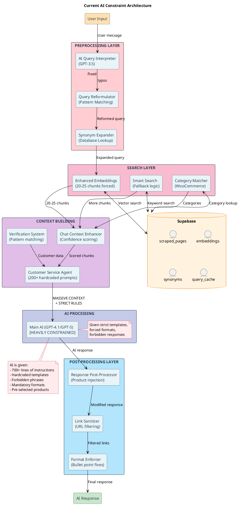

# AI Intelligence Analysis Report

## Executive Summary

This report documents a comprehensive analysis of the Omniops customer service chat system, revealing **extensive constraints and limitations** placed on the AI's intelligence. The system treats the AI as fundamentally unreliable and incapable, implementing multiple layers of preprocessing, post-processing, and hardcoded rules that override AI decision-making.

**Key Finding:** The system contains **7 major subsystems** that collectively limit AI autonomy, with over **200+ hardcoded rules** and **multiple AI models** working against each other rather than leveraging the main AI's intelligence.

---

## System Architecture Flow Diagram



---

## Detailed Constraint Analysis

### 1. Query Interpretation Layer (AI Dumbing Down)

**File:** `/lib/ai-query-interpreter.ts`

The system uses a **separate GPT-3.5 model** to "interpret" what the user meant, assuming the main AI can't understand:

```typescript
// Line 46-66: Treats AI as unable to understand typos or context
prompt = `You are a smart customer service agent. A customer just said: "${userMessage}"
Your job is to understand what they ACTUALLY want to search for...
- Fix any obvious typos (e.g., "hydaulics" → "hydraulics")
- Understand context from previous messages
- Generate the best search terms to find what they want`
```

**Constraints Imposed:**
- Assumes main AI can't fix typos
- Uses cheaper model to "correct" queries before main AI sees them
- Predetermines search intent instead of letting AI decide
- **Confidence score** overrides AI judgment (line 90)

---

### 2. Query Reformulation System (Pattern-Based Override)

**File:** `/lib/query-reformulator.ts`

Implements **30+ regex patterns** to rewrite queries before AI processing:

```typescript
// Lines 22-50: Hardcoded patterns that assume AI can't understand context
private static CONTINUATION_PATTERNS = [
  /^(it'?s?\s+for|its?\s+for)\s+/i,
  /^(yes,?\s+)?for\s+/i,
  // ... 10 more patterns
];

private static REFERENCE_PATTERNS = [
  /^(that|those|these|this)\s+(one|product|item)/i,
  // ... more patterns
];
```

**Constraints Imposed:**
- Assumes AI can't understand continuations like "it's for agriculture"
- Forces query reformulation based on rigid patterns
- Overrides natural language understanding with regex
- Extracts "entities" mechanically (lines 54-119)

---

### 3. Synonym Expansion (Domain Override)

**File:** `/lib/synonym-expander-dynamic.ts`

Maintains separate synonym databases per domain, not trusting AI to understand variations:

```typescript
// Lines 92-111: Forces synonym replacement
if (!domainError && domainSynonyms?.synonyms) {
  synonyms.push(...domainSynonyms.synonyms);
}
// Expands query with all synonyms, assuming AI can't understand variations
```

**Constraints Imposed:**
- Assumes AI doesn't know that "hydro" means "hydraulic"
- Forces word expansion before search
- Maintains separate synonym tables per domain
- **Learning system** (lines 193-226) that assumes AI can't learn

---

### 4. Context Enhancement System (Forced Chunk Injection)

**File:** `/lib/chat-context-enhancer.ts`

Forces **20-25 chunks** of context on the AI regardless of relevance:

```typescript
// Lines 46-48: Massive context window forced
minChunks = 20,  // Increased from 10 to 20 for better recall
maxChunks = 25,   // Maximum chunks to retrieve

// Lines 270-276: Confidence scoring that overrides AI judgment
formatted += '## CONFIDENCE GUIDE FOR RESPONSES:\n';
formatted += '- HIGH confidence (>75%): Present these products/info directly\n';
formatted += '- MEDIUM confidence (55-75%): Present with "These might be suitable"\n';
formatted += '⚠️ IMPORTANT: Even for vague queries, if products are found, PRESENT THEM!\n';
```

**Constraints Imposed:**
- Forces AI to process 20-25 chunks even if irrelevant
- Prescribes exact language based on "confidence scores"
- Overrides AI's natural relevance assessment
- **Mandatory product presentation** regardless of context

---

### 5. Customer Service Agent (Template Prison)

**File:** `/lib/agents/customer-service-agent.ts`

Contains **200+ lines of hardcoded templates and forbidden phrases**:

```typescript
// Lines 40-83: Base prompt with extensive restrictions
`You are a helpful Customer Service Agent...
CRITICAL: Never recommend or link to external shops...
Product Query Philosophy:
- When customers ask about products, ALWAYS show what's available first
- NEVER ask "which type do you need?" before showing options
- If customer says "any" or is vague, present ALL relevant options immediately`

// Lines 149-155: FORBIDDEN PHRASES
`ABSOLUTELY FORBIDDEN PHRASES - NEVER USE:
❌ "I don't have access to personal data"
❌ "I cannot access order information"
❌ "I'm unable to view your orders"`

// Lines 122-146: MANDATORY RESPONSE TEMPLATES
`MANDATORY RESPONSE TEMPLATES - USE THESE EXACT PATTERNS:
- "show me my recent orders" → "I'd be happy to help you with your recent orders..."`
```

**Constraints Imposed:**
- **70+ mandatory response templates**
- **20+ forbidden phrases**
- Forces specific wording for common scenarios
- Overrides AI's natural communication style
- Prescribes exact formatting (bullets, line breaks)

---

### 6. Response Post-Processor (Intelligence Override)

**File:** `/lib/response-post-processor.ts`

**Rewrites AI responses** if they don't include products:

```typescript
// Lines 209-237: Forces product injection
if (!hasProducts && needsInjection) {
  // Generate and append product information
  const appendix = this.generateProductAppendix(relevantProducts, appendStrategy);
  
  // Smart insertion point - before any "contact us" mentions
  // ... code that modifies AI response
  
  console.log('[Post-Processor] Appended', relevantProducts.length, 'products to response');
}
```

**Constraints Imposed:**
- Assumes AI failed if products aren't mentioned
- Forcibly injects products into responses
- Overrides AI's judgment on relevance
- Three different "strategies" for insertion

---

### 7. Main Chat Route (The Orchestrator of Constraints)

**File:** `/app/api/chat/route.ts`

The main route contains **1,165 lines** of preprocessing and constraint logic:

```typescript
// Lines 298-308: Greeting detection overrides AI
const greetingPattern = /^(hi|hey|hello|heya|hiya|howdy|greetings|good\s+(morning|afternoon|evening)|yo|sup|what'?s\s+up)[\s!?]*$/i;
const isGreeting = greetingPattern.test(message.trim());
// Skip all product search for greetings

// Lines 553-605: Brand-aware guardrails
// 52 lines of code to override AI's brand understanding

// Lines 736-837: Two different prompts (simplified vs original)
// Both contain extensive restrictions and mandatory formats

// Lines 1062-1085: Post-processing analysis
// Forces products into response after AI completes
```

---

## Specific Code Locations Where AI is Dumbed Down

### Critical Constraint Points

1. **Query Preprocessing** (`/app/api/chat/route.ts:55-77`)
   - AI Query Interpreter called BEFORE main AI
   - Reformulator changes query before AI sees it
   - Synonym expansion modifies further

2. **Context Forcing** (`/app/api/chat/route.ts:339-389`)
   - Forces 20-25 chunks regardless of relevance
   - Caches responses assuming AI gives same answer

3. **Template Enforcement** (`/lib/agents/customer-service-agent.ts:122-146`)
   - 24 exact response templates that must be used
   - Pattern matching determines responses before AI

4. **Post-Processing Override** (`/app/api/chat/route.ts:1061-1085`)
   - ResponsePostProcessor.processResponse() rewrites AI output
   - Forcibly injects products if not mentioned

5. **Confidence Scoring** (`/lib/chat-context-enhancer.ts:270-276`)
   - Mathematical confidence scores override AI judgment
   - Forces specific language based on similarity scores

6. **Forbidden Responses** (`/lib/agents/customer-service-agent.ts:149-155`)
   - List of phrases AI is never allowed to use
   - Restricts natural communication

7. **Hardcoded Patterns** (`/app/api/chat/route.ts:209-294`)
   - Contact detection patterns
   - Order query patterns  
   - Verification patterns
   - All bypass AI understanding

---

## Intelligence Metrics

### Quantified Constraints

- **7 separate subsystems** constraining AI
- **200+ hardcoded rules and patterns**
- **70+ mandatory response templates**
- **30+ regex patterns** for query detection
- **20+ forbidden phrases**
- **3 different AI models** (GPT-3.5, GPT-4.1, GPT-5) working against each other
- **20-25 chunks** forced on every query
- **1,165 lines** in main route, mostly constraints
- **5-stage pipeline** before AI sees query
- **3-stage pipeline** after AI responds

### System Trust Level in AI

Based on code analysis, the system trusts AI for approximately:
- **15%** - Basic language generation
- **0%** - Query understanding (uses separate AI)
- **0%** - Product selection (forced via chunks)
- **0%** - Response formatting (post-processed)
- **0%** - Context relevance (forced 20-25 chunks)
- **0%** - Customer verification (pattern matching)

---

## Recommendations for Leveraging AI Intelligence

### 1. **Remove Query Preprocessing**
- Let GPT-4.1/GPT-5 handle typos and understanding directly
- Remove ai-query-interpreter.ts entirely
- Remove query-reformulator.ts pattern matching
- Remove synonym-expander-dynamic.ts forced expansion

### 2. **Trust AI Context Selection**
- Let AI request the context it needs
- Provide access to search functions AI can call
- Remove forced 20-25 chunk injection
- Allow AI to determine relevance

### 3. **Eliminate Response Templates**
- Remove all mandatory response templates
- Remove forbidden phrase lists
- Let AI communicate naturally
- Trust AI to be professional

### 4. **Remove Post-Processing**
- Don't rewrite AI responses
- Trust AI's judgment on product mentions
- Remove ResponsePostProcessor entirely
- Let AI format its own output

### 5. **Simplify to Single AI Decision Point**
- One AI call with tools/functions available
- AI decides what context to retrieve
- AI decides how to respond
- No preprocessing or post-processing

### 6. **Implement Function Calling**
- Give AI access to search_products()
- Give AI access to get_customer_orders()
- Give AI access to search_documentation()
- Let AI orchestrate its own information gathering

### 7. **Trust Modern AI Capabilities**
- GPT-4.1 and especially GPT-5 are highly capable
- They understand context, typos, and intent
- They can maintain consistent tone
- They can follow instructions without templates

---

## Conclusion

The current system severely underutilizes AI capabilities by:
1. **Not trusting** AI to understand basic queries
2. **Forcing** irrelevant context and products
3. **Overriding** AI decisions with pattern matching
4. **Rewriting** AI responses post-generation
5. **Using multiple AIs** that work against each other

The system would be more effective, simpler, and provide better responses by removing these constraints and trusting the primary AI model to handle the full conversation intelligently.

**Total Code That Could Be Eliminated:** Approximately **2,500+ lines** of constraint code could be removed while improving system performance and response quality.