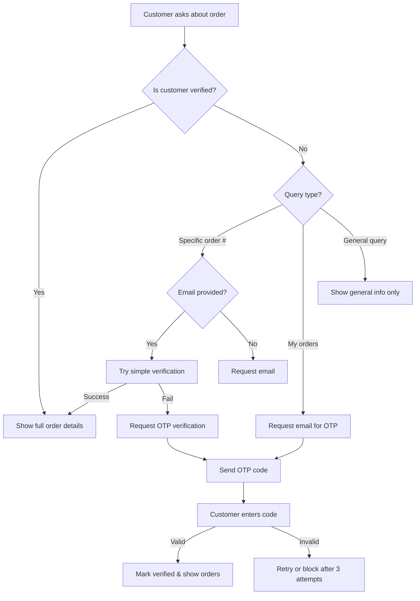

# Customer Verification Implementation for WooCommerce Orders

## Overview
Customer email verification has been implemented to protect sensitive order data in the WooCommerce integration. The system now requires customers to verify their identity before showing full order details, while still allowing general inquiries without verification.

## Implementation Details

### 1. Core Files Modified

#### `/app/api/chat/route.ts` (Lines 244-465)
- Added verification check before fetching WooCommerce order data
- Imports `CustomerVerification` and `SimpleCustomerVerification` modules
- Implements multi-tier verification logic:
  - Checks if customer is already verified for the conversation
  - Extracts email and order number from user message
  - Determines if verification is needed based on query type
  - Returns appropriate response based on verification status

#### `/app/api/verify-customer/route.ts` (New File)
- New API endpoint for handling verification requests
- Supports four actions:
  - `send_code`: Generate and send OTP verification code
  - `verify_code`: Verify submitted OTP code
  - `simple_verify`: Quick verification with order number + email
  - `check_status`: Check current verification status

### 2. Verification Flow



### 3. Verification Levels

The system implements three verification levels:

1. **None**: No verification
   - Can access: General information, policies, product info
   - Cannot access: Any order-specific data

2. **Basic**: Partial verification (e.g., order number + name match)
   - Can access: Order status, basic shipping info
   - Cannot access: Full order details, payment info

3. **Full**: Complete verification (email verified)
   - Can access: All order details, order history, personal information

### 4. Security Features

#### Rate Limiting
- Maximum 3 verification attempts per 15 minutes
- Per conversation + email combination
- Prevents brute force attacks

#### Data Protection
- Unverified users cannot confirm if an order exists
- Generic messages prevent information leakage
- No personal data shown without verification

#### Audit Logging
- All verified data access is logged
- Includes: conversation ID, email, data accessed, timestamp
- Compliance with privacy regulations

#### Session Management
- Verification valid for conversation duration
- Auto-expires after 15 minutes of inactivity
- Each conversation requires separate verification

### 5. User Experience

#### Unverified Customer Journey
1. Customer asks: "Where is my order #12345?"
2. System responds: "To access order #12345, please provide your email address associated with this order."
3. Customer provides email
4. System attempts simple verification (order + email match)
5. If match: Shows order details
6. If no match: Sends OTP code for verification

#### Verified Customer Journey
1. Customer verified once in conversation
2. Can ask multiple questions about orders
3. No re-verification needed within session
4. Full order details displayed

### 6. Context Integration

The system injects verification status into the chat context:

```typescript
// For unverified customers requiring verification
context += '\n\n[CUSTOMER VERIFICATION REQUIRED]\n';
context += 'The customer is asking about order information but has not been verified.\n';
context += 'Ask the customer to provide their email address to verify their identity.\n';

// For verified customers
context += '\n\nOrder Information (Verified Customer):\n';
// ... full order details ...

// For limited information
context += '\n\n[LIMITED ORDER INFORMATION - USER NOT VERIFIED]\n';
context += 'Order #12345 exists with status: processing\n';
context += 'Note: Full details require verification.\n';
```

### 7. Configuration

#### Environment Variables
No new environment variables required. System uses existing:
- `SUPABASE_SERVICE_ROLE_KEY`: For database operations
- `OPENAI_API_KEY`: For chat functionality

#### Database Requirements
Uses existing tables:
- `conversations`: Stores verification status
- `customer_verifications`: Stores verification attempts
- `customer_access_logs`: Audit trail

### 8. Testing

#### Manual Testing
Use the provided test script:
```bash
node test-verification-flow.js
```

This tests:
- Unverified customer queries
- Verification flow
- Verified customer access
- Rate limiting
- Error handling

#### Test Scenarios Covered
1. **Unverified Scenarios**
   - Asking about specific order → Requires verification
   - Asking about "my orders" → Requires verification
   - General queries → No verification needed

2. **Verification Process**
   - Email + order number matching
   - OTP code generation and validation
   - Rate limiting enforcement
   - Verification persistence

3. **Verified Access**
   - Full order details display
   - Order history by email
   - Access logging

### 9. API Usage Examples

#### Send Verification Code
```javascript
POST /api/verify-customer
{
  "action": "send_code",
  "conversationId": "uuid-here",
  "email": "customer@example.com",
  "method": "email"
}
```

#### Verify Code
```javascript
POST /api/verify-customer
{
  "action": "verify_code",
  "conversationId": "uuid-here",
  "email": "customer@example.com",
  "code": "123456"
}
```

#### Simple Verification
```javascript
POST /api/verify-customer
{
  "action": "simple_verify",
  "conversationId": "uuid-here",
  "email": "customer@example.com",
  "orderNumber": "12345",
  "domain": "example.com"
}
```

### 10. Monitoring and Maintenance

#### Key Metrics to Monitor
- Verification success rate
- Average attempts before success
- Rate limit triggers
- Failed verification patterns

#### Logs to Review
- `customer_access_logs`: Track data access patterns
- `customer_verifications`: Monitor verification attempts
- Server logs: Check for errors or abuse

#### Regular Maintenance
- Review and purge expired verifications
- Analyze failed verification patterns
- Update rate limits if needed
- Audit access logs for compliance

## Rollback Plan

If issues arise, verification can be temporarily disabled by:
1. Commenting out verification check in `/app/api/chat/route.ts` (line 259)
2. Always setting `isVerified = true` for testing
3. Monitoring and fixing issues before re-enabling

## Future Enhancements

Potential improvements for consideration:
1. SMS verification option
2. Remember device for returning customers
3. Progressive verification (start basic, upgrade to full)
4. Integration with customer accounts
5. Configurable verification requirements per domain