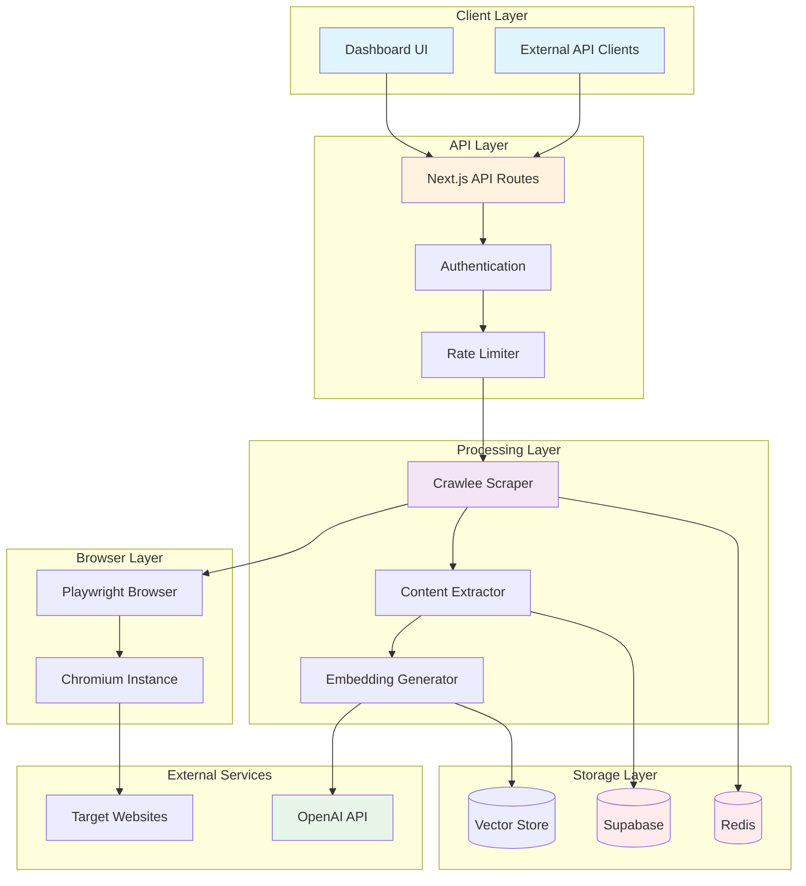
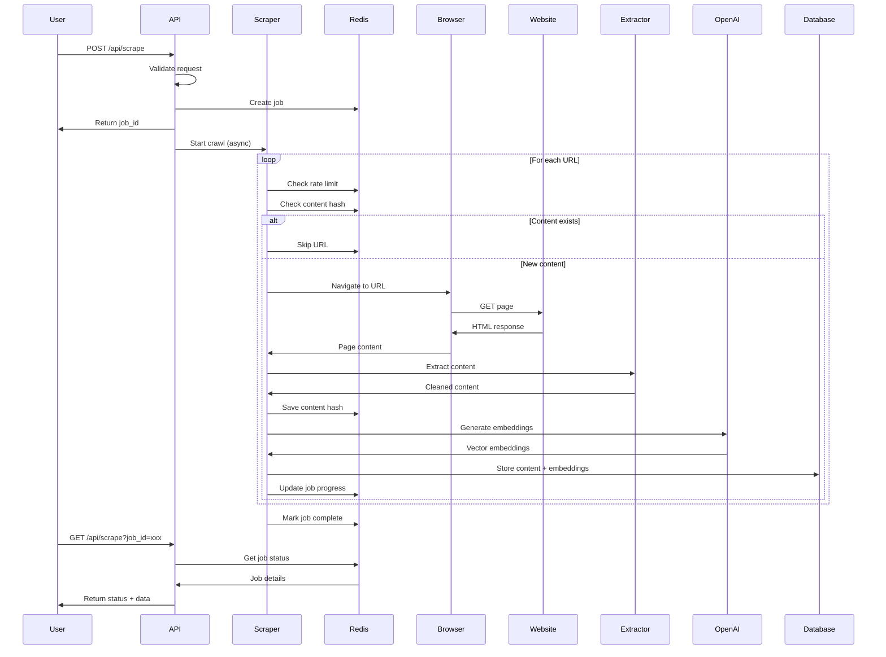

# Web Scraping Architecture

## System Overview



## Data Flow Diagram



## Component Details

### 1. API Layer (`/app/api/scrape/route.ts`)

**Responsibilities:**
- Request validation
- Authentication/authorization
- Rate limiting
- Job initialization
- Response formatting

**Key Functions:**
```typescript
POST /api/scrape
├── validateRequest()
├── checkRateLimit()
├── initializeJob()
├── triggerCrawl()
└── returnResponse()

GET /api/scrape
├── validateJobId()
├── fetchJobStatus()
├── fetchResults()
└── formatResponse()
```

### 2. Crawlee Scraper (`/lib/crawlee-scraper-v2.ts`)

**Responsibilities:**
- URL queue management
- Concurrent crawling
- Link discovery
- Error handling
- Progress tracking

**Key Components:**
```typescript
PlaywrightCrawler
├── Request Handler
│   ├── Page navigation
│   ├── Content extraction
│   └── Link enqueueing
├── Failed Request Handler
│   └── Error logging
└── Configuration
    ├── Concurrency: 5
    ├── Timeout: 30s
    └── Retries: 3
```

### 3. Content Extractor (`/lib/content-extractor.ts`)

**Responsibilities:**
- HTML parsing
- Main content identification
- Metadata extraction
- Markdown conversion
- Content validation

**Extraction Pipeline:**
```
HTML Input
    ↓
Mozilla Readability
    ↓
Content Parsing
    ├── Title extraction
    ├── Main content
    ├── Metadata
    └── Images/Links
    ↓
Markdown Conversion
    ↓
Content Validation
    ├── Word count check
    ├── Error page detection
    └── Quality scoring
    ↓
Cleaned Output
```

### 4. Redis Storage (`/lib/redis.ts`)

**Data Structures:**

```redis
# Job Storage
crawl:job:{jobId} = {
  jobId: string,
  status: string,
  progress: number,
  total: number,
  completed: number,
  failed: number,
  errors: array,
  startedAt: timestamp,
  completedAt: timestamp
}

# Job Results
crawl:results:{jobId} = [
  { url, title, content, ... },
  { url, title, content, ... }
]

# Content Deduplication
content:hash:{hash} = url

# Rate Limiting
rate:{domain} = count
rate:delay:{domain} = milliseconds
```

### 5. Database Schema

**Scraped Pages Table:**
```sql
CREATE TABLE scraped_pages (
  id UUID PRIMARY KEY,
  url TEXT UNIQUE NOT NULL,
  title TEXT,
  content TEXT,
  content_hash VARCHAR(16),
  word_count INTEGER,
  metadata JSONB,
  last_scraped_at TIMESTAMP,
  created_at TIMESTAMP DEFAULT NOW()
);
```

**Page Embeddings Table:**
```sql
CREATE TABLE page_embeddings (
  id UUID PRIMARY KEY,
  page_id UUID REFERENCES scraped_pages(id),
  chunk_text TEXT,
  chunk_index INTEGER,
  embedding VECTOR(1536),
  metadata JSONB,
  created_at TIMESTAMP DEFAULT NOW()
);
```

## Performance Characteristics

### Throughput
- **Single page**: 2-5 seconds
- **Full crawl**: ~50-100 pages/minute
- **Concurrent requests**: 5 per crawl
- **Rate limit**: 20 requests/minute/domain

### Resource Usage
- **Memory**: ~200MB base + 50MB per concurrent page
- **CPU**: Moderate (Playwright rendering)
- **Network**: Variable based on page size
- **Storage**: ~5KB per page + embeddings

### Scalability Limits
- **Redis**: Memory-based, scale vertically
- **Playwright**: CPU-bound, scale horizontally
- **Database**: Depends on Supabase plan
- **OpenAI**: API rate limits apply

## Monitoring Points

```yaml
metrics:
  - crawl_jobs_total
  - crawl_pages_per_minute
  - crawl_errors_total
  - content_extraction_duration
  - embedding_generation_duration
  - redis_memory_usage
  - database_storage_usage
  
alerts:
  - high_error_rate: > 10%
  - slow_crawl_speed: < 10 pages/min
  - redis_memory_high: > 80%
  - job_stuck: > 30 min without progress
```

## Deployment Considerations

### Development
```yaml
services:
  - Next.js: Local dev server
  - Redis: Docker container
  - Playwright: Local browsers
  - Supabase: Cloud instance
```

### Production
```yaml
services:
  - Next.js: Vercel/AWS/GCP
  - Redis: Redis Cloud/ElastiCache
  - Playwright: Dedicated workers
  - Supabase: Paid plan
  
scaling:
  - API: Horizontal (multiple instances)
  - Crawlers: Horizontal (job queue)
  - Redis: Vertical (more memory)
  - Database: Managed scaling
```

### Security Considerations

1. **Input Validation**
   - URL format validation
   - Domain whitelisting (optional)
   - Max pages limit enforcement

2. **Resource Protection**
   - Rate limiting (API & crawling)
   - Memory limits
   - Timeout enforcement
   - Job expiration

3. **Data Privacy**
   - Respect robots.txt (optional)
   - No credential storage
   - Secure data transmission
   - GDPR compliance options

## Future Enhancements

### Phase 1: Optimization
- [ ] Implement robots.txt checking
- [ ] Add caching layer
- [ ] Optimize embedding generation
- [ ] Parallel job processing

### Phase 2: Features
- [ ] Structured data extraction
- [ ] PDF/document support
- [ ] Authentication support
- [ ] Webhook notifications

### Phase 3: Scale
- [ ] Distributed crawling
- [ ] Multi-region support
- [ ] Advanced queueing (BullMQ)
- [ ] Kubernetes deployment