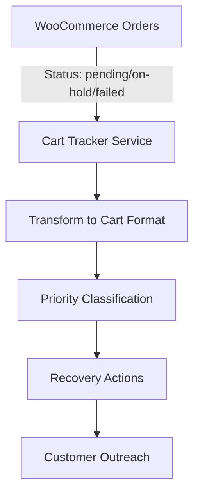

# WooCommerce Abandoned Cart Tracking

## Overview

The Abandoned Cart Tracking feature provides comprehensive monitoring and recovery tools for incomplete purchases in your WooCommerce store. Since WooCommerce REST API v3 doesn't provide direct cart access, this implementation uses pending, on-hold, and failed orders as a proxy for abandoned carts.

## Table of Contents
- [Architecture](#architecture)
- [Installation](#installation)
- [API Reference](#api-reference)
- [Usage Examples](#usage-examples)
- [Integration Guide](#integration-guide)
- [Configuration](#configuration)
- [Troubleshooting](#troubleshooting)

## Architecture

### How It Works



The system identifies abandoned carts by monitoring orders with specific statuses:
- **Pending**: Payment initiated but not completed
- **On-Hold**: Awaiting payment confirmation (bank transfer, check)
- **Failed**: Payment attempt failed

### Components

1. **`lib/woocommerce-cart-tracker.ts`** - Core service class
2. **`app/api/woocommerce/abandoned-carts/route.ts`** - REST API endpoint
3. **WooCommerce Integration** - Uses existing `woocommerce-api.ts`

## Installation

### Prerequisites
- WooCommerce store with REST API enabled
- API credentials configured in `.env.local`
- Node.js 18+ and Next.js 15+

### Setup

1. Ensure WooCommerce credentials are configured:
```env
WOOCOMMERCE_URL=https://your-store.com
WOOCOMMERCE_CONSUMER_KEY=ck_xxxxx
WOOCOMMERCE_CONSUMER_SECRET=cs_xxxxx
```

2. The feature is automatically available once credentials are set.

## API Reference

### Base Endpoint
```
GET /api/woocommerce/abandoned-carts
```

### Actions

#### 1. List Abandoned Carts
Retrieves a list of abandoned carts with filtering options.

**Request:**
```http
GET /api/woocommerce/abandoned-carts?action=list&limit=10&hoursOld=2&minValue=50
```

**Parameters:**
| Parameter | Type | Default | Description |
|-----------|------|---------|-------------|
| action | string | "list" | Action to perform |
| limit | number | 20 | Maximum carts to return |
| hoursOld | number | 1 | Minimum age in hours |
| minValue | number | 0 | Minimum cart value |

**Response:**
```json
{
  "success": true,
  "timestamp": "2025-08-24T17:51:37.999Z",
  "filters": {
    "hoursOld": 2,
    "minValue": 50,
    "limit": 10
  },
  "summary": {
    "total": 5,
    "totalValue": "2045.12",
    "highPriority": 1,
    "mediumPriority": 3,
    "lowPriority": 1
  },
  "carts": [
    {
      "orderId": 119151,
      "status": "on-hold",
      "customer": {
        "email": "customer@example.com",
        "name": "John Doe",
        "phone": "01234567890"
      },
      "cart": {
        "total": "366.00",
        "currency": "GBP",
        "itemCount": 3,
        "items": [
          {
            "name": "Product Name",
            "quantity": 3,
            "price": "95.00",
            "total": "285.00"
          }
        ]
      },
      "dates": {
        "created": "2025-08-22T14:48:17",
        "modified": "2025-08-22T14:48:18",
        "abandoned_duration": "2 days"
      },
      "recovery": {
        "priority": "medium",
        "suggested_action": "Send friendly reminder email",
        "recovery_url": "https://store.com/checkout/order-pay/119151/?pay_for_order=true&key=xxx"
      }
    }
  ]
}
```

#### 2. Get Single Cart
Retrieves detailed information about a specific abandoned cart.

**Request:**
```http
GET /api/woocommerce/abandoned-carts?action=single&orderId=119151
```

**Parameters:**
| Parameter | Type | Required | Description |
|-----------|------|----------|-------------|
| action | string | Yes | Must be "single" |
| orderId | number | Yes | WooCommerce order ID |

#### 3. Get Statistics
Provides analytics and insights about abandoned carts.

**Request:**
```http
GET /api/woocommerce/abandoned-carts?action=stats&days=30
```

**Parameters:**
| Parameter | Type | Default | Description |
|-----------|------|---------|-------------|
| action | string | - | Must be "stats" |
| days | number | 7 | Period for statistics |

**Response:**
```json
{
  "success": true,
  "period": "Last 30 days",
  "statistics": {
    "total_abandoned": 25,
    "total_value": "5432.10 GBP",
    "average_cart_value": "217.28 GBP",
    "by_status": {
      "on-hold": 12,
      "pending": 8,
      "failed": 5
    },
    "top_abandoned_products": [
      {"name": "Product A", "count": 15},
      {"name": "Product B", "count": 8}
    ],
    "recovery_rate": "78.5%"
  }
}
```

#### 4. Send Recovery Reminder
Triggers a recovery action for a specific cart.

**Request:**
```http
GET /api/woocommerce/abandoned-carts?action=recover&orderId=119151
```

**Parameters:**
| Parameter | Type | Required | Description |
|-----------|------|----------|-------------|
| action | string | Yes | Must be "recover" |
| orderId | number | Yes | WooCommerce order ID |

## Usage Examples

### JavaScript/TypeScript Integration

```typescript
// Fetch abandoned carts
async function getAbandonedCarts() {
  const response = await fetch('/api/woocommerce/abandoned-carts?action=list&limit=10');
  const data = await response.json();
  
  if (data.success) {
    console.log(`Found ${data.summary.total} abandoned carts`);
    console.log(`Total value: ${data.summary.totalValue}`);
    
    // Process high-priority carts
    const highPriority = data.carts.filter(
      cart => cart.recovery.priority === 'high'
    );
    
    for (const cart of highPriority) {
      await sendRecoveryEmail(cart);
    }
  }
}

// Get cart statistics
async function getCartStats() {
  const response = await fetch('/api/woocommerce/abandoned-carts?action=stats&days=30');
  const data = await response.json();
  
  console.log(`Recovery rate: ${data.statistics.recovery_rate}`);
  console.log(`Average cart value: ${data.statistics.average_cart_value}`);
}

// Recover specific cart
async function recoverCart(orderId: number) {
  const response = await fetch(
    `/api/woocommerce/abandoned-carts?action=recover&orderId=${orderId}`
  );
  const data = await response.json();
  
  if (data.success) {
    console.log(`Recovery initiated for order ${orderId}`);
  }
}
```

### React Component Example

```tsx
import { useEffect, useState } from 'react';

function AbandonedCartDashboard() {
  const [carts, setCarts] = useState([]);
  const [stats, setStats] = useState(null);

  useEffect(() => {
    fetchAbandonedCarts();
    fetchStats();
  }, []);

  const fetchAbandonedCarts = async () => {
    const res = await fetch('/api/woocommerce/abandoned-carts?action=list');
    const data = await res.json();
    if (data.success) setCarts(data.carts);
  };

  const fetchStats = async () => {
    const res = await fetch('/api/woocommerce/abandoned-carts?action=stats');
    const data = await res.json();
    if (data.success) setStats(data.statistics);
  };

  const handleRecover = async (orderId) => {
    const res = await fetch(
      `/api/woocommerce/abandoned-carts?action=recover&orderId=${orderId}`
    );
    const data = await res.json();
    if (data.success) {
      alert(`Recovery initiated for order ${orderId}`);
      fetchAbandonedCarts(); // Refresh list
    }
  };

  return (
    <div>
      <h2>Abandoned Carts</h2>
      {stats && (
        <div className="stats">
          <p>Total Abandoned: {stats.total_abandoned}</p>
          <p>Recovery Rate: {stats.recovery_rate}</p>
          <p>Total Value: {stats.total_value}</p>
        </div>
      )}
      
      <div className="cart-list">
        {carts.map(cart => (
          <div key={cart.orderId} className="cart-item">
            <h3>{cart.customer.name} - {cart.cart.total} {cart.cart.currency}</h3>
            <p>Email: {cart.customer.email}</p>
            <p>Abandoned: {cart.dates.abandoned_duration} ago</p>
            <p>Priority: {cart.recovery.priority}</p>
            <button onClick={() => handleRecover(cart.orderId)}>
              Send Recovery Email
            </button>
            <a href={cart.recovery.recovery_url} target="_blank">
              View Cart
            </a>
          </div>
        ))}
      </div>
    </div>
  );
}
```

## Integration Guide

### Customer Service Chat Integration

```typescript
// In your chat handler
import { WooCommerceCartTracker } from '@/lib/woocommerce-cart-tracker';

async function handleCustomerInquiry(customerEmail: string) {
  const tracker = new WooCommerceCartTracker();
  
  // Check for abandoned carts
  const carts = await tracker.getAbandonedCarts();
  const customerCart = carts.find(
    cart => cart.customer.email === customerEmail
  );
  
  if (customerCart) {
    return {
      hasAbandonedCart: true,
      cartValue: customerCart.cart.total,
      recoveryUrl: customerCart.recovery.recovery_url,
      suggestedMessage: `I see you have items in your cart worth ${customerCart.cart.total}. Would you like help completing your purchase?`
    };
  }
  
  return { hasAbandonedCart: false };
}
```

### Automated Recovery Campaign

```typescript
// Set up a cron job or scheduled function
import { WooCommerceCartTracker } from '@/lib/woocommerce-cart-tracker';

export async function runCartRecoveryCampaign() {
  const tracker = new WooCommerceCartTracker();
  
  // Get carts abandoned 2-24 hours ago
  const carts = await tracker.getAbandonedCarts({
    hoursOld: 2,
    limit: 50
  });
  
  for (const cart of carts) {
    if (cart.recovery.priority === 'high') {
      // Send immediate recovery with 10% discount
      await sendHighPriorityRecovery(cart);
    } else if (cart.recovery.priority === 'medium') {
      // Send friendly reminder
      await sendFriendlyReminder(cart);
    }
    
    // Mark as recovery attempted
    await tracker.sendRecoveryReminder(cart.orderId);
  }
  
  return {
    processed: carts.length,
    timestamp: new Date().toISOString()
  };
}
```

## Configuration

### Priority Rules

The system automatically assigns priority based on:

| Priority | Criteria | Suggested Action |
|----------|----------|------------------|
| **High** | Value > £100 AND Age < 24 hours | Immediate recovery with discount |
| **Medium** | Value > £50 OR Age < 48 hours | Friendly reminder email |
| **Low** | All others | Weekly recovery campaign |

### Customizing Priority Rules

Edit `lib/woocommerce-cart-tracker.ts`:

```typescript
private transformOrderToCart(order: Order): AbandonedCart {
  // Customize priority logic here
  const orderValue = parseFloat(order.total);
  let priority: 'high' | 'medium' | 'low' = 'low';
  
  // Your custom rules
  if (orderValue > 200 && hoursSinceCreated < 12) {
    priority = 'high';
  } else if (orderValue > 100 || hoursSinceCreated < 24) {
    priority = 'medium';
  }
  // ... rest of implementation
}
```

## Troubleshooting

### Common Issues

#### 1. No carts appearing
- **Check order statuses**: Ensure you have orders with status: pending, on-hold, or failed
- **Verify time filter**: Default `hoursOld` is 1, try setting to 0
- **Check credentials**: Ensure WooCommerce API credentials are valid

#### 2. Recovery URL not working
- **Check order status**: Order might already be completed
- **Verify WooCommerce settings**: Ensure guest checkout is enabled
- **Check order key**: Recovery URLs require valid order keys

#### 3. Statistics showing high recovery rate
- **Normal behavior**: High recovery rate means most carts are being completed
- **Check time period**: Adjust the `days` parameter for different periods

### Debug Mode

Enable detailed logging:

```typescript
// In your API route or service
const DEBUG = true;

if (DEBUG) {
  console.log('Fetching orders with status:', includeStatuses);
  console.log('Found orders:', orders.length);
  console.log('After filtering:', abandonedCarts.length);
}
```

## Best Practices

1. **Recovery Timing**
   - First reminder: 2-4 hours after abandonment
   - Second reminder: 24 hours after
   - Final reminder: 3-7 days after

2. **Personalization**
   - Use customer name in recovery messages
   - Reference specific products in cart
   - Offer relevant incentives based on cart value

3. **Monitoring**
   - Track recovery rates weekly
   - Monitor top abandoned products
   - Analyze abandonment patterns by time/day

4. **GDPR Compliance**
   - Only send recovery emails to customers who opted in
   - Include unsubscribe links
   - Respect data retention policies

## Related Documentation
- [WooCommerce API Documentation](./WOOCOMMERCE_FULL_API.md)
- [Main README](../README.md)
- [API Routes Guide](./API_ROUTES.md)

## Support

For issues or questions:
1. Check the troubleshooting section above
2. Review WooCommerce order statuses in your admin panel
3. Verify API credentials and permissions
4. Contact support with error logs and request/response examples